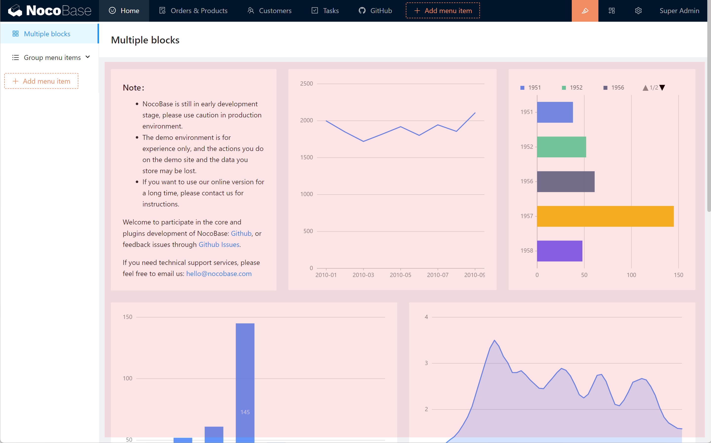
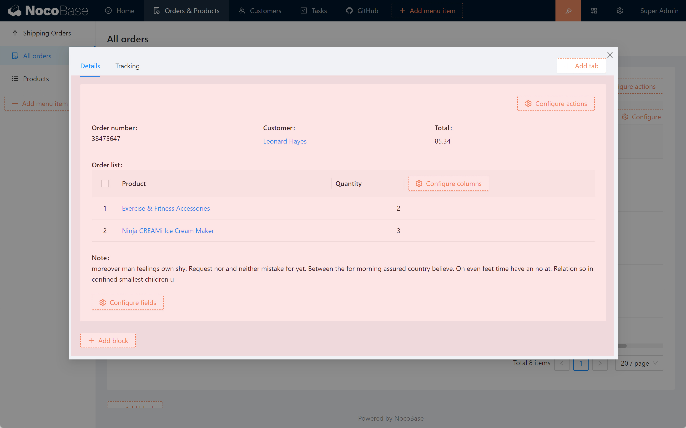
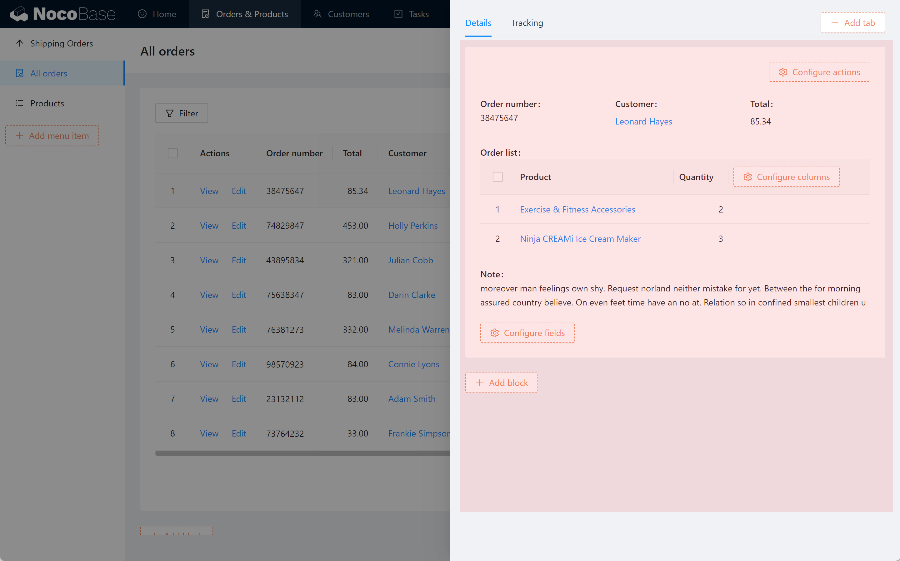

# 容器

在 NocoBase 里，将页面、弹窗、抽屉看作是区块的容器，容器就像一张画布，在里面可以放置各种各样的区块

## 页面

## 弹窗

## 抽屉

## 容器内支持标签页

在弹窗、抽屉、页面内，可以添加多个标签页。向每个标签页里添加不同的区块，从而显示不同的内容和操作。比如，在一个顾客信息的弹窗里，添加 3 个标签页，分别用来显示顾客的个人信息、订单记录、顾客评价：

