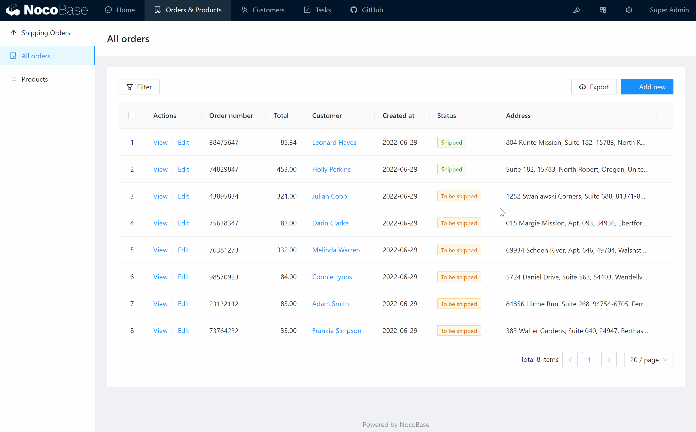
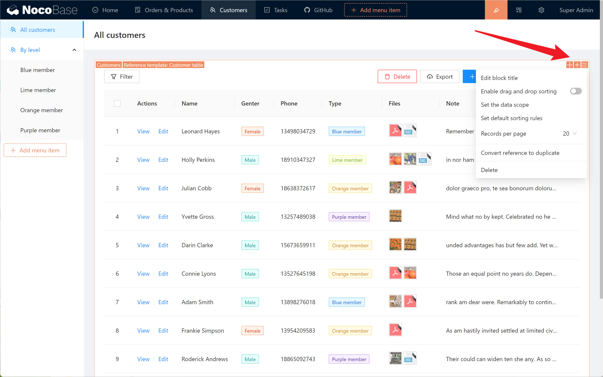
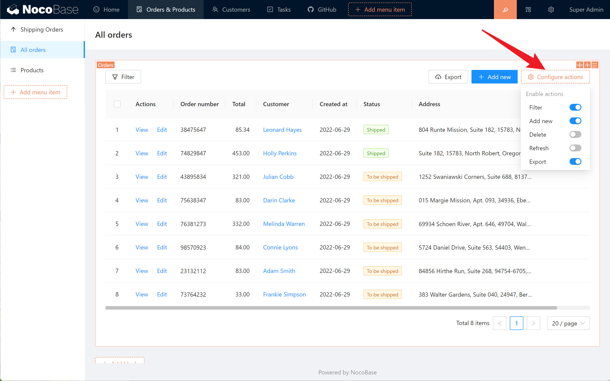
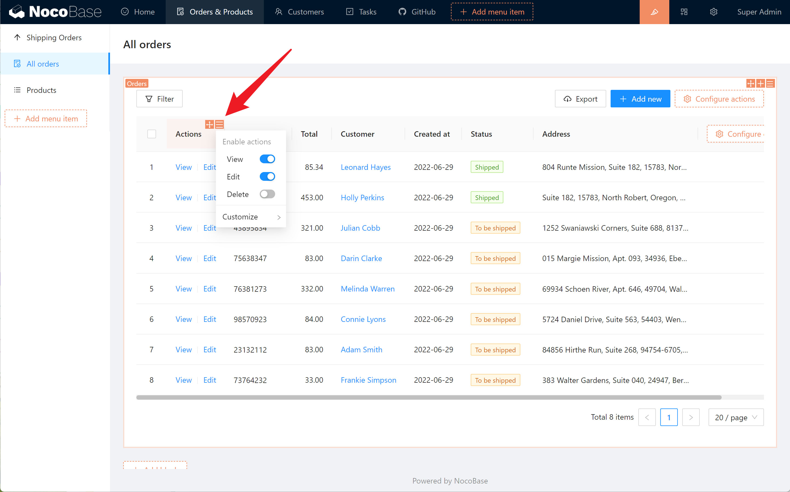
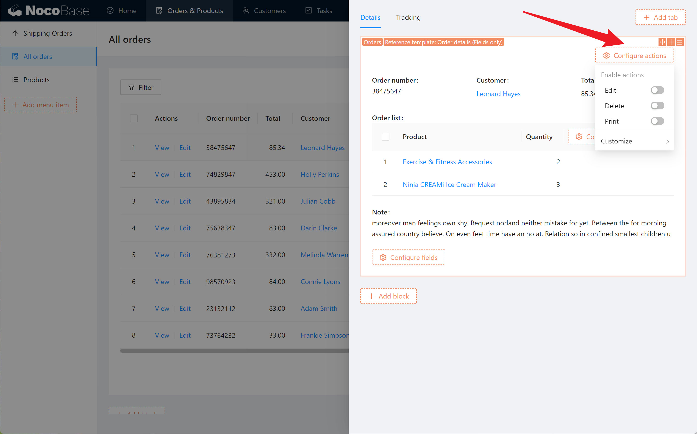
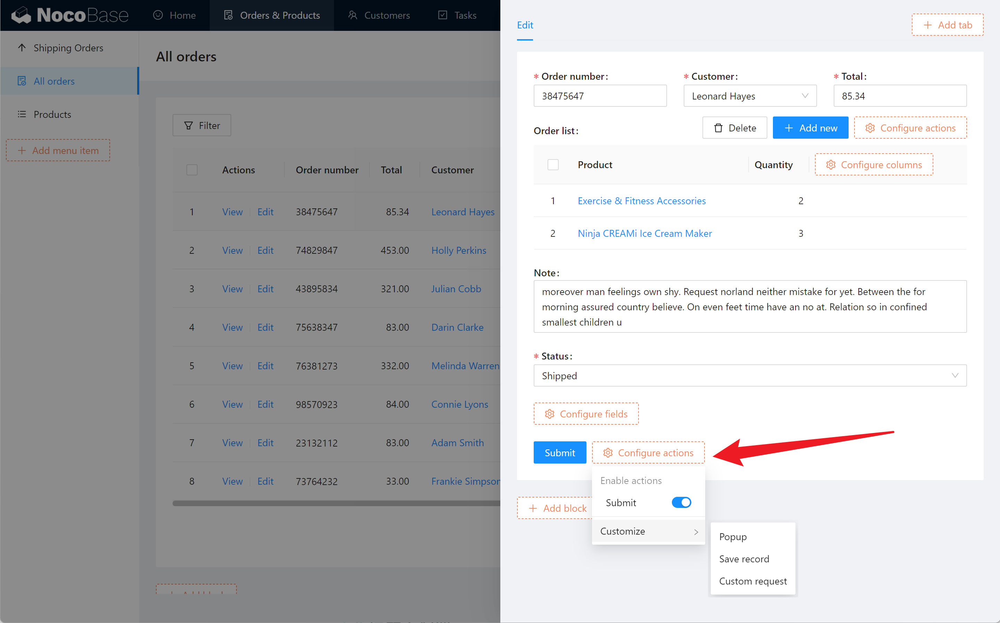
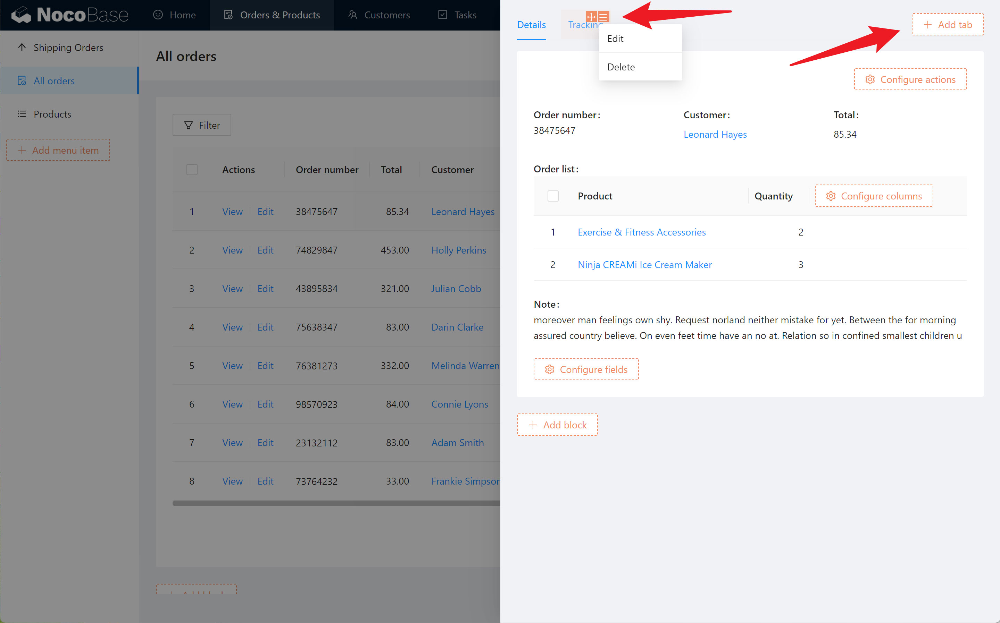

# 界面配置模式

NocoBase 采用所见即所得的方式来配置界面。点击右上角的`UI Editor`按钮，即可切换配置模式和使用模式。进入配置模式之后，界面上各处将会出现橙色的配置入口。

通常，配置项入口会出现在元素的右上角。

## 菜单项配置

将鼠标移到菜单项上，在右上角即可以看到拖拽排序按钮、配置项按钮，可以编辑、移动、插入、删除。

## 区块配置

将鼠标移到一个区块上，在右上角即可以看到拖拽排序按钮、新增区块按钮、配置项按钮。

不同的区块还会有一些自己独有的配置项。比如表格区块，将鼠标移到表头上即可以在右上角看到表头的配置项；在表头最右侧还可以看到表格列的配置项。

## 操作配置

在区块中可以看到操作的配置入口，这些入口在不同的区块里会出现在不同的位置。

比如表格区块，在右上方可以看到针对表格数据的操作：

在操作列的表头里可以看到针对单行数据的操作：

在详情区块的右上角可以看到针对详情的操作：

在表单区块底部可以看到针对表单的操作：

## 标签页配置

在弹窗或抽屉里，可以添加多个标签页，用于承载不同的区块。

