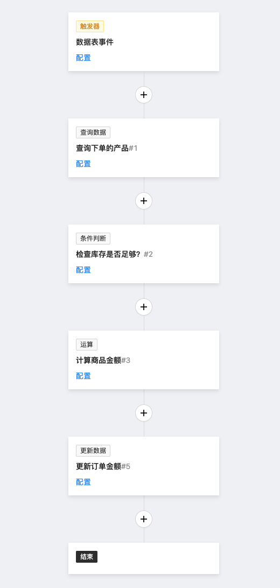

# 概览

工作流是一个编排和配置自动化流程的强大工具，常用于基于数据模型的业务流程设计与编排，通过触发条件与执行流程编排实现业务流程的自动化流转。基于工作流插件，可以在 UI 界面上完成大部分业务的编排，而无需通过修改代码的传统方式来开发或升级系统中的业务流程。

## 认识工作流

试想一个简单的电商购物场景，用户在下单时的业务流程通常如下：

1. 用户提交包含商品信息与数量的下单请求。
2. 系统检查商品库存是否充足，不足则返回库存不足的错误信息。
3. 系统根据商品信息与数量计算出商品总金额。
4. 系统根据以上信息生成待支付的订单，并返回给用户。

如果用传统的编程实现，看起来可能是这样的：

```ts
export default const order = new Controller({
  // 下单请求接口
  async create({ productId, quantity = 1, address }) {
    // 加载请求的商品
    const product = await productService.get(productId);
    // 检查库存
    if (product.inventory < quantity) {
      throw new Error('out of inventory');
    }

    // 计算商品金额
    const amount = product.price * quantity;

    // 计算运费
    const freight = await freightService.calculate({
      address,
      weight: product.weight * quantity,
    });

    // 生成订单
    const order = await orderService.create({
      product,
      quantity,
      amount: amount + freight,
      address
    });

    // 返回订单信息
    return order;
  }
});
```

对于微型业务系统，可能写代码的方式并不复杂。但是当系统随着业务变得复杂，比如需要加入不同时期的促销规则等需求时，会要求开发的迭代也变得频繁，而且如果涉及到复杂架构的微服务等，整个系统的代码会变得难以维护，带来很高的升级成本。

而工作流插件可以帮助我们将上述的业务流程编排成一个可视化的流程图，通过配置触发条件与执行流程，在系统管理的界面上就可以完成业务流程的编排与升级，而无需修改代码。



可以看到这样一个流程图，所描述的业务实际上是与之前的代码等价的。当其中的处理内容发生变化时，可以灵活的修改流程节点以达到与业务同步的目的。

使用工作流代替业务编码的意义就在于，通过抽象后的节点指令，图形化的配置业务，可以随时随业务变更，而无需通过传统的研发迭代周期来对业务进行演进，这将极大的提升业务系统的开发效率。

## 扩展开发

工作流从内置的功能来说不是全能的，比如内置的节点类型无法穷举所有业务场景中的每一种操作，所以我们还提供了对工作流进行扩展的设计，包括扩展触发器与节点类型等方面，遇到内置功能无法满足的业务场景，可以通过低代码的方式扩展解决。具体可以参考文档的其他内容：

* [扩展开发](./development)
* [API 参考](./api)
