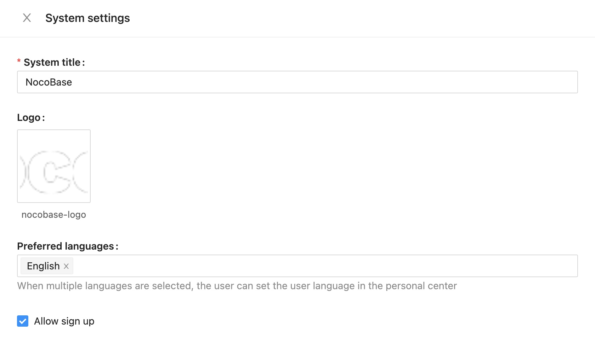

# 语言设置

NocoBase 可以在安装时选择语言，目前支持两种语言：

- 英文：`en-US`（默认）
- 中文：`zh-CN`

```bash
# 英文
yarn nocobase install --lang=en-US
# 中文
yarn nocobase install --lang=zh-CN
```

安装之后，可以在 System settings 里修改 Enabled languages。



如果启用了多个语言，用户可以在个人中心设置自己的语言环境。


