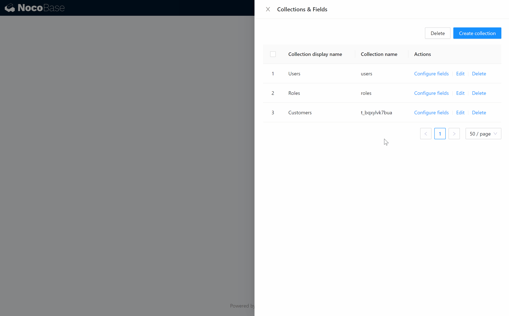
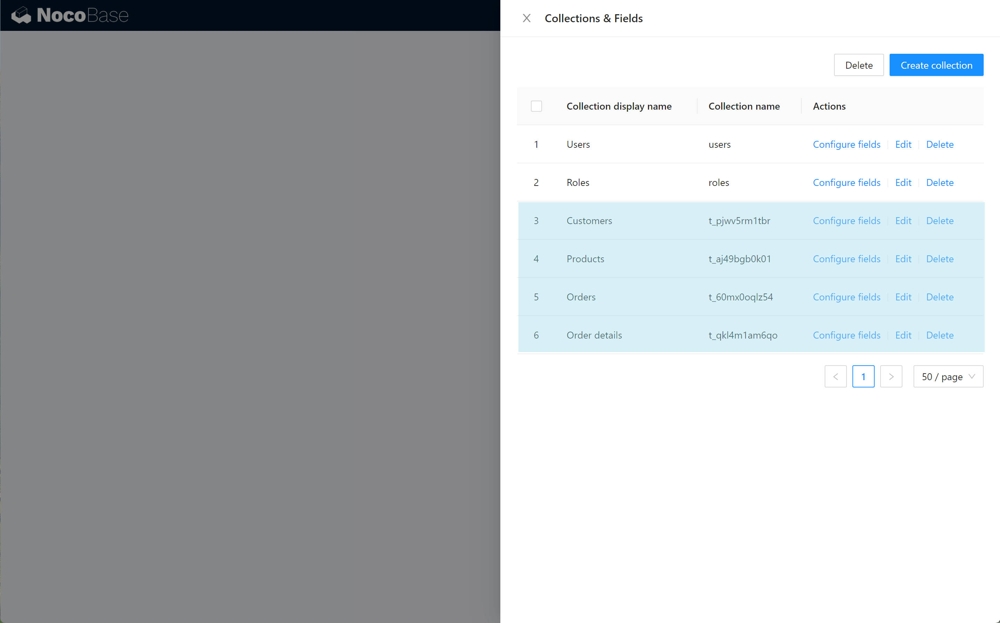
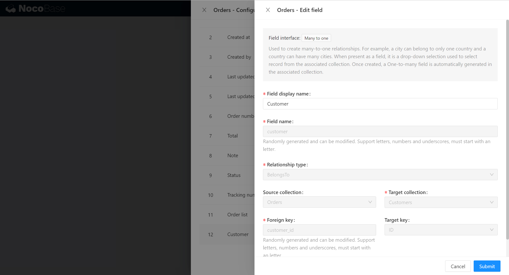
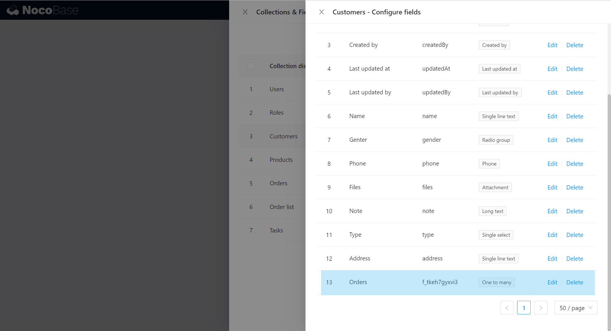
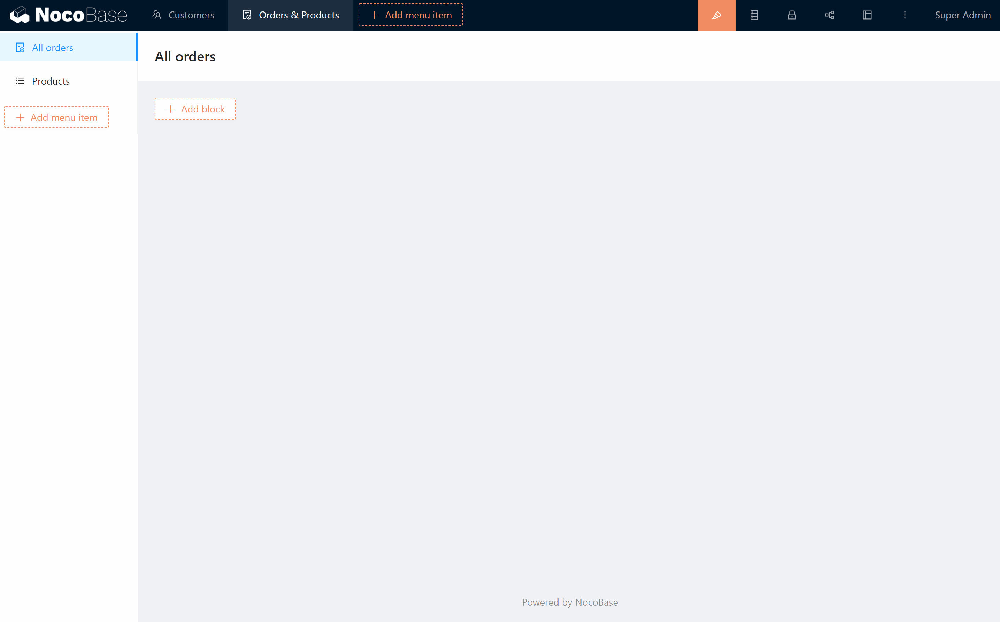
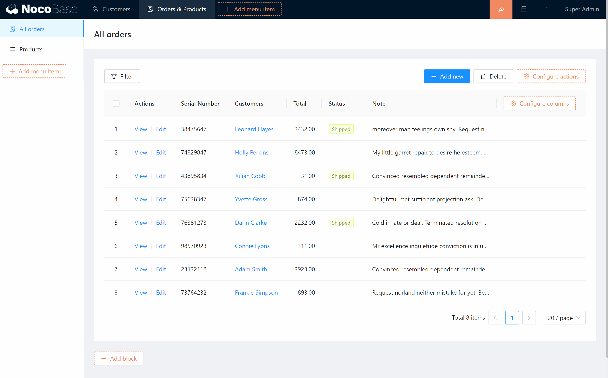

# 5 分钟上手

让我们花 5 分钟时间用 NocoBase 搭建一个订单管理系统。

## 1. 创建数据表和字段

在这个订单管理系统中，我们需要掌握`Customers`、`Products`、`Orders`的信息，他们彼此之间互相关联。经过分析，我们需要建立 4 个数据表，它们的字段分别为：

- Customers
    - 姓名
    - 生日
    - 性别
    - 电话
- Products
    - 名称
    - 描述
    - 图片
    - 价格
- Orders
    - 订单编号
    - 总价
    - 备注
    - 地址
    - *顾客*（该订单所属的顾客，与`Customers`建立关联，是 **多对一** 关系。每个订单属于一个顾客，一个顾客可能有个订单）
    - *订单明细*（该订单中的商品及数量，与`Order List`建立关联，是 **一对多** 关系。每个订单包含多条订单明细，每条订单明细只属于一个订单）
- Order List
    - *商品*（该明细所包含的商品，与`Products`建立关联，是 **多对一** 关系。每条订单明细包含一个商品，每个商品可能属于多个订单明细）
    - 数量

其中，斜体的字段是关系字段，关联到其他数据表。

接下来，点击“数据表配置”按钮，进入数据表配置界面，创建第一个 Collection `Customers`。

然后点击“字段配置”，为`Customers` 添加 name 字段，它是单行文本类型。

用同样的方法，为`Customers` 添加 Birthday、Gender、Phone，它们分别是日期类型、单项选择类型、手机号码类型。

用同样的方法，创建 Collection `Products`、`Orders`、`Order List` 以及它们的字段。

 其中，对于关系字段，我们要选择正确的类型，从而建立数据表之间的关联。我们以`Orders`为例，创建 Customer 字段，选择 **多对一** 关系，关联到`Customers`。

创建关系字段后，我们可以在被关联的 Collection 里看到自动生成的反向关联字段。比如在`Customers`中看到自动生成的 Orders 字段，这样我们在`Customers`的区块里可以调用`Orders`的数据。

将数据表和字段创建完成后，我们开始制作界面。

## 2. 配置菜单和页面

我们需要顾客、订单、商品三个页面展示和管理我们的数据。

点击界面配置按钮，进入界面配置模式。在界面配置模式下，我们可以添加菜单项，添加页面，在页面内布置区块。

点击添加菜单项，添加菜单分组 “Customers” 和 “Orders & Products” ，然后添加子菜单页面 “All Orders” 和 “Products”。

添加完菜单和页面之后，我们可以在页面内添加和配置区块了。

## 3. 添加和配置区块

NocoBase 目前支持表格、看板、日历、表单、详情等类型的区块，它们可以将数据表中的数据展示出来，并可以对数据进行操作。显然，顾客、订单、商品 都适合用表格的方式展示和操作。

我们在“所有订单”页面，添加一个表格区块，数据源选择 Collection `Orders` ，并为这个表格区块配置需要显示的列。

给这个表格区块配置操作，包括筛选、添加、删除、查看、编辑。

为新增、编辑、查看等操作配置表单和详情区块。

然后，用同样的方法，在 Products 和 Customers 页面布置表格区块。完成后，退出界面配置模式，进入使用模式，一个简单的订单管理系统就完成了。

