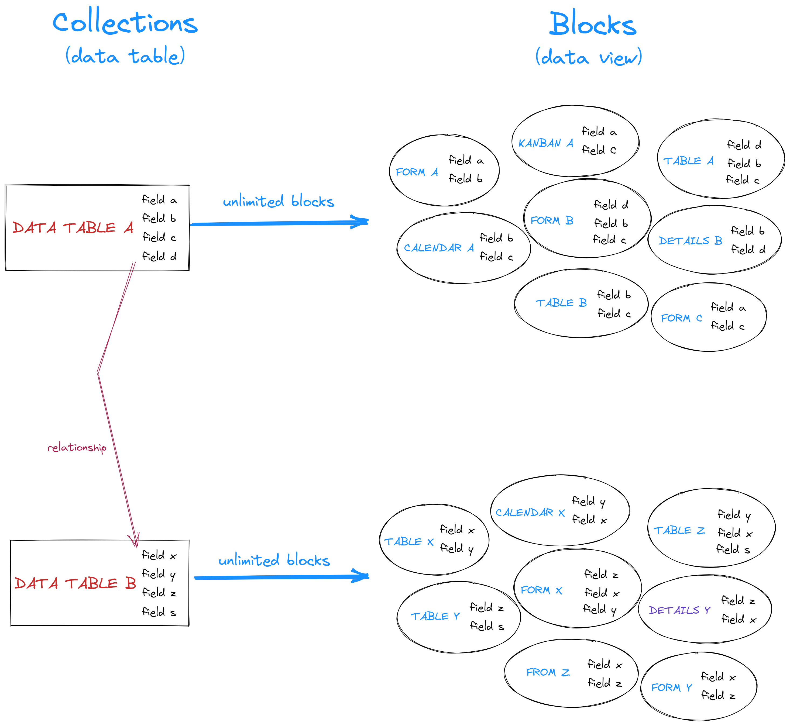

# NocoBase 特色

## 1. “数据结构”与“使用界面”分离

多数以表单、表格或者流程驱动的无代码产品都是在使用界面上直接创建数据结构，比如 Airtable 在表格里新增一列就是新增一个字段。这样的好处是使用简单，不足是功能和灵活性受限，难以满足较复杂场景的需求。

NocoBase 采用数据结构与使用界面分离的设计思路，可以为数据表创建任意数量、任意形态的区块（数据视图），每个区块里可以定义不同的样式、文案、操作。这样既兼顾了无代码的简单操作，又具备了原生开发的灵活性。

## 2. “系统配置”与“系统使用”分离

NocoBase 用来开发相对复杂的业务系统。在这些场景中，我们希望系统开发者与系统使用者是不同的角色。使用者看到的是一个成熟的、经过精心设计的系统，就像原生开发出来的产品一样，而不是僵化的、可以自由拖拽的、随时修改的系统；而开发者则可以采用所见即所得的方式快速开发系统。

## 3. 功能即插件

NocoBase 采用插件化架构，所有新功能都可以通过开发和安装插件来实现。未来我们将搭建插件市场，扩展功能就像在手机上安装 APP 一样简单。