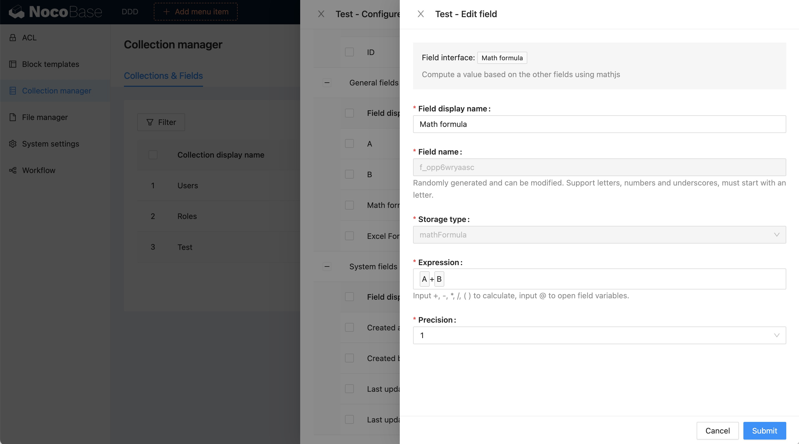

# v0.8.1：字段的计算公式插件

NocoBase 目前提供了两种计算公式插件：

- `@nocobase/plugin-math-formula-field` Math 公式
- `@nocobase/plugin-excel-formula-field` Excel 公式（感谢 [azriel46d](https://github.com/nocobase/nocobase/pull/906) 贡献）

## Math Formula

基于 [Math.js](https://mathjs.org/) 实现，它具有支持符号计算的灵活表达式解析器，大量内置函数和常量，并提供了集成的解决方案来处理不同的数据类型，例如数字，大数，复数，分数，单位和矩阵。

```ts
import { evaluate } from 'mathjs';
// expressions
evaluate('1.2 * (2 + 4.5)')     // 7.8
evaluate('12.7 cm to inch')     // 5 inch
evaluate('sin(45 deg) ^ 2')     // 0.5
evaluate('9 / 3 + 2i')          // 3 + 2i
evaluate('det([-1, 2; 3, 1])')  // -7
```



## Excel Formula

基于 [Formula.js](https://formulajs.info/) 实现，详细用法参考 [Formula.js functions](https://formulajs.info/functions/)。

```ts
SUM(-5, 15, 32) // 42
IF(true, 'Hello!', 'Goodbye!') // Hello!
```


