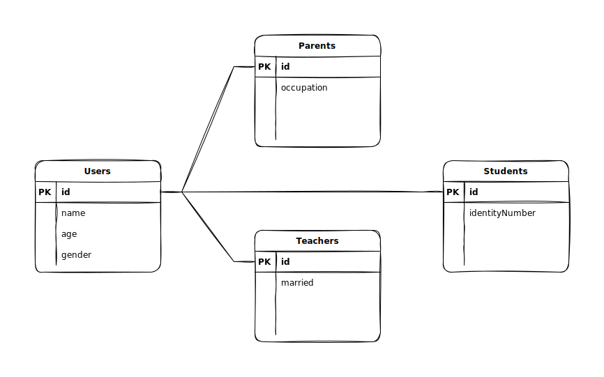
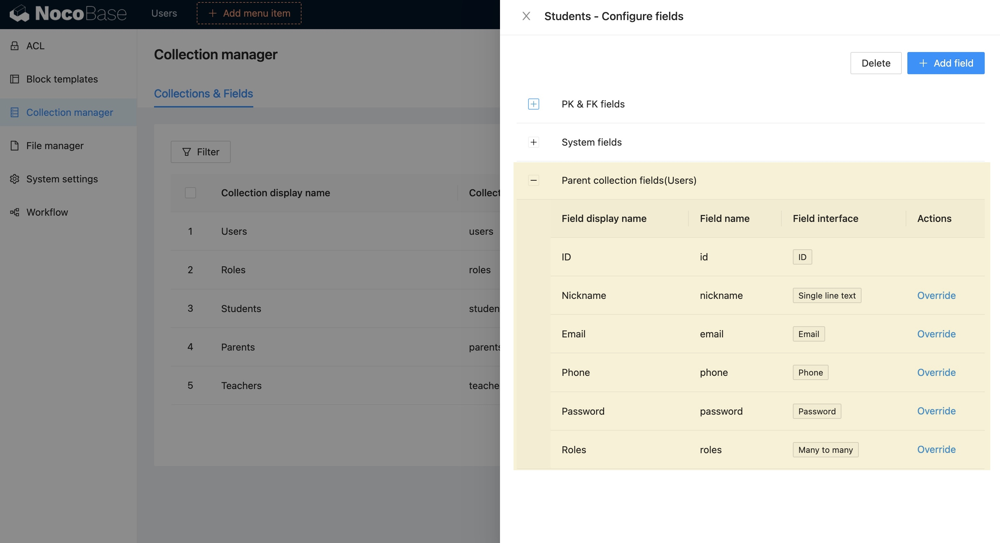
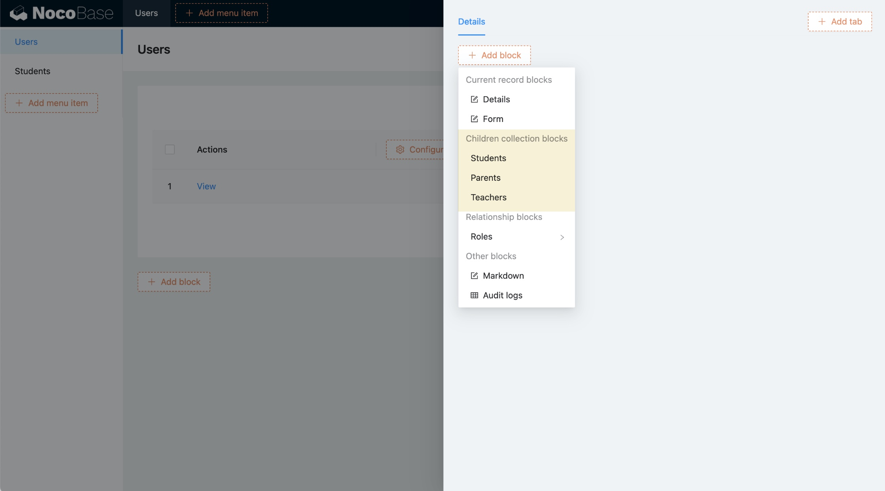
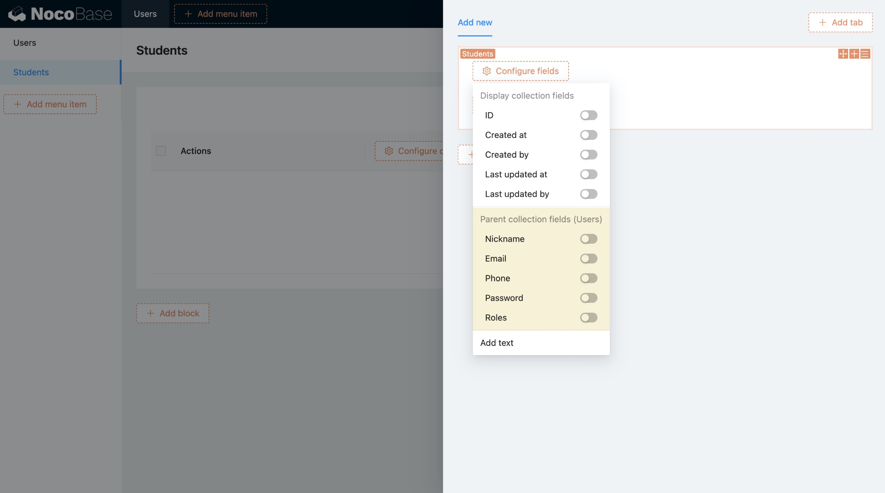

# v0.8.1: 数据表继承

数据表继承基于 [PostgreSQL 的 INHERITS 语法](https://www.postgresql.org/docs/current/tutorial-inheritance.html) 实现，仅限于 PostgreSQL 数据库安装的 NocoBase 时才会提供。

## 示例

我们从一个例子开始，假设要做一个教学系统，有三类用户：学生、家长和老师。

如果没有继承，要分别为三类用户建表：

- 学生：姓名、年龄、性别、身份证
- 家长：姓名、年龄、性别、职业、学历
- 老师：姓名、年龄、性别、教龄、已婚

有了数据表继承之后，共同的信息就可以提炼出来：

- 用户：姓名、年龄、性别
- 学生：身份证
- 家长：职业、学历
- 老师：教龄、已婚

ER 图如下：



注：子表 ID 和父表 ID 共享序列

## 配置数据表继承

Inherits 字段选择需要继承的数据表


通过代码配置如下：

```ts
db.collection({
  name: 'users',
});

db.collection({
  name: 'students',
  inherits: 'users',
});
```

注意：

- 继承的表并不能随意选择，主键必须是唯一序列，比如 uuid 或者所有继承线路上的表的 id 自增序列都用同一个
- Inherits 参数不能被编辑
- 如果有继承关系，被继承的父表不能被删除

## 数据表字段列表

字段列表里同步显示继承的父表字段，父表字段不可以修改，但可以重写（Override）



重写父表字段的注意事项：
- 子表字段标识与父表字段一样时为重写
- 重写字段的类型必须保持一致
- 关系字段除了 target collection 以外的其他参数需要保持一致

## 父表的子表区块

在父表区块里可以配置子表的区块



## 新增继承的父表字段的配置

当有继承的父表时，配置字段时，会提供从父表继承的字段的配置


