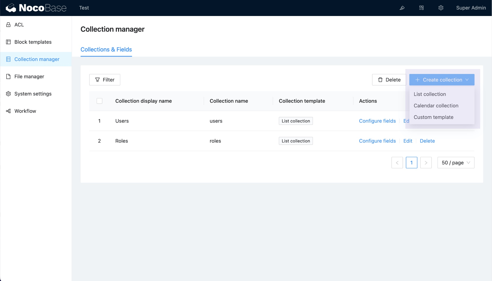

# v0.8.1: Collection 模板



## 为什么需要 Collection 模板？

待补充

## 配置参数说明

```ts
interface ICollectionTemplate {
  name: string;
  title?: string;
  /** 排序 */
  order?: number;
  /** 默认配置 */
  default?: CollectionOptions;
  /** UI 可配置的 CollectionOptions 参数（添加或编辑的 Collection 表单的字段） */
  configurableProperties?: Record<string, ISchema>;
  /** 当前模板可用的字段类型 */
  availableFieldInterfaces?: AvailableFieldInterfacesInclude | AvailableFieldInterfacesExclude;
}

interface AvailableFieldInterfacesInclude {
  include?: any[];
}

interface AvailableFieldInterfacesExclude {
  exclude?: any[];
}

interface CollectionOptions {
  /** 
   * 自动生成 id
   * @default true
   * */
  autoGenId?: boolean;
  /** 创建人 */
  createdBy?: boolean;
  /** 最后更新人 */
  updatedBy?: boolean;
  /** 创建日期 */
  createdAt?: boolean;
  /** 更新日期 */
  updatedAt?: boolean;
  /** 可排序 */
  sortable?: boolean;
  /* 树结构 */
  tree?: string;
  /* 日志 */
  logging?: boolean;
  /** 继承 */
  inherits: string | string[];
  /* 字段列表 */
  fields?: FieldOptions[];
}
```

## 示例

创建时都不需要 autoGenId，并且只提供 title 和 name 配置项

```ts
import { collectionConfigurableProperties } from '@nocobase/client';

{
  default: {
    autoGenId: false,
    fields: [],
  },
  configurableProperties: {
    ...collectionConfigurableProperties('name', 'title'),
  },
}
```

完整插件示例参考：[samples/custom-collection-template](https://github.com/nocobase/nocobase/tree/feat/collection-templates/packages/samples/custom-collection-template)

