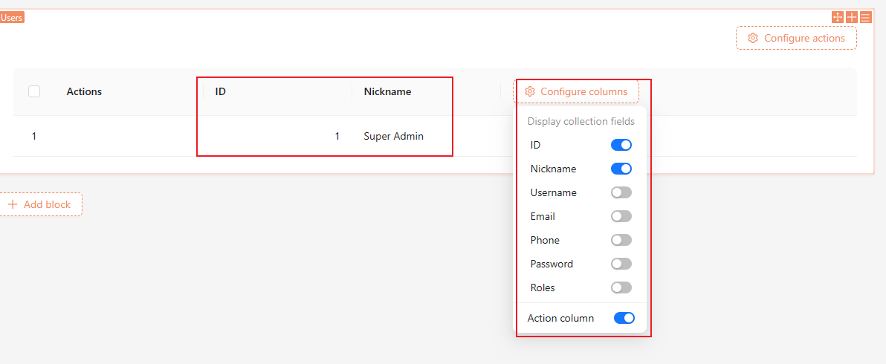

# DataBlockProvider

## Block Types

Blocks are divided into simple blocks and blocks that contain various data.

### Simple Blocks

Simple blocks, such as Markdown blocks.


It only has text content and no other complex data. The text content is stored in the `schema` and not in the database.

```json {5}| pure
{
  "type": "void",
  "x-component": "Markdown.Void",
  "x-component-props": {
    "content": "markdown content"
  },
}
```

### Data Blocks

Data blocks refer to blocks whose data is stored in server-side database tables, such as the Table component.



The field information and list data in the Table component are stored in the database.


## Introduction to DataBlockProvider

To facilitate the management of data in data blocks, we provide the `DataBlockProvider` component, which encapsulates the following components:

- `DataBlockProvider`: Encapsulates all the components below and provides block properties
  - [CollectionProvider](/core/data-source/collection-provider) / [AssociationProvider](/core/data-source/association-provider): Queries the corresponding data table data and relationship field information based on the context information provided by `DataBlockProvider` and passes them on
  - [BlockResourceProvider](/core/data-block/data-block-resource-provider): Constructs the block [Resource](/core/request) API based on the context information provided by `DataBlockProvider`, used for CRUD operations on block data
  - [BlockRequestProvider](/core/data-block/data-block-request-provider): Automatically calls `resource.get()` or `resource.list()` provided by `BlockResourceProvider` based on the context information provided by `DataBlockProvider`, retrieves block data, and passes it on
    - [CollectionRecordProvider](/core/data-source/record-provider): For the `resource.get()` scenario, it automatically nests `CollectionRecordProvider` and passes the `resource.get()` request result down. For the `resource.list()` scenario, you need to use `CollectionRecordProvider` to provide data records manually.

```tsx | pure
const DataBlockProvider = (props) => {
  return <DataBlockContext.Provider>
    <CollectionDataSourceProvider>
      <CollectionProvider> / <AssociationProvider>
        <BlockResourceProvider>
          <BlockRequestProvider>
            {action !== 'list' && <CollectionRecordProvider record={blocRequest.data}>
              {props.children}
            </Record>}
          </BlockRequestProvider>
        </BlockResourceProvider>  / </AssociationProvider>
      </CollectionProvider>
    </CollectionDataSourceProvider>
  </DataBlockContext.Provider>
}
```

The above components are encapsulated inside the `DataBlockProvider`, and you only need to use `DataBlockProvider` to obtain the above data.

### Usage

It is mainly used in the schema `x-decorator` of the block, for example:

```js {5}| pure
{
  type: 'void',
  name: 'hello-block',
  'x-component': 'CardItem',
  'x-decorator': 'DataBlockProvider',
  'x-decorator-props': {
    collection: 'users',
    dataSource: 'main',
    action: 'list',
    tableProps: {
      bordered: true,
    }
  },
  'x-use-decorator-props': 'useDynamicDataBlockProps',
}
```

### Complete Example

<code src="./demos/data-block-provider/complete-demo.tsx"></code>

## Properties

### Static Properties and Dynamic Properties

- The `x-decorator-props` in the schema is called static properties, which is a plain object that records the configuration information of the block.
- The properties in `x-use-decorator-props` in the schema are called dynamic properties, which is a React hook that can be used to obtain data such as the ID on the URL or the context data of the parent.

When both exist, they will be deeply merged and used as properties of `DataBlockProvider`.

### Property Details

```ts | pure
interface AllDataBlockProps {
  collection?: string;
  association?: string;
  sourceId?: string | number;
  record?: Record;
  action?: 'list' | 'get';
  filterByTk?: string;
  params?: Record<string, any>;
  parentRecord?: Record;
  [index: string]: any;
}
```

- collection (`x-decorator-props`): The table name of the block's collection, used to retrieve the field information and block data of the block.
- association (`x-decorator-props`): The name of the relationship field of the block, used to retrieve the relationship field information and data of the block.
- dataSource (`x-decorator-props`): The data source, refer to [Data Modeling](https://docs.nocobase.com/manual/data-modeling) for details.
- action (`x-decorator-props`): The request type of the block, either `list` or `get`.
- params (`x-decorator-props` and `x-use-decorator-props`): The request parameters of the block, exist in both `x-decorator-props` and `x-use-decorator-props`.
- filterByTk (`x-use-decorator-props`): Equivalent to `params.filterByTk`, can be understood as `id`, used to retrieve a single data.
- sourceId (`x-use-decorator-props`): The sourceId of the block, used in conjunction with `association` to retrieve the relationship field data of the block.
- record (`x-use-decorator-props`): When provided, the `record` will be used as the data of the block instead of making a request.
- parentRecord (`x-use-decorator-props`): When provided, the `parentRecord` will be used as the table data of the relationship field instead of making a request.

```tsx | pure
const DataBlockProvider = (props) => {
  return <DataBlockContext.Provider value={props}>
    <CollectionDataSourceProvider>
      <CollectionProvider name={props.collection}> / <CollectionProvider name={props.association}>
          <BlockResourceProvider {...props}>
            <BlockRequestProvider resource={resource}>
              {action !== 'list' && <CollectionRecordProvider record={blocRequest.data}>
                {props.children}
              </Record>}
            </BlockRequestProvider>
          </BlockResourceProvider>
        </CollectionProvider>
    </CollectionDataSourceProvider>
  </DataBlock.Provider>
}
```

### Property Combinations and Scenarios

These properties have 8 different combinations based on different scenarios:

- collection
  - Create: `collection`
  - Get a single data: `collection` + `action: get` + `params`
  - Get a list of data: `collection` + `action: list` + `params`
  - Use `record` as data: `collection` + `record`

For *Get a single data* and *Get a list of data*, `params` is optional.

- association
  - Create: `association` + `sourceId`
  - Get a single data: `association` + `sourceId` + `action: get` + `params` + `parentRecord`
  - Get a list of data: `association` + `sourceId` + `action: list` + `params` + `parentRecord`
  - Use `record` as data: `association` + `sourceId` + `record` + `parentRecord`

For *Get a single data* and *Get a list of data*, `params` and `parentRecord` are optional. If `parentRecord` is not provided, it will query the corresponding `collection` based on the `association`, and then query the corresponding `parentRecord` based on the `collection`.

### Property Access and Modification

#### useDataBlock()

Used to access and modify the properties of `DataBlockProvider`.

- Type

```tsx | pure
const { props, dn } = useDataBlock<{ tableProps: { bordered?: boolean } }>();

// get
const checked = props.tableProps.bordered;

// change
dn.deepMerge({
  'x-decorator-props': {
    tableProps: {
      bordered: !checked,
    },
  },
});
```

#### useDataBlockProps()

Equivalent to `useDataBlock().props`.

```tsx | pure
const props = useDataBlockProps<{ tableProps: { bordered?: boolean } }>();

const checked = props.tableProps.bordered;
```

## Example

### collection

#### Table list

<code src="./demos/data-block-provider/collection-table-list.tsx"></code>

#### Form get & update

<code src="./demos/data-block-provider/collection-form-get-and-update.tsx"></code>

#### Form create

<code src="./demos/data-block-provider/collection-form-create.tsx"></code>

#### Form record & update

<code src="./demos/data-block-provider/collection-form-record-and-update.tsx"></code>

### association

association is similar to collection, but it requires providing `sourceId`. Let's take `Table list` as an example.

#### Table list & sourceId

<code src="./demos/data-block-provider/association-table-list-and-source-id.tsx"></code>

#### Table list & parentRecord

If `sourceId` is not provided, `parentRecord` needs to be provided. Let's take `Table list` as an example.

<code src="./demos/data-block-provider/association-table-list-and-parent-record.tsx"></code>

