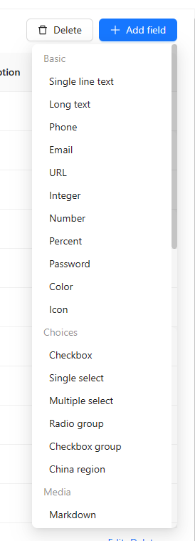

# CollectionFieldInterface

Used to create data fields.



```ts
class CollectionFieldInterface {
  app: Application;
  collectionManager: CollectionManager;

  name: string;
  group: string;
  title?: string;
  description?: string;
  order?: number;
  default?: {
    type: string;
    uiSchema?: ISchema;
    [key: string]: any;
  };
  sortable?: boolean;
  availableTypes?: string[];
  hasDefaultValue?: boolean;
  isAssociation?: boolean;
  operators?: any[];
  filterable?: {
    operators?: any[];
    children?: any[];
    [key: string]: any;
  };
  titleUsable?: boolean;

  validateSchema(fieldSchema: ISchema): Record<string, ISchema>
  usePathOptions(field: CollectionFieldOptions): any
  schemaInitialize(schema: ISchema, data: any): void
}
```

It needs to be used in conjunction with [CollectionManager](./collection-field-interface-manager.md).

```ts
class EmailFieldInterface extends CollectionFieldInterface {
  name = 'email';
  type = 'object';
  group = 'basic';
  order = 4;
  title = '{{t("Email")}}';
  sortable = true;
  // ...
}

class MyPlugin extends Plugin {
  load() {
    this.app.dataSourceManager.addFieldInterfaces([ EmailFieldInterface ]);
  }
}
```

## Instance Properties

### name

Unique identifier.

### group

Group.

### title

Title.

### default

Configure the default value field schema for the form.


## Instance Methods

### collectionFieldInterface.validateSchema(fieldSchema)


### collectionFieldInterface.usePathOptions(field: CollectionFieldOptions)


### collectionFieldInterface.schemaInitialize(schema: ISchema, data: any)

