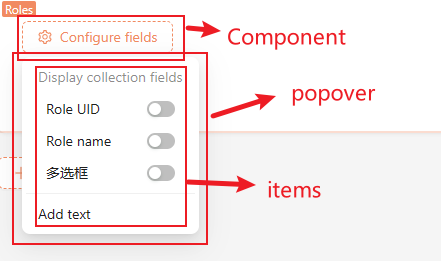

# SchemaInitializer

## new SchemaInitializer(options)

```tsx | pure
interface SchemaInitializerOptions<P1 = ButtonProps, P2 = {}> {
  Component?: ComponentType<P1>;
  componentProps?: P1;
  style?: React.CSSProperties;
  title?: string;
  icon?: ReactNode;

  items?: SchemaInitializerItemType[];
  ItemsComponent?: ComponentType<P2>;
  itemsComponentProps?: P2;
  itemsComponentStyle?: React.CSSProperties;

  insertPosition?: 'beforeBegin' | 'afterBegin' | 'beforeEnd' | 'afterEnd';
  designable?: boolean;
  wrap?: (s: ISchema) => ISchema;
  onSuccess?: (data: any) => void;
  insert?: InsertType;
  useInsert?: () => InsertType;

  popover?: boolean;
  popoverProps?: PopoverProps;
}

class SchemaInitializer<P1 = ButtonProps, P2 = {}> {
    constructor(options: SchemaInitializerOptions<P1, P2> & { name: string }): SchemaInitializer<P1, P2>;
    add(name: string, item: Omit<SchemaInitializerItemType, 'name'>): void
    get(nestedName: string): SchemaInitializerItemType | undefined
    remove(nestedName: string): void
}
```

### Details



- name: Unique identifier, required
- Component related

  - Component: Trigger component, default is `Button` component
  - componentProps: Component properties, default is `ButtonProps`
  - title: Button text
  - icon: Button icon property
  - style: Component style
- Items related

  - items: List item configuration
  - ItemsComponent: By default, it is rendered as a list. Customize items with this parameter
  - itemsComponentProps: Properties of `ItemsComponent`
  - itemsComponentStyle: Style of `ItemsComponent`
- Popover component related

  - popover: Whether to use popover, default is `true`
  - popoverProps: Properties of popover
- Schema operation related

  - insertPosition: Insertion position, refer to: [useDesignable()](/core/ui-schema/designable#usedesignable)
  - designable: Whether to display design mode, refer to: [useDesignable()](/core/ui-schema/designable#usedesignable)
  - wrap: Secondary processing of Schema, refer to: [useDesignable()](/core/ui-schema/designable#usedesignable)
  - onSuccess: Callback after Schema is updated to the server, refer to: [useDesignable()](/core/ui-schema/designable#usedesignable)
  - insert: Custom Schema insertion logic, default is [useDesignable()](/core/ui-schema/designable#usedesignable)'s `insertAdjacent`
  - useInsert: When customizing the logic for inserting Schema requires the use of Hooks, this parameter can be used

### Example

#### 基础用法

```tsx | pure
const myInitializer = new SchemaInitializer({
  name: 'myInitializer',
  title: 'Add Block',
  insertPosition: 'beforeEnd',
  items: [
    {
      name: 'a',
      title: 'Item A',
      Component: Demo,
    },
  ],
});
```
<code src="./demos/schema-initializer-basic.tsx"></code>

#### Custom `Component`

```tsx | pure
const myInitializer = new SchemaInitializer({
  name: 'myInitializer',
  Component: (props) => (
    <Avatar style={{ cursor: 'pointer' }} {...props}>
      C
    </Avatar>
  ),
  componentProps: {
    size: 'large',
  },
  items: [
    {
      name: 'a',
      title: 'Item A',
      Component: Demo,
    }
  ],
});
```

<code src="./demos/schema-initializer-component.tsx"></code>

#### Not Using Popover

Please refer to [useDesignable](/core/ui-schema/designable#usedesignable) for more information about `useDesignable()`.

```tsx | pure
const schema = {
  type: 'void',
  title: Math.random(),
  'x-component': 'Hello',
};
const MyInitializerComponent = () => {
    const { insertBeforeEnd } = useDesignable();
    return <Button onClick={() => insertBeforeEnd(schema)}>Add block</Button>
}

const myInitializer = new SchemaInitializer({
  name: 'myInitializer',
  title: 'Add block',
  popover: false,
  Component: MyInitializerComponent,
});
```

<code src="./demos/schema-initializer-popover.tsx"></code>


#### Custom Items

```tsx | pure
const CustomListGridMenu: FC<SchemaInitializerItemsProps<ButtonProps, ListProps<any>>> = (props) => {
  const { items, options, ...others } = props;
  return (
    <List
      {...others}
      style={{ marginTop: 20 }}
      dataSource={items}
      grid={{ gutter: 16, column: 2 }}
      renderItem={(item) => (
        <List.Item style={{ minWidth: 100, textAlign: 'center' }}>
          <SchemaInitializerChild {...item} />
        </List.Item>
      )}
    ></List>
  );
};

const myInitializer = new SchemaInitializer({
  name: 'myInitializer',
  title: 'Button Text',
  ItemsComponent: CustomListGridMenu,
  items: [
    {
      name: 'a',
      title: 'Item A',
      Component: Demo,
    }
  ],
});
```

<code src="./demos/schema-initializer-items.tsx"></code>

## options.items

### Types

```tsx | pure
interface SchemaInitializerComponentCommonProps {
  title?: string;
  schema?: ISchema;
  style?: React.CSSProperties;
  className?: string;
}

interface SchemaInitializerItemBaseType<T = {}> extends SchemaInitializerComponentCommonProps {
  name: string;
  sort?: number;
  type?: string;
  Component?: string | ComponentType<T>;
  componentProps?: Omit<T, 'children'>;
  useComponentProps?: () => Omit<T, 'children'>;
  useVisible?: () => boolean;
  children?: SchemaInitializerItemType[];
  useChildren?: () => SchemaInitializerItemType[];
  [index: string]: any;
}
```

### Two ways to define: `Component` and `type`

- `Component` param

```tsx | pure

const Demo = () => {
  return <SchemaInitializerItem title='Demo' />
}

const myInitializer = new SchemaInitializer({
  name: 'myInitializer',
  items: [
    {
      name: 'a',
      Component: Demo,
    }
  ],
});
```

- `type` param

NocoBase has built-in some common `type`s. For example, `type: 'item'` is equivalent to `Component: SchemaInitializerItem`.

For more built-in types, please refer to: [Built-in Components and Types](/core/ui-schema/schema-initializer#%E5%86%85%E7%BD%AE%E7%BB%84%E4%BB%B6%E5%92%8C%E7%B1%BB%E5%9E%8B)

```tsx | pure
const myInitializer = new SchemaInitializer({
  name: 'myInitializer',
  items: [
    {
      name: 'a',
      type: 'item',
      title: 'Demo'
    }
  ],
});
```

<code src="./demos/schema-initializer-options-item-define.tsx"></code>

### `children` and dynamic `useChildren`

For some components that have child items, such as `type: 'itemGroup'`, we use the `children` property. However, in certain scenarios where the children are dynamic and need to be obtained from hooks, we can define them using `useChildren`.

<code src="./demos/schema-initializer-options-item-children.tsx"></code>

### Dynamic visibility with `useVisible`

<code src="./demos/schema-initializer-options-item-visible.tsx"></code>

### Component properties `componentProps` and dynamic properties `useComponentProps`

For some common components, we can define component properties using `componentProps`. In certain scenarios where the component properties are dynamic and need to be obtained from hooks, we can define them using `useComponentProps`.

Of course, you can also encapsulate them into a component and define them using the `Component` property.

<code src="./demos/schema-initializer-options-item-props.tsx"></code>

### Common properties and component properties

```tsx | pure
{
  name: 'demo',
  title: 'Demo',
  foo: 'bar',
  Component: Demo,
  componentProps: {
    zzz: 'xxx',
  },
}
```

From the above example, we can see that there are two ways to obtain the data required by the component from the configuration:

- Component properties: defined through `componentProps`, for example `zzz: 'xxx'`
- Common properties: directly defined on the configuration item, for example `foo: 'bar'`, `name`, `title`

In terms of retrieval:

- Data defined in `componentProps` will be passed to the component's `props`
- Data directly defined on the configuration item needs to be obtained through [useSchemaInitializerItem()](/core/ui-schema/schema-initializer#useschemainitializeritem)

```tsx | pure
const Demo = (props) => {
  console.log(props); // { zzz: 'xxx' }
  const { foo } = useSchemaInitializerItem(); // { foo: 'bar' }
}
```

## Methods

```tsx | pure
const myInitializer = new SchemaInitializer({
  name: 'myInitializer',
  title: 'Button Text',
  items: [
    {
      name: 'a',
      title: 'item a',
      type: 'itemGroup',
      children: [
          {
              name: 'a1',
              title: 'item a1',
          }
      ],
    },
  ],
});
```

```tsx
import { SchemaInitializer, Application, useSchemaInitializerRender } from '@nocobase/client';
const myInitializer = new SchemaInitializer({
  name: 'myInitializer',
  title: 'Button Text',
  items: [
    {
      name: 'a',
      title: 'item a',
      type: 'itemGroup',
      children: [
          {
              name: 'a1',
              title: 'item a1',
              type: 'item',
          }
      ],
    },
  ],
});

const Root = () => {
  const { render } = useSchemaInitializerRender('myInitializer');
  return render();
}
const app = new Application({
  schemaInitializers: [myInitializer],
  providers: [Root],
  designable: true,
});

export default app.getRootComponent();
```

### schemaInitializer.add()

Used to add a new item. Another way to add items is through [schemaInitializerManager.addItem()](/core/ui-schema/schema-initializer-manager#schemainitializermanageradditem);

- Type

```tsx | pure
class SchemaInitializer {
    add(name: string, item: Omit<SchemaInitializerItemType, 'name'>): void
}
```

- params

The first parameter is `name`, which serves as a unique identifier for adding, deleting, modifying, and querying. The `name` also supports `.` as a delimiter for hierarchical separation.

- Example

```tsx | pure
myInitializer.add('b', {
    type: 'item',
    title: 'item b',
})

myInitializer.add('a.a2', {
    type: 'item',
    title: 'item a2',
})
```

```tsx
import { SchemaInitializer, Application, useSchemaInitializerRender } from '@nocobase/client';
const myInitializer = new SchemaInitializer({
  name: 'myInitializer',
  title: 'Button Text',
  items: [
    {
      name: 'a',
      title: 'item a',
      type: 'itemGroup',
      children: [
          {
              name: 'a1',
              title: 'item a1',
              type: 'item',
          }
      ],
    },
  ],
});

myInitializer.add('b', {
    type: 'item',
    title: 'item b',
})

myInitializer.add('a.a2', {
    type: 'item',
    title: 'item a2',
})

const Root = () => {
  const { render } = useSchemaInitializerRender('myInitializer');
  return render();
}
const app = new Application({
  schemaInitializers: [myInitializer],
  providers: [Root],
  designable: true,
});


export default app.getRootComponent();
```


### schemaInitializer.get()

- Type

```tsx | pure
class SchemaInitializer {
    get(nestedName: string): SchemaInitializerItemType | undefined
}
```

- Example

```tsx | pure
const itemA = myInitializer.get('a')

const itemA1 = myInitializer.add('a.a1')
```

### schemaInitializer.remove()

Another way to remove items can be found in [schemaInitializerManager.addItem()](/core/ui-schema/schema-initializer-manager#schemainitializermanagerremoveitem);

- Type

```tsx | pure
class SchemaInitializer {
    remove(nestedName: string): void
}
```

- Example

```tsx | pure
myInitializer.remove('a.a1')

myInitializer.remove('a')
```

## Hooks

### useSchemaInitializer()

Used to retrieve the context content of `SchemaInitializer`.

- Type

```tsx | pure
export type InsertType = (s: ISchema) => void;

const useSchemaInitializer: () => {
    insert: InsertType;
    options: SchemaInitializerOptions<any>;
    visible?: boolean;
    setVisible?: (v: boolean) => void;
}
```

- Parameter Details
  - `insert`: The parameter is a Schema object used to insert the Schema.
  - `options`: The options configuration when obtaining `new SchemaInitializer(options)`.
  - `visible`: Whether the popover is displayed.
  - `setVisible`: Sets the visibility status of the popover.

- Example

```tsx | pure
const schema = {
  type: 'void',
  'x-component': 'Hello',
}
const Demo = () => {
    const { insert } = useSchemaInitializer();
     const handleClick = () => {
      insert(schema);
    };
    return  <SchemaInitializerItem title={'Demo'} onClick={handleClick}></SchemaInitializerItem>;
}
```

### useSchemaInitializerRender()

Used to render `SchemaInitializer`.

- Type

```tsx | pure
function useSchemaInitializerRender(name: string, options?: SchemaInitializerOptions): {
    exists: boolean;
    render: (props?: SchemaInitializerOptions) => React.FunctionComponentElement;
}
```

- Details

The returned `render` method can accept a parameter to override the `options` configuration of `new SchemaInitializer(options)`.

- Example

```tsx | pure
const Demo = () => {
    const filedSchema = useFieldSchema();
    const { render } = useSchemaInitializerRender(fieldSchema['x-initializer'], fieldSchema['x-initializer-props']);
    return <div>
        <div>{ render() }</div>
        <div>可以进行参数的二次覆盖：{ render({ style: { color: 'red' } }) }</div>
    </div>
}
```

<code src="./demos/schema-initializer-render.tsx"></code>

### useSchemaInitializerItem()

Used to retrieve the content of a configuration item, where the configuration item refers to one item in the `items` property of `SchemaInitializer`.

- Type

```tsx | pure
const useSchemaInitializerItem: <T = any>() => T
```

- Example

```tsx | pure
const myInitializer = new SchemaInitializer({
  name: 'myInitializer',
  title: 'Button Text',
  items: [
    {
      name: 'a',
      title: 'Item A',
      foo: 'bar',
      Component: Demo,
    },
  ],
});

/**
 * The result obtained through useSchemaInitializerItem() is
 *  {
 *    name: 'a',
 *    title: 'Item A',
 *    foo: 'bar',
 *    Component: Demo,
 * }
 */
const Demo = () => {
  const { title, foo } = useSchemaInitializerItem();
  return <div>{ title } - { foo }</div>
}
```

<code src="./demos/schema-initializer-hooks-item.tsx"></code>

## Built-in Components and Types

| type        | Component                      |                                       |
| ----------- | ------------------------------ | ----------------------------------------- |
| item        | SchemaInitializerItem            | Text |
| itemGroup   | SchemaInitializerItemGroup       | Group, similar to antd `Menu` component with `type: 'group'`      |
| subMenu     | SchemaInitializerSubMenu         | Submenu, similar to antd `Menu` component's submenu              |
| divider     | SchemaInitializerDivider         | Divider, similar to antd `Menu` component with `type: 'divider'` |
| switch      | SchemaInitializerSwitch      | Switch                                      |
| actionModal      | SchemaInitializerActionModal      | Modal|

The following examples provide two [definition methods](/core/ui-schema/schema-initializer#two-ways-to-define-component-and-type), one is defined through `Component`, and the other is defined through `type`.

### `type: 'item'` & `SchemaInitializerItem`

Text。

```tsx | pure
interface SchemaInitializerItemProps {
  style?: React.CSSProperties;
  className?: string;
  name?: string;
  icon?: React.ReactNode;
  title?: React.ReactNode;
  items?: SchemaInitializerItemType[];
  onClick?: (args?: any) => any;
}
```

The core parameters are `title`, `icon`, `onClick`, and `items`. Among them, `onClick` is used to insert Schema, and `items` is used to render child list items.

<code src="./demos/schema-initializer-components-item.tsx"></code>

### `type: 'itemGroup'` & SchemaInitializerItemGroup

分组。

```tsx | pure
interface SchemaInitializerItemGroupProps {
  name: string;
  title: string;
  children?: SchemaInitializerOptions['items'];
  divider?: boolean;
}
```

The core parameters are `title`, `children`, and `divider`. Among them, `children` is used to render child list items, and `divider` is used to render a divider.

<code src="./demos/schema-initializer-components-group.tsx"></code>

### `type: 'switch'` & SchemaInitializerSwitch

Switch Button.

```tsx | pure
interface SchemaInitializerSwitchItemProps extends SchemaInitializerItemProps {
  checked?: boolean;
  disabled?: boolean;
}
```

The core parameters are `checked` and `onClick`, where `onClick` is used to insert or remove Schema.

<code src="./demos/schema-initializer-components-switch.tsx"></code>

### `type: 'subMenu'` &  SchemaInitializerSubMenu

Sub menu.

<code src="./demos/schema-initializer-components-menu.tsx"></code>

### `type: 'divider'` & SchemaInitializerDivider

<code src="./demos/schema-initializer-components-divider.tsx"></code>

### `type: 'actionModal'` &  SchemaInitializerActionModal

#### Component Mode

<code src="./demos/schema-initializer-components-action-modal-1.tsx"></code>

#### Item Mode

`SchemaInitializerActionModal` needs to add the `isItem` property.

<code src="./demos/schema-initializer-components-action-modal-2.tsx"></code>

## Render Components

### SchemaInitializerChildren

Used to customize the rendering of multiple list items.

```tsx | pure

const Demo = ({ children }) => {
  // children: [{ name: 'a1', Component: ItemA1 }, { name: 'a2', type: 'item', title: 'ItemA2' }]
  return <SchemaInitializerChildren>{ children }</SchemaInitializerChildren>
}

const myInitializer = new SchemaInitializer({
  name: 'myInitializer',
  title: 'Button Text',
  items: [
    {
      name: 'test',
      Component: Demo,
      children: [
        {
          name: 'a1',
          Component: ItemA1,
        },
        {
          name: 'a2',
          type: 'item',
          title: 'ItemA2',
        }
      ]
    }
  ],
});
```

### SchemaInitializerChild

Used to customize the rendering of individual list items.

```tsx | pure
const Demo = (props) => {
  return <SchemaInitializerChild {...props}/>
}
```
