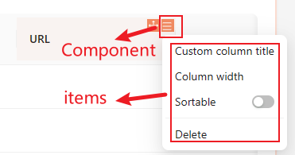

# SchemaSettings

## new SchemaSettings(options)

创建一个 SchemaSettings 实例。

```tsx | pure
interface SchemaSettingsOptions<T = {}> {
  name: string;
  Component?: ComponentType<T>;
  componentProps?: T;
  style?: React.CSSProperties;

  items: SchemaSettingsItemType[];
}

class SchemaSettings<T = {}>{
    constructor(options: SchemaSettingsOptions<T>): SchemaSettings<T>;
    add(name: string, item: Omit<SchemaSettingsItemType, 'name'>): void
    get(nestedName: string): SchemaSettingsItemType | undefined
    remove(nestedName: string): void
}
```

### 详细解释



- name：唯一标识，必填
- Component 相关

  - Component：触发组件，默认是 `<MenuOutlined />` 组件
  - componentProps: 组件属性
  - style：组件的样式
- items：列表项配置

### 示例

#### 基础用法

```tsx | pure
const mySchemaSettings = new SchemaSettings({
  name: 'MySchemaSettings',
  items: [
    {
      name: 'demo1', // 唯一标识
      type: 'item', // 内置类型
      componentProps: {
        title: 'DEMO1',
        onClick() {
          alert('DEMO1');
        },
      },
    },
    {
      name: 'demo2',
      Component: () => <SchemaSettings.Item title="DEMO2" onClick={() => alert('DEMO2')} />, // 直接使用 Component 组件
    },
  ],
});
```

#### 定制化 `Component`

```tsx | pure
const mySchemaSettings = new SchemaSettings({
  name: 'MySchemaSettings',
  Component: Button, // 自定义组件
  componentProps: {
    type: 'primary',
    children: '自定义按钮',
  },
  // Component: (props) => <Button type='primary' {...props}>自定义按钮</Button>, // 等同于上面效果
  items: [
    {
      name: 'demo1',
      type: 'item',
      componentProps: {
        title: 'DEMO',
      },
    },
  ],
});
```

## options.items 配置详解

```tsx | pure
interface SchemaSettingsItemCommon<T = {}> {
  name: string;
  sort?: number;
  type?: string;
  Component: string | ComponentType<T>;
  useVisible?: () => boolean;
  children?: SchemaSettingsItemType[];
  useChildren?: () => SchemaSettingsItemType[];
  checkChildrenLength?: boolean;
  componentProps?: Omit<T, 'children'>;
  useComponentProps?: () => Omit<T, 'children'>;
}
```

### 两种定义方式：`Component` 和 `type`


- 通过 `Component` 定义

```tsx | pure

const Demo = () => {
  // 最终渲染 `SchemaSettingsItem`
  return <SchemaSettingsItem title='Demo' />
}

const mySettings = new SchemaSettings({
  name: 'mySettings',
  items: [
    {
      name: 'a',
      Component: Demo, // 通过 Component 定义
    }
  ],
});
```

- 通过 `type` 定义

NocoBase 内置了一些常用的 `type`，例如 `type: 'item'`，相当于 `Component: SchemaSettingsItem`。

更多内置类型，请参考：[内置组件和类型](/core/ui-schema/schema-settings#%E5%86%85%E7%BD%AE%E7%BB%84%E4%BB%B6%E5%92%8C%E7%B1%BB%E5%9E%8B)

```tsx | pure
const mySettings = new SchemaSettings({
  name: 'mySettings',
  items: [
    {
      name: 'a',
      type: 'item',
      componentProps: {
        title: 'Demo',
      },
    }
  ],
});
```

<code src="./demos/schema-settings-options-item-define.tsx"></code>

### `children` 和动态方式 `useChildren`

对于某些组件而言是有子列表项的，例如 `type: 'itemGroup'`，那么我们使用 children 属性，同时考虑到某些场景下 children 是动态的，需要从 Hooks 里面获取，那么就可以通过 `useChildren` 来定义。

<code src="./demos/schema-settings-options-item-children.tsx"></code>

### 动态显示隐藏 `useVisible`

<code src="./demos/schema-settings-options-item-visible.tsx"></code>

### 组件属性 `componentProps` 和动态属性 `useComponentProps`

对于一些通用组件，我们可以通过 `componentProps` 来定义组件属性，同时考虑到某些场景下组件属性是动态的，需要从 Hooks 里面获取，那么就可以通过 `useComponentProps` 来定义。

当然也可以不使用这两个属性，直接封装成一个组件，然后通过 `Component` 来定义。

<code src="./demos/schema-settings-options-item-props.tsx"></code>

## 实例方法

```tsx | pure
const mySchemaSettings = new SchemaSettings({
  name: 'MySchemaSettings',
  items: [
    {
      name: 'a',
      type: 'itemGroup',
      componentProps: {
        title: 'item a'
      },
      children: [
          {
              name: 'a1',
              title: 'item a1',
          }
      ],
    },
  ],
});
```

### schemaSettings.add()

用于新增 Item。

- 类型

```tsx | pure
class SchemaSettings {
    add(name: string, item: Omit<SchemaSettingsItemType, 'name'>): void
}
```

- 参数说明

第一个参数是 name，作为唯一标识，用于增删改查，并且 `name` 支持 `.` 用于分割层级。

- 示例

```tsx | pure
mySchemaSetting.add('b', {
    type: 'item',
    title: 'item b',
})

mySchemaSetting.add('a.a2', {
    type: 'item',
    title: 'item a2',
})
```

### schemaSettings.get()

- 类型

```tsx | pure
class SchemaSettings {
    get(nestedName: string): SchemaSettingsItemType| undefined
}
```

- 示例

```tsx | pure
const itemA = mySchemaSetting.get('a')

const itemA1 = mySchemaSetting.add('a.a1')
```

### schemaSettings.remove()

- 类型

```tsx | pure
class SchemaSettings {
    remove(nestedName: string): void
}
```

- 示例

```tsx | pure
mySchemaSetting.remove('a.a1')

mySchemaSetting.remove('a')
```

## Hooks

### useSchemaSettingsRender()

用于渲染 SchemaSettings。

- 类型

```tsx | pure
function useSchemaSettingsRender(name: string, options?: SchemaSettingsOptions): {
    exists: boolean;
    render: (options?: SchemaSettingsRenderOptions) => React.ReactElement;
}
```

- 示例

```tsx | pure
const Demo = () => {
    const filedSchema = useFieldSchema();
    const { render, exists } = useSchemaSettingsRender(fieldSchema['x-settings'], fieldSchema['x-settings-props'])
    return <div>
        <div>{ render() }</div>
        <div>可以进行参数的二次覆盖：{ render({ style: { color: 'red' } }) }</div>
    </div>
}
```

<code src="./demos/schema-settings-render.tsx"></code>

### useSchemaSettings()

获取 schemaSetting 上下文数据。

上下文数据包含了 `schemaSetting` 实例化时的 `options` 以及调用 `useSchemaSettingsRender()` 时传入的 `options`。

- 类型

```tsx | pure
interface UseSchemaSettingsResult<T> extends SchemaSettingsOptions<T> {
  dn?: Designable;
  field?: GeneralField;
  fieldSchema?: Schema;
}

function useSchemaSettings(): UseSchemaSettingsResult;
```

- 示例

```tsx | pure
const { dn } = useSchemaSettings();
```

### useSchemaSettingsItem()

用于获取一个 item 的数据。

- 类型

```tsx | pure
export type SchemaSettingsItemType<T = {}> = {
  name: string;
  type?: string;
  sort?: number;
  Component?: string | ComponentType<T>;
  componentProps?: T;
  useComponentProps?: () => T;
  useVisible?: () => boolean;
  children?: SchemaSettingsItemType[];
  [index]: any;
};

function useSchemaSettingsItem(): SchemaSettingsItemType;
```

- 示例

```tsx | pure
const { name } = useSchemaSettingsItem();
```

## 内置组件和类型

| type        | Component                      | 效果                                      |
| ----------- | ------------------------------ | ----------------------------------------- |
| item        | SchemaSettingsItem            | 文本                                      |
| itemGroup   | SchemaSettingsItemGroup       | 分组，同 Menu 组件的 `type: 'itemGroup'`      |
| subMenu     | SchemaSettingsSubMenu         | 子菜单，同 Menu 组件的子菜单              |
| divider     | SchemaSettingsDivider         | 分割线，同 Menu 组件的  `type: 'divider'` |
| remove      | SchemaSettingsRemove          | 删除，用于删除一个区块                    |
| select      | SchemaSettingsSelectItem      | 下拉选择                                  |
| cascader    | SchemaSettingsCascaderItem    | 级联选择                                  |
| switch      | SchemaSettingsSwitchItem      | 开关                                      |
| popup       | SchemaSettingsPopupItem       | 弹出层                                    |
| actionModal | SchemaSettingsActionModalItem | 操作弹窗                                  |
| modal       | SchemaSettingsModalItem       | 弹窗                                      |

### SchemaSettingsItem

文本，对应的 `type` 为 `item`。

```tsx | pure
interface SchemaSettingsItemProps extends Omit<MenuItemProps, 'title'> {
  title: string;
}
```

核心参数为 `title` 和 `onClick`，可以在 `onClick` 中修改 schema。

<code src="./demos/schema-settings-components-item.tsx"></code>

### SchemaSettingsItemGroup

分组，对应的 `type` 为 `itemGroup`。

核心参数是 `title`。

<code src="./demos/schema-settings-components-group.tsx"></code>

### SchemaSettingsSubMenu

子菜单，对应的 `type` 为 `subMenu`。

核心参数是 `title`。

<code src="./demos/schema-settings-components-sub-menu.tsx"></code>

### SchemaSettingsDivider

分割线，对应的 `type` 为 `divider`。

<code src="./demos/schema-settings-components-divider.tsx"></code>

### SchemaSettingsRemove

删除，对应的 `type` 为 `remove`。

```tsx | pure
interface SchemaSettingsRemoveProps {
  confirm?: ModalFuncProps;
  removeParentsIfNoChildren?: boolean;
  breakRemoveOn?: ISchema | ((s: ISchema) => boolean);
}
```

- `confirm`：删除前的确认弹窗
- `removeParentsIfNoChildren`：如果删除后没有子节点了，是否删除父节点
- `breakRemoveOn`：如果删除的节点满足条件，是否中断删除

<code src="./demos/schema-settings-components-remove.tsx"></code>

### SchemaSettingsSelectItem

选择器，对应的 `type` 为 `select`。

<code src="./demos/schema-settings-components-select.tsx"></code>

### SchemaSettingsCascaderItem

级联选择，对应的 `type` 为 `cascader`。

### SchemaSettingsSwitchItem

开关，对应的 `type` 为 `switch`。

<code src="./demos/schema-settings-components-switch.tsx"></code>

### SchemaSettingsModalItem

弹窗，对应的 `type` 为 `modal`。

```tsx | pure
export interface SchemaSettingsModalItemProps {
  title: string;
  onSubmit: (values: any) => void;
  initialValues?: any;
  schema?: ISchema | (() => ISchema);
  modalTip?: string;
  components?: any;
  hidden?: boolean;
  scope?: any;
  effects?: any;
  width?: string | number;
  children?: ReactNode;
  asyncGetInitialValues?: () => Promise<any>;
  eventKey?: string;
  hide?: boolean;
}
```

我们可以通过 `schema` 参数来定义弹窗的表单，然后在 `onSubmit` 中获取表单的值，然后修改当前 schema 节点。

<code src="./demos/schema-settings-components-modal.tsx"></code>

### SchemaSettingsActionModalItem

操作弹窗，对应的 `type` 为 `actionModal`。

其和 `modal` 的区别是，`SchemaSettingsModalItem` 弹窗会丢失上下文，而 `SchemaSettingsActionModalItem` 会保留上下文，简单场景下可以使用 `SchemaSettingsModalItem`，复杂场景下可以使用 `SchemaSettingsActionModalItem`。

```tsx | pure
export interface SchemaSettingsActionModalItemProps extends SchemaSettingsModalItemProps, Omit<SchemaSettingsItemProps, 'onSubmit' | 'onClick'> {
  uid?: string;
  initialSchema?: ISchema;
  schema?: ISchema;
  beforeOpen?: () => void;
  maskClosable?: boolean;
}
```

<code src="./demos/schema-settings-components-action-modal.tsx"></code>
