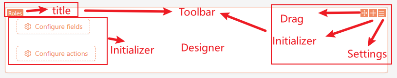

# SchemaToolbar



## Component

### SchemaToolbar Component

This is the default Toolbar component, which automatically renders the `SchemaSettings`, `SchemaInitializer`, and `Drag` components based on the Schema's `x-settings` and `x-initializer`.

The specific rendering rules for the Toolbar are as follows: when `x-toolbar` is present, it renders the corresponding component; when there is no `x-toolbar` but `x-settings` and `x-initializer` are present, it renders the default `SchemaToolbar` component.

- Type

```tsx | pure
interface SchemaToolbarProps {
  title?: string;
  draggable?: boolean;
  initializer?: string | false;
  settings?: string | false;
  /**
   * @default true
   */
  showBorder?: boolean;
  showBackground?: boolean;
}
```

- Details
  - `title`: The title in the top left corner.
  - `draggable`: Whether it can be dragged, default is `true`.
  - `initializer`: The default value of `SchemaInitializer`. When there is no `x-initializer` in the schema, this value will be used. When set to `false`, `SchemaInitializer` will not be rendered.
  - `settings`: The default value of `SchemaSettings`. When there is no `x-settings` in the schema, this value will be used. When set to `false`, `SchemaSettings` will not be rendered.
  - `showBorder`: Whether the border becomes orange.
  - `showBackground`: Whether the background becomes orange.

- Example

When `x-toolbar` is not specified, the default `SchemaToolbar` component will be rendered.

```tsx
import { useFieldSchema } from '@formily/react';
import {
  Application,
  CardItem,
  Grid,
  Plugin,
  SchemaComponent,
  SchemaInitializer,
  SchemaInitializerItem,
  SchemaSettings,
  useSchemaInitializer,
  useSchemaInitializerItem,
} from '@nocobase/client';
import React from 'react';

const mySettings = new SchemaSettings({
  name: 'mySettings',
  items: [
    {
      name: 'remove',
      type: 'remove',
      componentProps: {
        removeParentsIfNoChildren: true,
      },
    },
  ],
});

const myInitializer = new SchemaInitializer({
  name: 'MyInitializer',
  title: 'Button Text',
  wrap: Grid.wrap,
  items: [
    {
      name: 'demo1',
      title: 'Demo1',
      Component: () => {
        const itemConfig = useSchemaInitializerItem();
        const { insert } = useSchemaInitializer();
        const handleClick = () => {
          insert({
            type: 'void',
            'x-settings': 'mySettings',
            'x-decorator': 'CardItem',
            'x-component': 'Hello',
          });
        };
        return <SchemaInitializerItem title={itemConfig.title} onClick={handleClick}></SchemaInitializerItem>;
      },
    },
  ],
});

const Hello = () => {
  const schema = useFieldSchema();
  return <h1>Hello, world! {schema.name}</h1>;
};

const hello1 = Grid.wrap({
  type: 'void',
  // Only `x-settings` is specified but `x-toolbar` is not, the default `SchemaToolbar` component will be used.
  'x-settings': 'mySettings',
  'x-decorator': 'CardItem',
  'x-component': 'Hello',
});

const HelloPage = () => {
  return (
    <div>
      <SchemaComponent
        schema={{
          name: 'root',
          type: 'void',
          'x-component': 'Grid',
          'x-initializer': 'MyInitializer',
          properties: {
            hello1,
          },
        }}
      />
    </div>
  );
};

class PluginHello extends Plugin {
  async load() {
    this.app.addComponents({ Grid, CardItem, Hello });
    this.app.schemaSettingsManager.add(mySettings);
    this.app.schemaInitializerManager.add(myInitializer);
    this.router.add('hello', {
      path: '/',
      Component: HelloPage,
    });
  }
}

const app = new Application({
  router: {
    type: 'memory',
  },
  designable: true,
  plugins: [PluginHello],
});

export default app.getRootComponent();
```

Custom Toolbar component.

```tsx
import { useFieldSchema } from '@formily/react';
import {
  Application,
  CardItem,
  Grid,
  Plugin,
  SchemaComponent,
  SchemaInitializer,
  SchemaInitializerItem,
  SchemaSettings,
  SchemaToolbar,
  useSchemaInitializer,
  useSchemaInitializerItem,
} from '@nocobase/client';
import React from 'react';

const mySettings = new SchemaSettings({
  name: 'mySettings',
  items: [
    {
      name: 'remove',
      type: 'remove',
      componentProps: {
        removeParentsIfNoChildren: true,
      },
    },
  ],
});

const MyToolbar = () => {
  return <SchemaToolbar showBackground title='Test' />
}

const myInitializer = new SchemaInitializer({
  name: 'MyInitializer',
  title: 'Button Text',
  wrap: Grid.wrap,
  items: [
    {
      name: 'demo1',
      title: 'Demo1',
      Component: () => {
        const itemConfig = useSchemaInitializerItem();
        const { insert } = useSchemaInitializer();
        const handleClick = () => {
          insert({
            type: 'void',
            'x-toolbar': 'MyToolbar',
            'x-settings': 'mySettings',
            'x-decorator': 'CardItem',
            'x-component': 'Hello',
          });
        };
        return <SchemaInitializerItem title={itemConfig.title} onClick={handleClick}></SchemaInitializerItem>;
      },
    },
  ],
});

const Hello = () => {
  const schema = useFieldSchema();
  return <h1>Hello, world! {schema.name}</h1>;
};

const hello1 = Grid.wrap({
  type: 'void',
  'x-toolbar': 'MyToolbar',
  'x-settings': 'mySettings',
  'x-decorator': 'CardItem',
  'x-component': 'Hello',
});

const HelloPage = () => {
  return (
    <div>
      <SchemaComponent
        schema={{
          name: 'root',
          type: 'void',
          'x-component': 'Grid',
          'x-initializer': 'MyInitializer',
          properties: {
            hello1,
          },
        }}
      />
    </div>
  );
};

class PluginHello extends Plugin {
  async load() {
    this.app.addComponents({ Grid, CardItem, Hello, MyToolbar });
    this.app.schemaSettingsManager.add(mySettings);
    this.app.schemaInitializerManager.add(myInitializer);
    this.router.add('hello', {
      path: '/',
      Component: HelloPage,
    });
  }
}

const app = new Application({
  router: {
    type: 'memory',
  },
  designable: true,
  plugins: [PluginHello],
});

export default app.getRootComponent();
```

## Hooks

### useSchemaToolbarRender()

Used to render the `SchemaToolbar`.

- Type

```tsx | pure
const useSchemaToolbarRender: (fieldSchema: ISchema) => {
    render(props?: SchemaToolbarProps): React.JSX.Element;
    exists: boolean;
}
```

- Details

In the previous example, the component `CardItem` is used in the `'x-decorator': 'CardItem'` property, which calls `useSchemaToolbarRender()` for rendering. Other built-in components include: `BlockItem`, `CardItem`, `Action`, `FormItem`.

The `render()` function supports overriding component properties.

- Example

```tsx | pure
const MyDecorator = () => {
  const filedSchema = useFieldSchema();
  const { render } = useSchemaToolbarRender(filedSchema);

  return <Card>{ render() }</Card>
}
```


```tsx
import { Card } from 'antd';
import { useFieldSchema } from '@formily/react';
import {
  Application,
  CardItem,
  Grid,
  Plugin,
  SchemaComponent,
  SchemaInitializer,
  SchemaInitializerItem,
  SchemaSettings,
  SchemaToolbar,
  useSchemaInitializer,
  useSchemaInitializerItem,
  useSchemaToolbarRender
} from '@nocobase/client';
import React from 'react';

const mySettings = new SchemaSettings({
  name: 'mySettings',
  items: [
    {
      name: 'remove',
      type: 'remove',
      componentProps: {
        removeParentsIfNoChildren: true,
      },
    },
  ],
});

const MyToolbar = (props) => {
  return <SchemaToolbar showBackground title='Test' {...props} />
}

const MyDecorator = ({children}) => {
  const filedSchema = useFieldSchema();
  const { render } = useSchemaToolbarRender(filedSchema);
  return <Card style={{ marginBottom: 10 }}>{ render({ draggable: false }) }{children}</Card>
}

const myInitializer = new SchemaInitializer({
  name: 'MyInitializer',
  title: 'Button Text',
  wrap: Grid.wrap,
  items: [
    {
      name: 'demo1',
      title: 'Demo1',
      Component: () => {
        const itemConfig = useSchemaInitializerItem();
        const { insert } = useSchemaInitializer();
        const handleClick = () => {
          insert({
            type: 'void',
            'x-toolbar': 'MyToolbar',
            'x-settings': 'mySettings',
            'x-decorator': 'MyDecorator',
            'x-component': 'Hello',
          });
        };
        return <SchemaInitializerItem title={itemConfig.title} onClick={handleClick}></SchemaInitializerItem>;
      },
    },
  ],
});

const Hello = () => {
  const schema = useFieldSchema();
  return <h1>Hello, world! {schema.name}</h1>;
};

const hello1 = Grid.wrap({
  type: 'void',
  'x-toolbar': 'MyToolbar',
  'x-settings': 'mySettings',
  'x-decorator': 'MyDecorator',
  'x-component': 'Hello',
});

const HelloPage = () => {
  return (
    <div>
      <SchemaComponent
        schema={{
          name: 'root',
          type: 'void',
          'x-component': 'Grid',
          'x-initializer': 'MyInitializer',
          properties: {
            hello1,
          },
        }}
      />
    </div>
  );
};

class PluginHello extends Plugin {
  async load() {
    this.app.addComponents({ Grid, CardItem, Hello, MyToolbar, MyDecorator });
    this.app.schemaSettingsManager.add(mySettings);
    this.app.schemaInitializerManager.add(myInitializer);
    this.router.add('hello', {
      path: '/',
      Component: HelloPage,
    });
  }
}

const app = new Application({
  router: {
    type: 'memory',
  },
  designable: true,
  plugins: [PluginHello],
});

export default app.getRootComponent();
```
