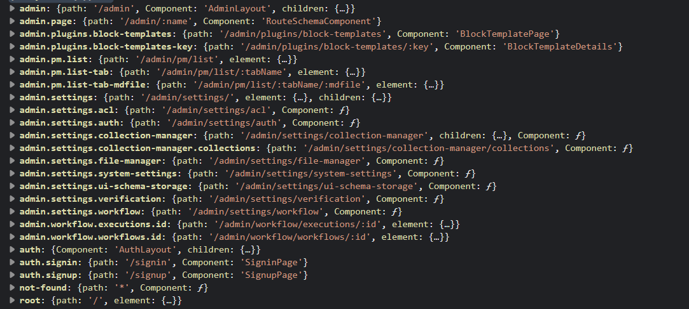

# RouterManager

用于管理路由。

```tsx | pure
import { ComponentType } from 'react';
import { RouteObject } from 'react-router-dom';

interface RouteType extends Omit<RouteObject, 'children' | 'Component'> {
  Component?: ComponentType<T> | string;
}

class RouterManager {
    add(name: string, route: RouteType): void;
    getRoutes(): Record<string, RouteType>;
    getRoutesTree(): RouteObject[];
    get(name: string): RouteType;
    has(name: string): boolean;
    remove(name: string): void;
    setType(type: 'browser' | 'memory' | 'hash'): void;
    setBasename(basename: string): void;
}
```

## 实例方法

### router.add()

添加一条路由。

- 类型

```tsx | pure
class RouterManager {
    add(name: string, route: RouteType): void
}
```

- 详情

第一个参数 `name`，是路由唯一标识，用于后续的删改查，并且 `name` 支持 `.` 用于分割层级，不过需要注意当使用 `.` 分层的时候，父级要使用 [Outlet](https://reactrouter.com/en/main/components/outlet)，让子元素能正常渲染。

第二个参数 `RouteType` 的 `Component` 支持组件形式和字符串形式，如果是字符串组件，要先通过 [app.addComponents](/core/application/application#appaddcomponents) 进行注册。

- 示例

单层级路由。

```tsx | pure
class MyPlugin extends Plugin {
    async load() {
      this.app.router.add('home', {
            path: '/',
            Component: () => <div>home page</div>
        })
        this.app.router.add('login', {
            path: '/login',
            element: <div>login page</div>
        })
    }
}
```

```tsx
import { useNavigate } from 'react-router-dom';
import { Plugin, Application } from '@nocobase/client';

const HomePage = () => {
  const navigate = useNavigate();
  return <div>
    <div>home page</div>
    <button onClick={() => navigate('/login')}>GO To LoginPage</button>
  </div>
}

const LoginPage = () => {
  const navigate = useNavigate();
  return <div>
    <div>login page</div>
    <button onClick={() => navigate('/')}>GO To HomePage</button>
  </div>
}

class MyPlugin extends Plugin {
    async load() {
      this.app.router.add('home', {
            path: '/',
            Component: HomePage
        })
        this.app.router.add('login', {
            path: '/login',
            Component: LoginPage
        })
    }
}


const app = new Application({
    plugins: [MyPlugin],
    router: {
        type: 'memory',
        initialEntries: ['/'],
    }
});

export default app.getRootComponent();
```

多层级路由。

```tsx | pure
import { Plugin } from '@nocobase/client';
import { Outlet } from 'react-router-dom';

const AdminLayout = () =>{
    return <div>
        <div>This is admin layout</div>
        <Outlet />
    </div>
}

const AdminSettings = () => {
    return <div>This is admin settings page</div>
}

class MyPlugin extends Plugin {
    async load() {
        this.app.router.add('admin', {
            path: '/admin',
            Component: AdminLayout
        })
        this.app.router.add('admin.settings', {
            path: '/admin/settings',
            Component: AdminSettings ,
        })
    }
}
```


```tsx
import { useNavigate, Outlet } from 'react-router-dom';
import { Plugin, Application } from '@nocobase/client';

const AdminLayout = () =>{
    return <div>
        <div>This is admin layout</div>
        <Outlet />
    </div>
}

const AdminSettings = () => {
    return <div>This is admin settings page</div>
}

class MyPlugin extends Plugin {
    async load() {
      this.app.router.add('admin', {
          path: '/admin',
          Component: AdminLayout
      })
      this.app.router.add('admin.settings', {
          path: '/admin/settings',
          Component: AdminSettings ,
      })
    }
}


const app = new Application({
    plugins: [MyPlugin],
    router: {
        type: 'memory',
        initialEntries: ['/admin/settings'],
    }
});

export default app.getRootComponent();
```

`Component` 参数为字符串。

```tsx | pure
const LoginPage = () => {
    return <div>login page</div>
}

class MyPlugin extends Plugin {
    async load() {
        // 通过 app.addComponents 进行注册
        this.app.addComponents({ LoginPage })

        this.app.router.add('login', {
            path: '/login',
            Component: 'LoginPage', // 这里可以使用字符串了
        })
    }
}
```

### router.getRoutes()

获取路由列表。

- 类型

```tsx | pure
class RouterManager {
    getRoutes(): Record<string, RouteType>
}
```

- 示例

```tsx | pure
class MyPlugin extends Plugin {
    async load() {
        console.log(this.app.router.getRoutes());
    }
}
```



### router.getRoutesTree()

获取用于 [useRoutes()](https://reactrouter.com/hooks/use-routes) 的数据。

- 类型

```tsx | pure
class RouterManager {
    getRoutesTree(): RouteObject[]
}
```

- 示例

```tsx | pure
class MyPlugin extends Plugin {
    async load() {
        const routes = this.app.router.getRoutesTree();
    }
}
```

### router.get()

获取单个路由配置。

- 类型

```tsx | pure
class RouterManager {
    get(name: string): RouteType
}
```

- 示例

```tsx | pure
class MyPlugin extends Plugin {
    async load() {
        const adminRoute = this.app.router.get('admin')
        const adminSettings = this.app.router.get('admin.settings')
    }
}
```

### router.has()

判断是否添加过路由。

- 类型

```tsx | pure
class RouterManager {
    has(name: string): boolean;
}
```

- 示例

```tsx | pure
class MyPlugin extends Plugin {
    async load() {
        const hasAdminRoute = this.app.router.has('admin')
        const hasAdminSettings = this.app.router.has('admin.settings')
    }
}
```

### router.remove()

移除路由配置。

- 类型

```tsx | pure
class RouterManager {
    remove(name: string): void;
}
```

- 示例

```tsx | pure
class MyPlugin extends Plugin {
    async load() {
        this.app.router.remove('admin')
        this.app.router.remove('admin.settings')
    }
}
```

### router.setType()

设置路由类型，默认为 `browser`。


- 类型

```tsx | pure
class RouterManager {
    setType(type: 'browser' | 'memory' | 'hash'): void;
}
```

- 详细解释
  - browser: [BrowserRouter](https://reactrouter.com/en/main/router-components/browser-router)
  - memory: [MemoryRouter](https://reactrouter.com/en/main/router-components/hash-router)
  - hash: [HashRouter](https://reactrouter.com/en/main/router-components/memory-router)

- 示例

```tsx | pure
class MyPlugin extends Plugin {
    async load() {
        this.app.router.setType('hash')
    }
}
```

### router.setBasename()

设置 [basename](https://reactrouter.com/en/main/router-components/browser-router#basename)。

- 类型

```tsx | pure
class RouterManager {
    setBasename(basename: string): void;
}
```

- 示例

```tsx | pure
class MyPlugin extends Plugin {
    async load() {
        this.app.router.setBasename('/')
    }
}
```

## Hooks

### useRouter()

获取当前路由的实例，等同于 `app.router`。

- 类型

```tsx | pure
const useRouter: () => RouterManager
```

- 示例

```tsx | pure
import { useRouter } from '@nocobase/client';

const Demo = () => {
    const router = useRouter();
}
```
