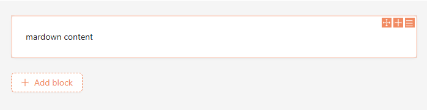
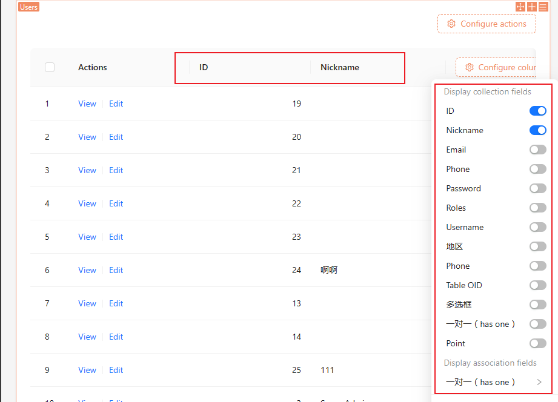

# DataBlockProvider

## 区块类型

区块分为简单区块和包含各种数据的区块。

### 简单区块

简单区块例如 Markdown 区块。



它只有文本内容，没有其他更多复杂数据，且文本内容是存储在 `schema` 中的，没有存储在数据库中。

```json {5}| pure
{
  "type": "void",
  "x-component": "Markdown.Void",
  "x-component-props": {
    "content": "markdown content"
  },
}
```

### 数据区块

数据区块是指区块的数据存储在服务端的数据表中，例如 Table 组件。



Table 中的字段信息及列表数据，都是存储在数据库中的。


## DataBlockProvider 介绍

为了方便对数据区块的数据进行管理，我们提供了 `DataBlockProvider` 组件，其内部封装了：

- `DataBlockProvider`：封装了下面的所有组件，并提供了区块属性
  - [CollectionProvider](/core/collection/collection-provider) / [AssociationProvider](/core/collection/association-provider): 根据 `DataBlockProvider` 提供的上下文信息，查询对应数据表数据及关联字段信息并传递
  - [BlockResourceProvider](/core/data-block/data-block-resource-provider): 根据 `DataBlockProvider` 提供的上下文信息，构建区块 [Resource](https://docs.nocobase.com/api/sdk#resource-action) API，用于区块数据的增删改查
  - [BlockRequestProvider](/core/data-block/data-block-request-provider): 根据 `DataBlockProvider` 提供的上下文信息，自动调用 `resource.get()` 或 `resource.list()` 发起请求，得到区块数据，并传递
    - [RecordProvider](/core/collection/record-provider): 对于 `resource.get()` 场景，会自动嵌套 `RecordProvider` 并将 `resource.get()` 请求结果传递下去，`resource.list()` 场景则需要自行使用 `RecordProvider` 提供数据记录

上述组件封装到 `DataBlockProvider` 的内部，只需要使用 `DataBlockProvider` 即可自行得到上述数据。

### 使用方式

其主要使用在区块的 schema [x-decorator](https://docs.nocobase.com/development/client/ui-schema/what-is-ui-schema#x-decorator) 中，例如：

```js {5}| pure
{
  type: 'void',
  name: 'hello-block',
  'x-component':  'CardItem',
  'x-decorator': 'DataBlockProvider',
  'x-decorator-props': {
    collection: 'users',
    action: 'list',
    tableProps: {
      bordered: true,
    }
  },
  'x-use-decorator-props': 'useDynamicDataBlockProps',
}
```

### 完整示例

<code src="./demos/data-block-provider/demo1.tsx"></code>

## 属性

### 静态属性和动态属性

- schema 中的 `x-decorator-props` 称为静态属性，它是一个普通对象，记录区块的配置信息
- schema 中的 `x-use-decorator-props` 中的属性称为动态属性，它是一个 React hook，可用于获取例如 URL 上的 ID，或者父级的 context 数据

当两者都存在时，会进行深度合并，作为 `DataBlockProvider` 的属性。

### 属性详解

```ts | pure
interface AllDataBlockProps {
  collection?: string;
  association?: string;
  sourceId?: string | number;
  record?: RecordV2;
  action?: 'list' | 'get';
  params?: Record<string, any>;
  parentRecord?: RecordV2;
  [index: string]: any;
}
```

- collection：区块的 collection 表名，用于获取区块的字段信息和区块数据，一般存在于静态属性 `x-decorator-props` 中
- association：区块的关联字段名，用于获取区块的关联字段信息和关联字段数据，一般存在于静态属性 `x-decorator-props` 中
- sourceId：区块的 sourceId，配合 `association` 使用，用于获取区块的关联字段数据，一般存在于动态属性 `x-use-decorator-props` 中
- action：区块的请求类型，`list` 或 `get`，一般存在于 `x-decorator-props` 中
- params：区块的请求参数，同时存在于 `x-decorator-props` 和 `x-use-decorator-props` 中
- record：当提供 `record` 时，会使用 `record` 作为区块的数据，不发起请求，一般存在于动态属性 `x-use-decorator-props` 中
- parentRecord：当提供 `parentRecord` 时，会使用 `parentRecord` 作为关联字段的表数据，不发起请求，一般存在于动态属性 `x-use-decorator-props` 中

### 属性组合和场景

这些属性根据不同的场景，共有 8 中情况：

- collection
  - 创建：`collection`
  - 获取单条数据：`collection` + `action: get` + `params`
  - 获取列表数据：`collection` + `action: list` + `params`
  - 使用 `record` 作为数据：`collection` + `record`

对于 *获取单条数据* 和 *获取列表数据*  `params` 非必须。

- association
  - 创建：`association` + `sourceId`
  - 获取单条数据：`association` + `sourceId` + `action: get` + `params` + `parentRecord`
  - 获取列表数据：`association` + `sourceId` + `action: list` + `params` + `parentRecord`
  - 使用 `record` 作为数据：`association` + `sourceId` + `record` + `parentRecord`


对于 *获取单条数据* 和 *获取列表数据*  `params` 和 `parentRecord` 非必须，当没有 `parentRecord` 会根据 `association` 查询到对应的 `collection`，然后再根据 `collection` 查询到对应的 `parentRecord`。

### 属性获取和修改

#### useDataBlockV2()

可用于获取和修改 `DataBlockProvider` 的属性。

- 类型

```tsx | pure
interface Result<T extends {} = {}> {
  props: AllDataBlockProps & T;
  dn: Designable;
}
const useDataBlockV2: <T extends {}>() => Result<T>
```

- 详解

`props` 就对应着上面的 `AllDataBlockProps`。
`dn` 是 `Designable` 对象，可用于修改 `DataBlockProvider` 的 UI schema，详细见 [Designable](/core/ui-schema/designable)。

- 示例

```tsx | pure
const { props, dn } = useDataBlockV2<{ tableProps: { bordered?: boolean } }>();

// 获取
const checked = props.tableProps.bordered;

// 修改
dn.deepMerge({
  'x-decorator-props': {
    tableProps: {
      bordered: !checked,
    },
  },
});
```

#### useDataBlockPropsV2()

相当于 `useDataBlockV2().props`。

```tsx | pure
const props = useDataBlockPropsV2<{ tableProps: { bordered?: boolean } }>();

const checked = props.tableProps.bordered;
```

## 示例

### collection

#### Table list

<code src="./demos/data-block-provider/collection-table-list.tsx"></code>

#### Form get

#### Form create

#### Form record

### association

#### Table list

#### Form get

#### Form create

#### Form record
