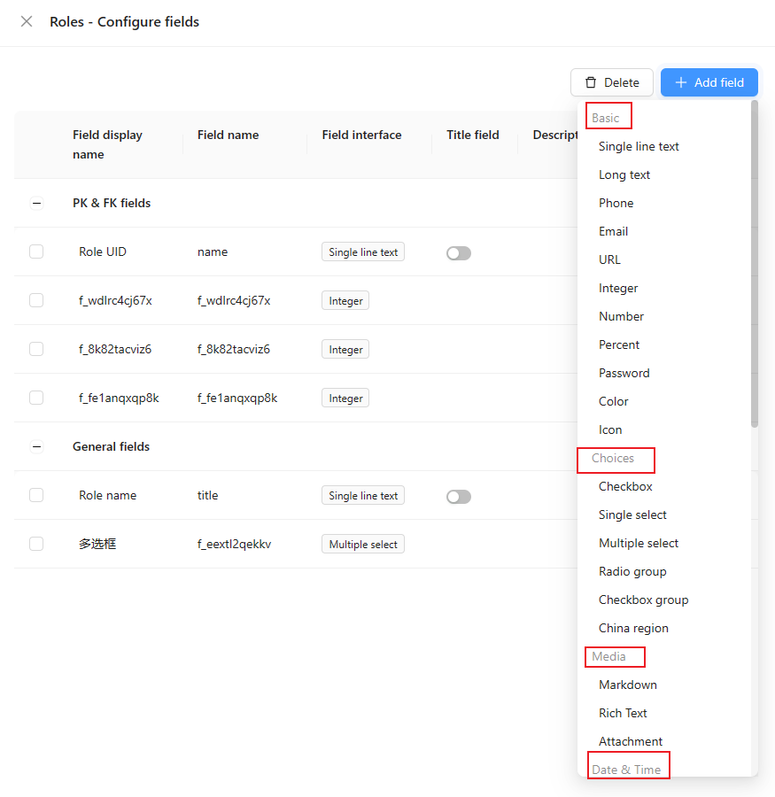

# CollectionFieldInterfaceManager

主要是用来管理 [CollectionFieldInterface](./collection-field-interface.md) 和 [CollectionFieldInterfaceGroups](#collectionfieldinterfacegroups)，其被 [DataSourceManager](./data-source-manager) 管理。


## CollectionFieldInterfaceGroups

CollectionFieldInterfaceGroups 是用来对数据表字段进行分组的。



## 实例方法

### field interface

#### addFieldInterfaces()

添加 field interface。

- 类型

```tsx | pure
class CollectionFieldInterfaceManager {
  addFieldInterfaces(fieldInterfaces: CollectionFieldInterface[]): void
}
```

- 示例

```tsx | pure
class CheckboxFieldInterface extends CollectionFieldInterface {
  name = 'checkbox';
  type = 'object';
  group = 'choices';
  title = '{{t("Checkbox")}}';
  // ...
}

class MyPlugin extends Plugin {
  async load() {
    this.app.dataSourceManager.collectionFieldInterfaceManager.addFieldInterfaces([CheckboxFieldInterface]);
    // or
    this.app.dataSourceManager.addFieldInterfaces([CheckboxFieldInterface]);
  }
}
```

#### getFieldInterface()

获取 field interface。

- 类型

```tsx | pure
class CollectionFieldInterfaceManager {
  getFieldInterface<T extends CollectionFieldInterface>(name: string): T;
}
```

- 示例

```tsx | pure
class MyPlugin extends Plugin {
  async load() {
    const fieldInterface = this.app.dataSourceManager.collectionFieldInterfaceManager.getFieldInterface('checkbox'); // checkboxFieldInterface
  }
}
```

#### getFieldInterfaces()

获取所有的 field interface。

- 类型

```tsx | pure
class CollectionFieldInterfaceManager {
  getFieldInterfaces(): CollectionFieldInterface[];
}
```

- 示例

```tsx | pure
class MyPlugin extends Plugin {
  async load() {
    const fieldInterfaces = this.app.dataSourceManager.collectionFieldInterfaceManager.getFieldInterfaces();
  }
}
```

### field interface group

#### addFieldInterfaceGroups()

添加 field interface group。

- 类型

```tsx | pure
class CollectionFieldInterfaceManager {
  addFieldInterfaceGroups(fieldGroups: Record<string, { label: string; order?: number }>): void;
}
```

- 示例

```tsx | pure
class MyPlugin extends Plugin {
  async load() {
    this.app.dataSourceManager.collectionFieldInterfaceManager.addFieldInterfaceGroups({
      'test': {
        label: 'Test',
        order: 1,
      }
    });

    // or
    this.app.dataSourceManager.addFieldInterfaceGroups({
      'test': {
        label: 'Test',
        order: 1,
      }
    });
  }
}
```

#### getFieldInterfaceGroups()

获取所有的 field interface group。

- 类型

```tsx | pure
class CollectionFieldInterfaceManager {
  getFieldInterfaceGroups(): Record<string, { label: string; order?: number }>;
}
```

- 示例

```tsx | pure
class MyPlugin extends Plugin {
  async load() {
    const fieldInterfaceGroups = this.app.dataSourceManager.collectionFieldInterfaceManager.getFieldInterfaceGroups(); // { 'test': { label: 'Test', order: 1 } }
  }
}
```

#### getFieldInterfaceGroup()

获取 field interface group。

- 类型

```tsx | pure
class CollectionFieldInterfaceManager {
  getFieldInterfaceGroup(name: string): { label: string; order?: number };
}
```

- 示例

```tsx | pure
class MyPlugin extends Plugin {
  async load() {
    const fieldInterfaceGroup = this.app.dataSourceManager.collectionFieldInterfaceManager.getFieldInterfaceGroup('test'); // { label: 'Test', order: 1 }
  }
}
```
