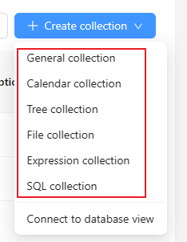
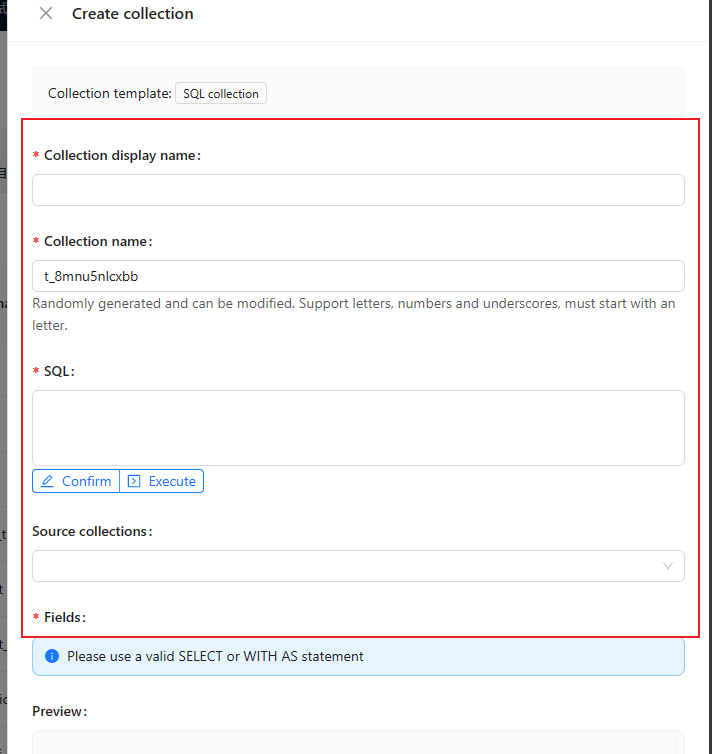

# CollectionTemplate

用于创建数据表的模板。



```ts
interface AvailableFieldInterfacesInclude {
  include?: any[];
}

interface AvailableFieldInterfacesExclude {
  exclude?: any[];
}

interface CollectionTemplateDefaultOptions {
  /**
   * 自动生成 id
   * @default true
   * */
  autoGenId?: boolean;
  /** 创建人 */
  createdBy?: boolean;
  /** 最后更新人 */
  updatedBy?: boolean;
  /** 创建日期 */
  createdAt?: boolean;
  /** 更新日期 */
  updatedAt?: boolean;
  /** 可排序 */
  sortable?: boolean;
  /* 树结构 */
  tree?: string;
  /* 日志 */
  logging?: boolean;
  /** 继承 */
  inherits?: string | string[];
  /* 字段列表 */
  fields?: CollectionOptions['fields'];
}

class CollectionTemplate {
  app: Application;
  collectionManager: CollectionManager;

  name: string;
  Collection?: typeof Collection;
  transform?: (collection: CollectionOptions, app: Application) => CollectionOptions;
  title?: string;
  color?: string;
  /** 排序 */
  order?: number;
  /** 默认配置 */
  default?: CollectionTemplateDefaultOptions;
  events?: any;
  /** UI 可配置的 CollectionOptions 参数（添加或编辑的 Collection 表单的字段） */
  configurableProperties?: Record<string, ISchema>;
  /** 当前模板可用的字段类型 */
  availableFieldInterfaces?: AvailableFieldInterfacesInclude | AvailableFieldInterfacesExclude;
  /** 是否分割线 */
  divider?: boolean;
  /** 模板描述 */
  description?: string;
  /**配置字段中的操作按钮 */
  configureActions?: Record<string, ISchema>;
  //是否禁止删除字段
  forbidDeletion?: boolean;
}
```

其需要结合 [CollectionManager](./collection-template-manager.md) 使用。

```ts
import { Plugin, Collection, CollectionTemplate } from '@nocobase/client';

class SqlCollection extends Collection {
  otherMethods() {
    // ...
  }
}

class SqlCollectionTemplate extends CollectionTemplate {
  name = 'sql';
  Collection = SqlCollection; // 自定义的数据表类
  title = '{{t("SQL collection")}}';
  order = 4;
  color = 'yellow';
  default = {
    fields: [],
  };
  configurableProperties = {
    // ...
  }
}

class MyPlugin extends Plugin {
  async load() {
    this.app.dataSourceManager.collectionTemplateManager.addCollectionTemplates([ SqlCollectionTemplate ]);

    // or
    this.app.dataSourceManager.addCollectionTemplates([ SqlCollectionTemplate ]);
  }
}
```

## 实例属性

### name

模板的唯一标识符。


### Collection

模板对应的数据表类。

在创建数据表后，Collection 会有 [template 字段](/core/data-source/collection#collectionoptions)，用于标识该数据表是由哪个模板创建的。

当通过 `collectionManager.addCollections()` 添加数据表对象时，会先读取 `collection.template` 字段，然后通过 `collectionManager.getCollectionTemplate(collection.template)` 获取到 `collectionTemplate`。

读取 `collectionTemplate.Collection` 字段，并通过 `new collectionTemplate.Collection(collection)` 创建对应的实例。

如果不传递 `Collection`，则会通过 `new Collection(collection)` 创建对应的实例。

```ts
class SqlCollection extends Collection {
  otherMethods() {
    // ...
  }
}

class SqlCollectionTemplate extends CollectionTemplate {
  name = 'sql';
  Collection = SqlCollection; // 自定义的数据表类
  // ...
}

const userCollection = {
  name: 'users',
  template: 'sql',
  // ...
}

// 内部会调用 new SqlCollection(userCollection)
```

### title

模板的标题。

### color

模板的颜色。

### order

模板的排序。

### events

- `beforeSubmit`：提交前触发


### configurableProperties

表单配置项。



```ts
class SqlCollectionTemplate extends CollectionTemplate {
  name = 'sql',
  // ...
  configurableProperties = {
    title: {
      type: 'string',
      title: '{{ t("Collection display name") }}',
      required: true,
      'x-decorator': 'FormItem',
      'x-component': 'Input',
    },
    name: {
      type: 'string',
      title: '{{t("Collection name")}}',
      required: true,
      'x-disabled': '{{ !createOnly }}',
      'x-decorator': 'FormItem',
      'x-component': 'Input',
      'x-validator': 'uid',
      description:
        "{{t('Randomly generated and can be modified. Support letters, numbers and underscores, must start with an letter.')}}",
    },
    // ...
  },
}
```

### default

表单默认值。


## 实例方法

### collectionTemplate.transform(collection)

collection 创建后，会调用该方法，用于对 collection 进行转换。

## Utils

### getConfigurableProperties()

用于获取内置的配置项字段。

- 类型

```tsx | pure
export type DefaultConfigurableKeys =
  | 'name'
  | 'title'
  | 'inherits'
  | 'category'
  | 'autoGenId'
  | 'createdBy'
  | 'updatedBy'
  | 'createdAt'
  | 'updatedAt'
  | 'sortable'
  | 'description'
  | 'moreOptions';

const getConfigurableProperties: (...keys: DefaultConfigurableKeys[]) => Record<DefaultConfigurableKeys, any>
```

- 示例

```tsx | pure
import { getConfigurableProperties } from '@nocobase/client';

const sqlCollectionTemplate = new CollectionTemplate({
  name: 'sql',
  // ...
  configurableProperties: {
    ...getConfigurableProperties('name', 'title', 'description'),
    // ...
  },
});
```
