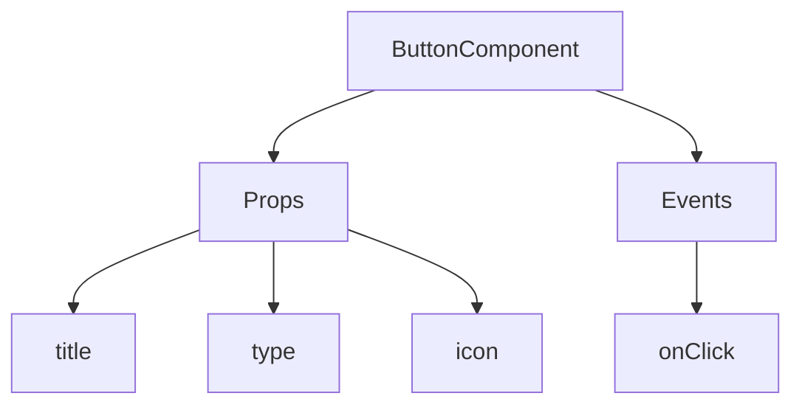
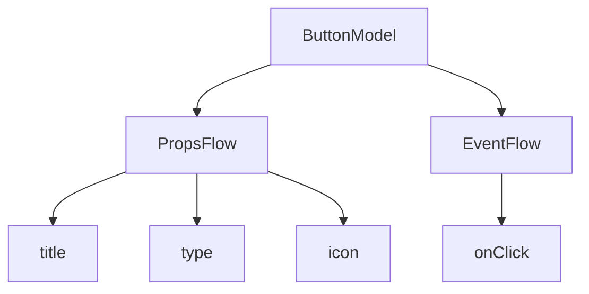

# 快速开始：用 FlowModel 构建可编排的按钮组件

在 React 中，我们通常这样渲染一个按钮组件：

```tsx | pure
import { Button } from 'antd';

export default function App() {
  return <Button type="primary">Primary Button</Button>;
}
```

上述代码虽然简单，但属于**静态组件**，无法满足无代码平台对可配置性和编排能力的需求。

在 NocoBase 的 FlowEngine 中，我们可以通过 **FlowModel + FlowDefinition** 快速构建支持配置和事件驱动的组件，实现更强大的无代码能力。

---

## 第一步：使用 FlowModel 渲染组件

<code src="./demos/quickstart-1-basic.tsx"></code>

### 🧠 关键概念

- `FlowModel` 是 FlowEngine 中的核心组件模型，封装组件逻辑、渲染和配置能力。
- 每个 UI 组件都可以通过 `FlowModel` 进行实例化并统一管理。

### 📌 实现步骤

#### 1. 创建自定义模型类

```tsx | pure
class MyModel extends FlowModel {
  render() {
    return <Button {...this.props} />;
  }
}
```

#### 2. 创建 model 实例

```ts
const model = this.flowEngine.createModel({
  uid: 'my-model',
  use: 'MyModel',
  props: {
    type: 'primary',
    children: 'Primary Button',
  },
});
```

#### 3. 使用 `<FlowModelRenderer />` 渲染

```tsx | pure
<FlowModelRenderer model={model} />
```

---

## 第二步：添加 PropsFlow，使按钮属性可配置

<code src="./demos/quickstart-2-register-propsflow.tsx"></code>

### 💡 为什么要用 PropsFlow？

使用 Flow 而非静态 props，可以实现属性的：
- 动态配置
- 可视化编辑
- 状态回放与持久化

### 🛠 关键改造点

#### 1. 定义按钮属性的 Flow

```tsx | pure

const buttonSettings = defineFlow({
  key: 'buttonSettings',
  auto: true,
  title: '按钮设置',
  steps: {
    setProps: {
      title: '通用配置',
      uiSchema: {
        title: {
          type: 'string',
          title: '按钮标题',
          'x-decorator': 'FormItem',
          'x-component': 'Input',
        },
        type: {
          type: 'string',
          title: '类型',
          'x-decorator': 'FormItem',
          'x-component': 'Select',
          enum: [
            { label: '主要', value: 'primary' },
            { label: '次要', value: 'default' },
            { label: '危险', value: 'danger' },
            { label: '虚线', value: 'dashed' },
            { label: '链接', value: 'link' },
            { label: '文本', value: 'text' },
          ],
        },
        icon: {
          type: 'string',
          title: '图标',
          'x-decorator': 'FormItem',
          'x-component': 'Select',
          enum: [
            { label: '搜索', value: 'SearchOutlined' },
            { label: '添加', value: 'PlusOutlined' },
            { label: '删除', value: 'DeleteOutlined' },
            { label: '编辑', value: 'EditOutlined' },
            { label: '设置', value: 'SettingOutlined' },
          ],
        },
      },
      defaultParams: {
        type: 'primary',
      },
      // 步骤处理函数，设置模型属性
      handler(ctx, params) {
        ctx.model.setProps('children', params.title);
        ctx.model.setProps('type', params.type);
        ctx.model.setProps('icon', params.icon ? React.createElement(icons[params.icon]) : undefined);
      },
    },
  },
});

MyModel.registerFlow(buttonSettings);
```

#### 2. 使用 `stepParams` 替代静态 `props`

```diff
const model = this.flowEngine.createModel({
  uid: 'my-model',
  use: 'MyModel',
- props: {
-   type: 'primary',
-   children: 'Primary Button',
- },
+ stepParams: {
+   buttonSettings: {
+     general: {
+       title: 'Primary Button',
+       type: 'primary',
+     },
+   },
+ },
});
```

> ✅ 使用 `stepParams` 是 FlowEngine 推荐方式，可避免不可序列化数据（如 React 组件）的问题。

#### 3. 启用属性配置界面

```diff
- <FlowModelRenderer model={model} />
+ <FlowModelRenderer model={model} showFlowSettings />
```

---

## 第三步：支持按钮事件流（EventFlow）

<code src="./demos/quickstart-3-register-eventflow.tsx"></code>

### 🎯 场景：点击按钮后弹出确认框

#### 1. 监听 onClick 事件

使用无入侵的方式，添加 onClick

```diff
const myPropsFlow = defineFlow({
  key: 'buttonSettings',
  steps: {
    general: {
      // ... 省略
      handler(ctx, params) {
        // ... 省略
+       ctx.model.setProps('onClick', (event) => {
+         ctx.model.dispatchEvent('click', { event });
+       });
      },
    },
  },
});
```

#### 2. 定义事件流

```ts
const myEventFlow = defineFlow({
  key: 'clickSettings',
  on: 'click',
  title: '按钮事件',
  steps: {
    confirm: {
      title: '确认操作配置',
      uiSchema: {
        title: {
          type: 'string',
          title: '弹窗提示标题',
          'x-decorator': 'FormItem',
          'x-component': 'Input',
        },
        content: {
          type: 'string',
          title: '弹窗提示内容',
          'x-decorator': 'FormItem',
          'x-component': 'Input.TextArea',
        },
      },
      defaultParams: {
        title: '确认操作',
        content: '你点击了按钮，是否确认？',
      },
      async handler(ctx, params) {
        // 弹窗
        const confirmed = await ctx.modal.confirm({
          title: params.title,
          content: params.content,
        });
        // 消息
        await ctx.message.info(`你点击了按钮，确认结果：${confirmed ? '确认' : '取消'}`);
      },
    },
  },
});
MyModel.registerFlow(myEventFlow);
```

**补充说明：**
- 事件流（EventFlow）可以让按钮的行为通过流程灵活配置，比如弹窗、消息、API 调用等。
- 你可以为不同事件（如 `onClick`, `onMouseEnter` 等）注册不同的事件流，满足复杂业务需求。

#### 3. 配置事件流参数

在创建模型时，可以通过 `stepParams` 配置事件流的默认参数：

```ts
const model = this.flowEngine.createModel({
  uid: 'my-model',
  use: 'MyModel',
  stepParams: {
    buttonSettings: {
      general: {
        title: 'Primary Button',
        type: 'primary',
      },
    },
    clickSettings: {
      confirm: {
        title: '确认操作',
        content: '你点击了按钮，是否确认？',
      },
    },
  },
});
```

---

## 模型对比图：ReactComponent vs FlowModel

Flow 并不会改变组件的实现方式。它只是为 ReactComponent 增加了对 PropsFlow 和 EventFlow 的支持，从而让组件的属性和事件都可以通过可视化方式配置和编排。


### ReactComponent



### FlowModel



## 总结

通过以上三步，我们完成了一个支持配置与事件编排的按钮组件，具备以下优势：

- 🚀 可视化配置属性（如标题、类型、图标）
- 🔄 事件响应可被流程接管（如点击弹窗）
- 🔧 支持后续拓展（如条件逻辑、变量绑定等）

这种模式也适用于表单、列表、图表等任何 UI 组件，在 NocoBase 的 FlowEngine 中，**一切皆可编排**。
