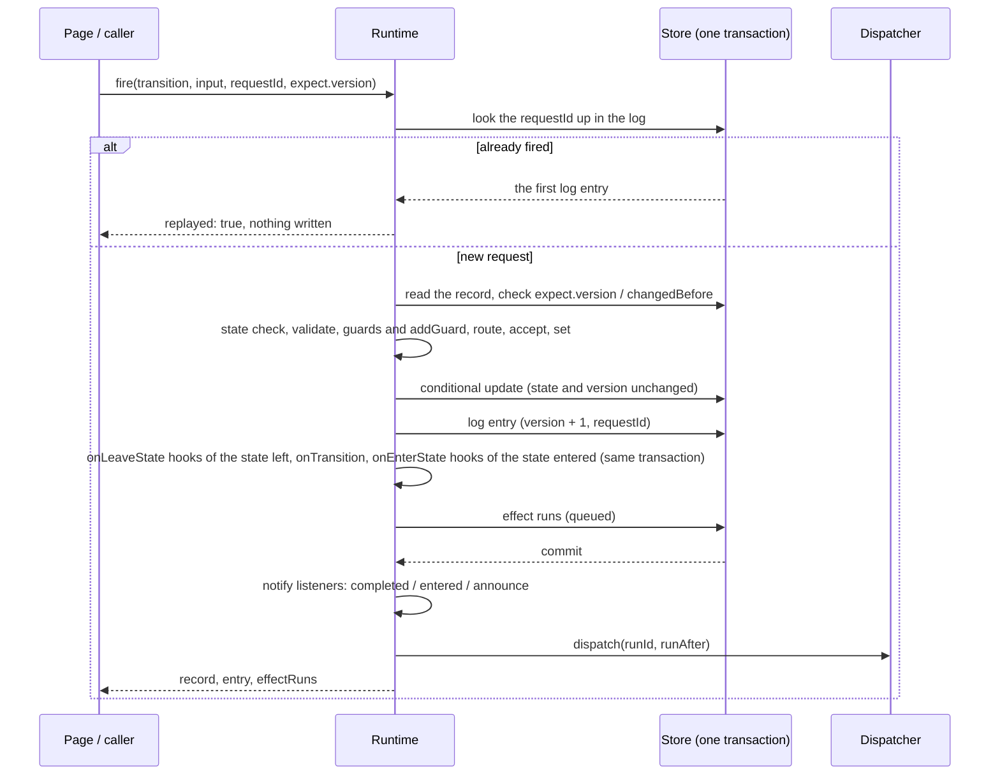
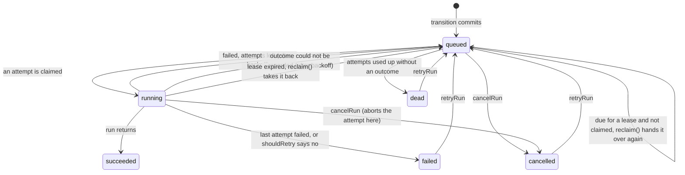

# Design

How the runtime keeps one copy of the state, makes every change atomic, and runs effects without losing or duplicating them — and what it deliberately leaves out. Read [concepts.md](concepts.md) first.

## Six invariants

| Invariant                                            | What guarantees it                                                                                                                                                                                                                                                                                                       |
| ---------------------------------------------------- | ------------------------------------------------------------------------------------------------------------------------------------------------------------------------------------------------------------------------------------------------------------------------------------------------------------------------ |
| The state is stored once                             | The state is a field of the record; there is no process instance table                                                                                                                                                                                                                                                   |
| A change is written completely or not at all         | The record, the log entry and the effect runs are written in one transaction                                                                                                                                                                                                                                             |
| Of two concurrent changes to one record, one commits | A conditional update: the write applies only while the state and the version are unchanged, otherwise `CONFLICT`. The log holds `(lifecycle, recordId, version)` under a unique index                                                                                                                                    |
| What a button shows is what a click does             | `available()`, `can()` and `fire()` ask the same guards and return the same blockers; `can()` with the click's input also validates it first, as `fire()` does, while `available()`, `view()` and `can()` without input ask the guards with `{}`                                                                         |
| A committed transition never loses its effects       | Effect runs are written in the transition's transaction (a transactional outbox); `reclaim()` on every sweep hands over again a queued run whose dispatch was lost and an attempt whose process stopped, each once it has waited a lease                                                                                 |
| One request takes effect once                        | `requestId` is kept on the log entry, and `requestKey` — the `requestId`, or `$v:<version>` without one — under a unique index on `(lifecycle, recordId, requestKey)`; a repeat of the same transition returns the first result, marked `replayed`; the key sent for another transition is refused with `REQUEST_REUSED` |

## Inside the transaction

`runtime.fire(name, id, transition, options)` runs the first five steps in one transaction; any error rolls all of them back.

### Joining the caller's transaction

With `transaction`, `fire()` and `create()` do not open a transaction of their own: the store nests the work in the caller's, as a savepoint on `@nocobase/db` and as a nested undo log in the memory store. What follows a commit — the listeners and the dispatch — is registered with the store's `afterCommit` before the transition is decided, so it runs once the outermost transaction commits, a transition before what its `onTransition` started, and never after a rollback. `tx.afterCommit()` callbacks join the same queue, so everything runs in the order it was registered: a callback registered before a `tx.fire()` runs before that transition's events, and one registered after it runs after them. A refusal rolls back only the savepoint, which is what lets a parent's refusal undo a child's transition without the child's caller losing its own writes, and lets a caller that catches the refusal commit the rest. A call without `transaction` goes through the same path in a transaction of its own, so `fire()` still returns after its in-process effects have run.

An effect's continuation is decided the same way, nested in the transaction that records the effect's outcome, with its listeners and effects registered before it is decided. A refusal — the continuation's own, or one a lifecycle call in its `onTransition` raised, such as a parent refusing the child's last step — rolls back only the continuation: the record, its log entry, what its `onTransition` wrote and the runs it owed are all undone together, and the outcome stays recorded.

### Why the condition compares the version as well as the state

Comparing the state alone breaks on self-transitions. The expense report's `escalate` goes from `awaitingManager` to `awaitingManager`; two concurrent escalations would both see the state unchanged and both commit. Every transition increments `lifecycleVersion`, the condition includes it, and the second one fails.

### Why the page sends the version back

A manager opens a report at version 3. Meanwhile the applicant withdraws it and resubmits; the record is at version 5 and back in `awaitingManager`. Judged by state alone, the manager's "approve" would be taken as approval of the new content. With `expect: { version: 3 }` the click is refused, and the page reloads before the manager decides again.

### Hooks run only for the transition that won

The hooks run after the conditional update, not before it, so a transition that loses a race has run none of them: whatever a hook writes belongs to a transition that is going to commit. Anything that fails rolls back the transition and its nested calls to their savepoint. A caller may catch the refusal and commit its other writes; an uncaught failure rolls back the outer transaction. Replays and refused transitions run no hooks.

### A hook that moves its own record on

A hook or `onTransition` may fire the record it runs for onward through `tx`: a stay that concludes as soon as it is set up. The transaction a transition runs its hooks in notes every transition that completes on it — through `tx.fire()`, through a `fire()` given its handle as `transaction`, and through whatever those calls fired in turn, such as a child created in a hook that moves its parent on — and after each hook, and after `onTransition`, the runtime checks whether one of them was a transition of this lifecycle on this record; once one was, it reads the record once and the transition stops there. A refused or rolled-back nested call notes nothing. Only transitions count: a hook that advances the version itself, as a fence or an edit does, or that fires another lifecycle sharing the record's version field, has not moved this lifecycle's record on, and the transition carries on. The hooks and `onTransition` still to come would set up or end a stay the record has already left, and the entered state's `onEnter` effects would act on it after the fact, so none of them run and those effects are not queued; the transition's own `effects` still are, because the transition happened. `fire()` and `create()` return the record as the nested transition left it, this transition's log entry and the effect runs of the transition's own effects, none for `create()`. Listeners still hear `completed` and `entered` for this transition, with the record as it wrote it and before those of the nested transition, but no `announce`: the state no longer allows anything. A transition whose hooks moved nothing reads nothing more.

### Creation is a transition too

`runtime.create()` writes a log entry with `from: null`, `transition: '$create'` and `version: 1`, runs the initial state's `onEnterState` hooks, and owes its `onEnter` effects. History starts at creation, and "send a welcome mail on entering draft" needs no special case. `initial` may list several states; the first is the default and the others are asked for by name. Setting the state field in `values` is refused with `INVALID_SET`. The definition's `create` holds a `validate` over the values and a `guard` over the values, the state and the actor, run in that order inside the creation's transaction, so who may create what is one rule for every caller rather than a check in each route.

## Two layers: what happens while a record waits

A record often waits in one state while something else goes on: several people answer a review, a person and an assistant go back and forth, a supplier sends documents in rounds. None of that is a transition — the record stays where it is — but it has to start when the record arrives, stop when it leaves, and its conclusion has to move the record on. The lifecycle offers four general pieces for this and knows nothing about what the second layer is.

| Piece                           | What it gives the second layer                                                                                                                                                                                                                                                                       |
| ------------------------------- | ---------------------------------------------------------------------------------------------------------------------------------------------------------------------------------------------------------------------------------------------------------------------------------------------------- |
| `onEnterState` / `onLeaveState` | Set the stay up and end it in the transaction of whichever transition enters or leaves the state, `runtime.create()` included. A self-transition leaves and enters again, so a stay is torn down and set up anew                                                                                     |
| `runtime.transaction(work)`     | Write the second layer's rows through `tx.handle` and fire the transition its conclusion maps to through `tx.fire()`, in one transaction. Hooks and `onTransition` receive the same `tx`, so they can fire or create other records too, or move this one on, which ends the transition that ran them |
| `manual: false`                 | A conclusion only the second layer reaches cannot be fired from a page: `fire(..., { manual: true })` refuses it with `NOT_MANUAL`, `available()` leaves it out, `can()` says no, `announce` skips it                                                                                                |
| A state with hooks of its own   | A reusable second layer, such as an approval layer, could provide the whole state the record waits in — starting its work on entering and cancelling it on leaving early — and the business lists it among its `states`. Its hooks run before the lifecycle's for that state                         |

The rules that make it correct live in the second layer: its rows belong to one stay, identified by the record and the version the entering transition wrote; intermediate events write only those rows and never the record, so the record's version and `statusChangedAt` do not move; the leave hook ends every row of the stay still in progress; and the conclusion fires its transition with `expect: { version }` set to that entering version, so a conclusion for a stay that has already ended — the record left, or left and came back — is refused and its own writes roll back with it. Whoever reaches the record first decides. Because the stay is known by its version, an edit that advances the version outside the lifecycle, which the guide's "Advance the version outside the lifecycle" allows elsewhere, ends the stay as far as the second layer can tell and every later conclusion is refused, so a record waiting in such a state is not edited that way.

A reusable second layer keeps its rows in collections of its own, created by a migration and written through the transaction's Repository. `packages/examples/app-plugin-lifecycle-example/tests/fixtures/second-layer/` shows two written by hand as test fixtures on the memory store: a material exchange in rounds and an assistant that waits for a person's answer.

## Effect execution

| Mechanism                                | What it does                                                                                                                                                                                                                                                                                                                                                                                                                                                                                                                                                                                                                                                                                                                                                                                                                                                                                                                                                                                                                                                                                                                                                                                                                                                                                                                                                                                                                                                                                                                                                                                                                                                                                                                                                                                                                                                                                                                                                                                                                                                                                                                                                                                                                                                                                                                                                                                                                                                                                                                                                                                                                                                                                                                                                                                                                                                                                                                                                                                                                                                                                                                                                                                                                                                        |
| ---------------------------------------- | ------------------------------------------------------------------------------------------------------------------------------------------------------------------------------------------------------------------------------------------------------------------------------------------------------------------------------------------------------------------------------------------------------------------------------------------------------------------------------------------------------------------------------------------------------------------------------------------------------------------------------------------------------------------------------------------------------------------------------------------------------------------------------------------------------------------------------------------------------------------------------------------------------------------------------------------------------------------------------------------------------------------------------------------------------------------------------------------------------------------------------------------------------------------------------------------------------------------------------------------------------------------------------------------------------------------------------------------------------------------------------------------------------------------------------------------------------------------------------------------------------------------------------------------------------------------------------------------------------------------------------------------------------------------------------------------------------------------------------------------------------------------------------------------------------------------------------------------------------------------------------------------------------------------------------------------------------------------------------------------------------------------------------------------------------------------------------------------------------------------------------------------------------------------------------------------------------------------------------------------------------------------------------------------------------------------------------------------------------------------------------------------------------------------------------------------------------------------------------------------------------------------------------------------------------------------------------------------------------------------------------------------------------------------------------------------------------------------------------------------------------------------------------------------------------------------------------------------------------------------------------------------------------------------------------------------------------------------------------------------------------------------------------------------------------------------------------------------------------------------------------------------------------------------------------------------------------------------------------------------------------------------- |
| Idempotency key                          | `idempotencyKey` is the same on every attempt of a run. Pass it to the external system so a retry does not pay twice                                                                                                                                                                                                                                                                                                                                                                                                                                                                                                                                                                                                                                                                                                                                                                                                                                                                                                                                                                                                                                                                                                                                                                                                                                                                                                                                                                                                                                                                                                                                                                                                                                                                                                                                                                                                                                                                                                                                                                                                                                                                                                                                                                                                                                                                                                                                                                                                                                                                                                                                                                                                                                                                                                                                                                                                                                                                                                                                                                                                                                                                                                                                                |
| Retry                                    | After failure n the next attempt waits `backoffMs × factor^(n-1)`, capped at `maxMs`; `shouldRetry(error)` returning false fails at once, as for a declined payment                                                                                                                                                                                                                                                                                                                                                                                                                                                                                                                                                                                                                                                                                                                                                                                                                                                                                                                                                                                                                                                                                                                                                                                                                                                                                                                                                                                                                                                                                                                                                                                                                                                                                                                                                                                                                                                                                                                                                                                                                                                                                                                                                                                                                                                                                                                                                                                                                                                                                                                                                                                                                                                                                                                                                                                                                                                                                                                                                                                                                                                                                                 |
| Timeout                                  | `timeoutMs` aborts the attempt's `signal` and counts the attempt as failed, whether or not `run` noticed                                                                                                                                                                                                                                                                                                                                                                                                                                                                                                                                                                                                                                                                                                                                                                                                                                                                                                                                                                                                                                                                                                                                                                                                                                                                                                                                                                                                                                                                                                                                                                                                                                                                                                                                                                                                                                                                                                                                                                                                                                                                                                                                                                                                                                                                                                                                                                                                                                                                                                                                                                                                                                                                                                                                                                                                                                                                                                                                                                                                                                                                                                                                                            |
| Fencing                                  | Every write names its attempt (`attempts`) in its condition. An attempt that `reclaim()` took back cannot record its outcome over the one that replaced it. The count is monotonic: `retryRun()` grants a fresh budget by raising `maxAttempts` rather than resetting the count, so no two attempts share a number                                                                                                                                                                                                                                                                                                                                                                                                                                                                                                                                                                                                                                                                                                                                                                                                                                                                                                                                                                                                                                                                                                                                                                                                                                                                                                                                                                                                                                                                                                                                                                                                                                                                                                                                                                                                                                                                                                                                                                                                                                                                                                                                                                                                                                                                                                                                                                                                                                                                                                                                                                                                                                                                                                                                                                                                                                                                                                                                                  |
| Outcome and continuation commit together | Recording success or failure and firing `onSuccess` / `onFailure` are one transaction, so a stop between them cannot leave a paid-for report sitting in `approved`. The continuation is logged under the request id `$run:<runId>:<outcome>`, so a run continues its record at most once per outcome, and a run of an `onEnter` effect continues only the stay it was queued for: once the lifecycle has logged any transition of the record after the one that queued the run, other than one the run's own outcome fired, the stay is over, even if the record is back in or never left the same state, as a report sent back and submitted again does, and the outcome is recorded with nothing following from it, so an old payment result cannot mark a new round paid. Only the entries after the run's own are read. A self-transition ends it too, since it leaves and enters the state again and queues its `onEnter` effects anew, whose runs carry the new stay; an edit that advances the version outside the lifecycle writes no log entry and does not end it. A run of an effect the transition itself declares serves the transition, not a stay: its continuation is checked only against the state the record is in then, as any transition is, so it still follows when a hook moved the record on to a state that continuation starts from. A run stores `stayBound` when it is queued. An effect named both by the transition and by the entered state's `onEnter` queues two runs: only the state's run is bound to its stay. When a hook has already ended the stay, only the transition's run is queued. Later definition changes never reclassify an existing run. `retryRun()` refuses with `RUN_SETTLED` a run whose `onFailure` already moved the record on, or is pending to, unless forced. Those are the only settled runs it refuses: a dead or cancelled run, one without `onFailure`, or one whose continuation was dropped because the record moved on is retried without `force` even if the record has left or re-entered the state since, so the caller checks the record first. Request ids starting with `$` are the library's own: `fire()` refuses a caller's with `INVALID_REQUEST_ID`, so no caller can spend or imitate a continuation's key                                                                                                                                                                                                                                                                                                                                                                                                                                                                                                                                                                                                                                                                                                                                                                                                                                                                                                                                                                           |
| A continuation that is refused           | The continuation's own transition was refused on its own record because the record moved on (`RECORD_NOT_FOUND`, `INVALID_STATE`, `GUARD_REJECTED`), or the record left the stay an `onEnter` effect's run was queued for (`INVALID_STATE`), logged as a warning: the continuation is rolled back, the outcome is recorded and nothing follows from it. Any other refusal means the continuation cannot fire yet, and waits: one a lifecycle call in its `onTransition` or a hook raised, such as a parent whose guard will not let it move yet (logged as a warning), or one saying this process cannot fire it as it defines it — `UNKNOWN_TRANSITION`, `INVALID_INPUT`, `INVALID_ROUTE`, `INVALID_SET`, `REQUEST_REUSED` and the like, from an old definition in a rolling deploy or a bug in `set` or `route` (logged as an error). The continuation is rolled back, the outcome is recorded with the run's status `succeeded` or `failed` as usual, and the continuation waits on the run as `continuation`, holding the transition, its input, the outcome, the last refusal and when it is due. The effect does not run again either way, because the same refusal would follow every attempt                                                                                                                                                                                                                                                                                                                                                                                                                                                                                                                                                                                                                                                                                                                                                                                                                                                                                                                                                                                                                                                                                                                                                                                                                                                                                                                                                                                                                                                                                                                                                                                                                                                                                                                                                                                                                                                                                                                                                                                                                                                                |
| A continuation that waits                | `reclaim()` tries again the waiting continuations that are due, at most `continuations.batchSize` (100) per sweep and those due longest first, under the request id the outcome would have used, in a transaction that clears it on the condition that the run and the continuation it holds are as they were read — its status, its attempts and the continuation's due time, kept in `continuationDueAt` — and decides the transition nested; a sweep acting on an older read, after another sweep has tried it, rewritten it or dropped it, writes nothing. After the n-th refused try a continuation is due `backoffMs × factor^(n-1)` later, a minute doubling up to an hour by default, so the query itself skips what is not due. A try fires and clears, settling after the commit as any continuation does; a log entry already under that request id clears it without firing again; a refusal saying the record moved on, or that it left the run's stay, clears it with a warning; any other refusal keeps it, counts the try, records the error and pushes the due time back, logged again as an error only when the refusal changes and otherwise as a warning on the 2nd, 4th, 8th… try. A `CONFLICT`, or an error that is not a refusal, rolls the try back as a whole and is then recorded on the continuation in a write of its own: an error is recorded with the code `ERROR` and backs off as a refusal does, each such try counted in `errorTries` and taking the delay one step further, up to `maxMs`, but never toward giving up, since a deadlock or a lost connection says nothing about the continuation — so a bug that throws an ordinary error is not given up on either, and is tried at most hourly and logged on its 1st, 2nd, 4th… such try until it is fixed — and a conflict, a race rather than a fault, is tried again after `backoffMs` without counting. After `continuations.maxAttempts` (10) counted tries the sweep gives up: the continuation keeps its last refusal and gains `abandonedAt`, `continuationDueAt` is cleared so the sweep no longer finds it, and the giving up is logged once as an error. A continuation needs only its lifecycle, not its effect, so a run whose effect has since been removed is still continued; a run whose lifecycle this process does not register — a rolling deploy — is put off by the backoff it is at without counting a try, so it cannot hold the batch against the runs behind it. `continueRun(id)` makes one try at once, due or given up on, throws the refusal, and refuses a run whose lifecycle is unknown here with `UNKNOWN_LIFECYCLE`; a continuation it fires is cleared, and one given up on that is refused again stays given up on. `listEffectRuns({ continuationPending: true })` lists the waiting runs and `listEffectRuns({ continuationAbandoned: true })` those given up on, which carry `continuation.abandonedAt`, kept in `continuationAbandonedAt`; `prune()` never deletes a run that holds a continuation, waiting or given up on, since it is the only record of an outcome its record never followed; and `retryRun()` refuses a failed run whose `onFailure` waits, or was given up on, with `RUN_SETTLED` unless forced, which drops it |
| An outcome that cannot be recorded       | When that transaction fails — the continuation met a `CONFLICT`, or anything other than a lifecycle refusal, such as the store failing — the attempt goes back to `queued` after its backoff and is dispatched again. It stays claimed only if even that write fails. An `EffectFailure` whose `details` are not JSON is recorded as a failure without them                                                                                                                                                                                                                                                                                                                                                                                                                                                                                                                                                                                                                                                                                                                                                                                                                                                                                                                                                                                                                                                                                                                                                                                                                                                                                                                                                                                                                                                                                                                                                                                                                                                                                                                                                                                                                                                                                                                                                                                                                                                                                                                                                                                                                                                                                                                                                                                                                                                                                                                                                                                                                                                                                                                                                                                                                                                                                                         |
| Lease and reclaim                        | A running attempt whose process stopped stays claimed until `leaseMs` (five minutes by default) passes. `reclaim()` takes such attempts back and hands them over, and also hands over a queued run that has been due for longer than a lease — its dispatch failed, or the timer waiting out its backoff died with its process. Run it on the same schedule as the triggers. It then tries again the waiting continuations that are due. A queued run naming an effect the process does not know is left for one that does. `recover()` takes back and hands over the same way once at start, and hands over everything queued, due or not                                                                                                                                                                                                                                                                                                                                                                                                                                                                                                                                                                                                                                                                                                                                                                                                                                                                                                                                                                                                                                                                                                                                                                                                                                                                                                                                                                                                                                                                                                                                                                                                                                                                                                                                                                                                                                                                                                                                                                                                                                                                                                                                                                                                                                                                                                                                                                                                                                                                                                                                                                                                                          |
| Dead                                     | A run none of whose attempts recorded an outcome becomes `dead` instead of being queued forever, so an effect that crashes its process every time stops after `maxAttempts`                                                                                                                                                                                                                                                                                                                                                                                                                                                                                                                                                                                                                                                                                                                                                                                                                                                                                                                                                                                                                                                                                                                                                                                                                                                                                                                                                                                                                                                                                                                                                                                                                                                                                                                                                                                                                                                                                                                                                                                                                                                                                                                                                                                                                                                                                                                                                                                                                                                                                                                                                                                                                                                                                                                                                                                                                                                                                                                                                                                                                                                                                         |
| Unknown effect                           | A run naming an effect this process has not registered stays queued; in a rolling deploy another process may know it. `listEffectRuns()` marks it `registered: false`; `retryRun()` refuses it with `INVALID_STATE` while it is queued, as it does every queued run, and with `UNKNOWN_EFFECT` once it is failed, dead or cancelled                                                                                                                                                                                                                                                                                                                                                                                                                                                                                                                                                                                                                                                                                                                                                                                                                                                                                                                                                                                                                                                                                                                                                                                                                                                                                                                                                                                                                                                                                                                                                                                                                                                                                                                                                                                                                                                                                                                                                                                                                                                                                                                                                                                                                                                                                                                                                                                                                                                                                                                                                                                                                                                                                                                                                                                                                                                                                                                                 |

The default dispatcher runs each effect in process before `fire()` returns, which suits scripts; it runs a retry at once and does not wait out its backoff. The test kit's `InProcessDispatcher` from `@nocobase/lifecycle/testing` waits for the fake clock instead, or runs retries at once with `retries: 'immediate'`. Production hands runs to the jobs service through `@nocobase/lifecycle/jobs`; a job carries only the run id, and the state stays in the database.

A continuation reads its record before checking whether its stay ended, and its conditional update compares that same record version. A transition committed while the history is being read therefore causes a conflict instead of applying an old outcome to a new stay. The next attempt sees the committed transition and drops the stale continuation.

## Trigger sweeps

`runTriggers()` asks each trigger's store for records in one of its `when` states whose `statusChangedAt` is older than `now − after`, oldest first, and fires the transition on each as the system.

- **No timer per record.** A restart loses nothing, and a changed wait applies on the next sweep.
- **Rechecked inside the transaction.** The fire carries `expect.changedBefore`; a record touched since it was read is no longer idle and is refused.
- **Safe on several instances.** Only one conditional update on a record can succeed.
- **Paged past refusals.** Records are read in pages keyed by `(changedAt, id)`, and `batchSize` counts transitions fired, not records looked at. A record whose guard refuses the trigger — a report already at the top approver — is passed over and cannot keep the records behind it from being reached, though it still costs one refused transaction per sweep.
- **Only "someone got there first" is swallowed.** `RECORD_NOT_FOUND`, `INVALID_STATE`, `GUARD_REJECTED` and `CONFLICT` are skipped. The trigger's own are routine — a guard may refuse the same record on every sweep by design — and are not logged; one raised inside the transition, by a lifecycle call its `onTransition` or a hook made, is logged as a warning, since it refuses until someone fixes the cause — on the 1st, 2nd, 4th, 8th… sweep in a row that refuses that record for the same reason, counted in memory for a bounded number of records, so a parent blocked for days does not fill the log. Anything else — a broken definition, a failing store — is logged, the sweep finishes the other records, and the error is thrown at the end, as an `AggregateError` when there were several.
- Every transition, a self-transition included, updates `statusChangedAt`, so an escalation starts the wait again.

## Storage

The runtime depends on the `LifecycleStore` interface and ships two implementations:

| Implementation                                | Use                                                                                                                          |
| --------------------------------------------- | ---------------------------------------------------------------------------------------------------------------------------- |
| `MemoryLifecycleStore`                        | Tests and the test kit. Transactions are serialized through a queue, and a rollback undoes only the transaction's own writes |
| `createRepositoryLifecycleStore(db, options)` | Reads and writes the record's own collection through `@nocobase/db` Repositories, plus two collections                       |

The library ships no migration: the plugin that owns the lifecycles declares the tables in its own migration, which must stay self-contained. What they need:

| Table                   | Fields and indexes                                                                                                                                                                                                                                                                                                                                                                                                                                                                                                                                                                                                                                                                                                                                                                                                                                                                                                                                               |
| ----------------------- | ---------------------------------------------------------------------------------------------------------------------------------------------------------------------------------------------------------------------------------------------------------------------------------------------------------------------------------------------------------------------------------------------------------------------------------------------------------------------------------------------------------------------------------------------------------------------------------------------------------------------------------------------------------------------------------------------------------------------------------------------------------------------------------------------------------------------------------------------------------------------------------------------------------------------------------------------------------------- |
| The record's collection | The state field (`status` by default), `statusChangedAt` (`datetimeTz`) and `lifecycleVersion` (integer, not null, default 0). An index on `(status, statusChangedAt)` serves the trigger sweep                                                                                                                                                                                                                                                                                                                                                                                                                                                                                                                                                                                                                                                                                                                                                                  |
| `lifecycleTransitions`  | `id`, `lifecycle`, `recordId`, `transition`, `from` (nullable), `to`, `actorId`, `input` (json), `at`, `version`, `requestId` (nullable), `requestKey` (not null). A unique index on `(lifecycle, recordId, version)`, and one on `(lifecycle, recordId, requestKey)`. `requestKey` is the entry's `requestId`, or `$v:<version>` when it has none, so the index never compares NULLs and is the same plain unique index on every dialect, Oracle, Dameng and MSSQL included, with no partial-index predicate. A caller's `requestId` cannot start with `$`, so the two never collide                                                                                                                                                                                                                                                                                                                                                                            |
| `lifecycleEffectRuns`   | `id`, `transitionId`, `lifecycle`, `recordId`, `effect`, `stayBound` (boolean, not null), `status`, `attempts`, `maxAttempts`, `result` (json), `error` (text), `createdAt`, `updatedAt`, `claimedAt`, `runAfter`, `continuation` (json, nullable), `continuationDueAt` (`datetimeTz`, nullable) and `continuationAbandonedAt` (`datetimeTz`, nullable). `continuationDueAt` is the waiting continuation's `dueAt` and null exactly when nothing waits — no continuation, or one the sweep gave up on — so the sweep finds the due runs with plain timestamp comparisons on every dialect rather than a JSON filter, and a write that clears or rewrites a continuation is conditioned on it; an index on it serves that query. `continuationAbandonedAt` is the `abandonedAt` of a continuation the sweep gave up on, and null otherwise, so those runs are listed, and kept from `prune()`, the same way: no portable filter tests a JSON column for being set |

The two table names are set through the `collections` option; the example plugins prefix them with their own names. `LIFECYCLE_COLLECTIONS` names the defaults, and the example migrations under `packages/examples/*/database/migrations/` are the shape to copy.

**SQLite:** a transaction holds the only connection. A guard, `route`, `set` or `onTransition` that reads another table through the database manager waits for that connection forever. Register the services as a factory and read through the handle it receives: `services: (handle) => ({ store: store.bound(handle) })`.

## Where an extension goes

Choose by whether it must succeed together with the state:

| Need                                                            | Use                                                  | When it runs                      | On failure                                     |
| --------------------------------------------------------------- | ---------------------------------------------------- | --------------------------------- | ---------------------------------------------- |
| Refuse an action and say why                                    | `guard`; from another plugin, `runtime.addGuard()`   | In the transaction, before writes | Refused; the reason joins the blockers         |
| Write related rows with the state                               | `set` (same record), `onTransition` (other tables)   | In the transaction                | The whole transition rolls back                |
| Set up or end what a state waits for                            | `onEnterState` / `onLeaveState`                      | In the transaction                | The whole transition rolls back                |
| Move several records, or conclude work done in rows of your own | `runtime.transaction()`, `tx.fire()`, `tx.create()`  | One transaction for all of it     | All of it rolls back                           |
| An external call that must happen                               | `effects` / `onEnter`                                | After commit, retried             | Retried, then `failed`; `onFailure` may follow |
| Refresh a page, a to-do list, an index                          | `runtime.on('completed' \| 'entered' \| 'announce')` | After commit, best effort         | Logged, not redelivered                        |

## Changing a definition

The definition lives in source, but some of its names are written to the database: state values on records, lifecycle and transition names in the log, lifecycle and effect names on effect runs. Renaming them does not rename what is already stored.

| Change                                                  | Safe?           | Effect and procedure                                                                                                                                                                                                                                                                                                                                    |
| ------------------------------------------------------- | --------------- | ------------------------------------------------------------------------------------------------------------------------------------------------------------------------------------------------------------------------------------------------------------------------------------------------------------------------------------------------------- |
| Add a state, transition, trigger or effect              | Yes             | The definition checks still apply: a new non-final state must be reachable and have a way out                                                                                                                                                                                                                                                           |
| Change the logic of `guard`, `validate`, `route`, `set` | Yes             | Only later operations see it; a record midway is judged by the new rule at its next step                                                                                                                                                                                                                                                                |
| Change a `parameters` default                           | Yes             | Immediate. A trigger's `after` uses the new value, for records already waiting too                                                                                                                                                                                                                                                                      |
| Change an effect's `retry` or `timeoutMs`               | Yes             | Existing runs keep the `maxAttempts` they were created with; backoff and timeout follow the current definition                                                                                                                                                                                                                                          |
| Rename a transition                                     | Mostly          | The old name in the log is history. Pages, API callers and the filters of `on()` and `addGuard()` that name it must change with it                                                                                                                                                                                                                      |
| Rename or remove a state                                | No              | Records still in the old state have no transition and are never swept; they are stuck. Do it in three releases: keep the old state, add the new one and a system-only transition from old to new; fire it on every record in the old state with a script, which leaves a log entry; once none remain, remove the old state and the migration transition |
| Rename or remove an effect                              | No              | Queued runs under the old name find no effect and stay queued (`registered: false`). Keep the old name registered until `listEffectRuns({ effect })` shows no queued or running run, then remove it; cancel with `cancelRun()` what need not run                                                                                                        |
| Rename a lifecycle                                      | Do not          | The log and the effect runs are keyed by lifecycle name; history disappears and old runs lose their lifecycle. To change only the table, change `collection` and rename the table in a migration                                                                                                                                                        |
| Change `stateField`, `changedAtField`, `versionField`   | Needs migration | Rename the columns in a migration in the same release                                                                                                                                                                                                                                                                                                   |

**Rolling deploys.** A process that does not know an effect run's effect leaves it queued for one that does, so a new effect can roll out without coordination. A new state makes old processes refuse operations on records in it (`INVALID_STATE`) until the deploy completes. Removals and renames follow the steps above, one release each.

## Deliberately not done

- **A visual designer.** Definitions live in source, checked by types and tests. `toMermaid(describe())` draws them for display.
- **Hierarchical states and parallel regions.** They would stop "what state is this record in" from being one field value. Work that goes on while a record waits belongs to a second layer of rows of its own, joined to the record by state hooks and `runtime.transaction()`; work that runs in parallel and has states of its own belongs to child records with their own lifecycles, created and concluded in the parent's transaction.
- **Reliable event delivery.** Listeners are best effort; reliability is what effects are for, and there is one reliable mechanism, not two.
- **Migrations or a schema helper.** Migrations must be self-contained and immutable, so the owning plugin spells out its tables.
- **Permissions.** The library has no routes; the plugin's own routes authenticate and authorize ahead of the lifecycle's guards, with whatever access control the application uses.

Definitions are checked when the module loads: every state is reachable from an initial state, a final state has no way out, every other state has one, and `accept` names none of the fields the lifecycle manages.

## Influences

| Source                | What was taken                                                                                                          |
| --------------------- | ----------------------------------------------------------------------------------------------------------------------- |
| Symfony Workflow      | Guards that return blockers with reasons; the `announce` event; metadata on states and transitions; export to a diagram |
| Statesman (Ruby)      | The transition log as the history; a per-record sequence number under a unique constraint                               |
| Transactional outbox  | Effect runs written in the business transaction and delivered after commit                                              |
| Fencing tokens        | Every attempt carries a number, and a reclaimed attempt cannot write its result                                         |
| HTTP idempotency keys | `requestId` returns the first result to a repeated request                                                              |
