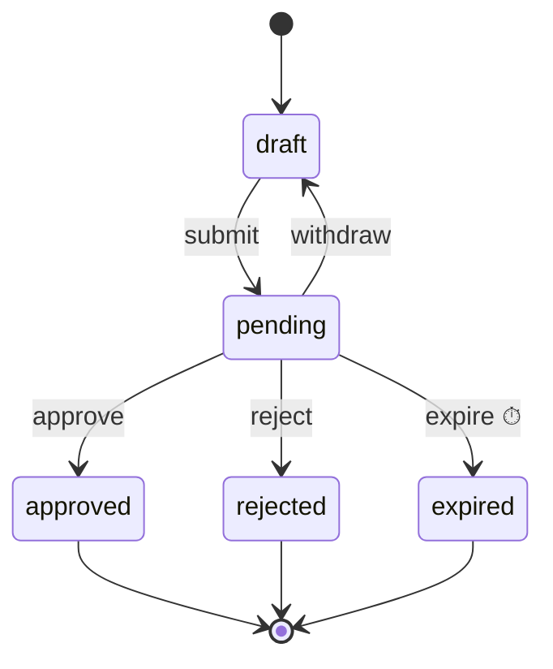

# Guide

A leave request taken from definition to page, then recipes by scenario, a checklist before going live, and troubleshooting. The package is `@nocobase/lifecycle`, with `/jobs`, `/react` and `/testing` entries.

## Quick start: a leave request

An employee submits a request into `pending`; the approver approves or rejects it; a request nobody handles for 72 hours expires; entering `pending` notifies the approver.



### 1. Declare the types

Four type members: the record, its states, the parameters an administrator may override, and the services guards and effects use.

```ts
import type { LifecycleRecord } from '@nocobase/lifecycle';

export type LeaveState =
  'draft' | 'pending' | 'approved' | 'rejected' | 'expired';

export interface Leave extends LifecycleRecord {
  readonly status: LeaveState;
  readonly applicantId: string;
  readonly approverId: string;
  readonly days: number;
}

export interface LeaveTypes {
  record: Leave;
  state: LeaveState;
  parameters: { expireAfterHours: number };
  services: {
    mail: { send(to: string, subject: string, key: string): Promise<void> };
  };
}
```

### 2. Write the effect and the lifecycle

```ts
import {
  defineEffect,
  defineLifecycle,
  type Lifecycle,
  type TransitionContext,
} from '@nocobase/lifecycle';

const notifyApprover = defineEffect<LeaveTypes>({
  name: 'leaves.notifyApprover', // stored on every effect run: keep it stable
  retry: { attempts: 3, backoffMs: 5_000, factor: 2 },
  run: ({ record, services, idempotencyKey }) =>
    services.mail.send(
      record.approverId,
      'A leave request awaits you',
      idempotencyKey,
    ),
});

const applicantOnly = ({ record, actor }: TransitionContext<LeaveTypes>) =>
  actor.id === record.applicantId || {
    code: 'applicantOnly',
    message: 'Only the applicant can do this.',
  };

const approverOnly = ({ record, actor }: TransitionContext<LeaveTypes>) =>
  actor.id === record.approverId || {
    code: 'approverOnly',
    message: 'Only the approver can decide.',
  };

export const leaveLifecycle: Lifecycle<LeaveTypes> =
  defineLifecycle<LeaveTypes>({
    name: 'leaves', // also the default collection name
    initial: 'draft',
    states: [
      'draft',
      'pending',
      { name: 'approved', title: 'Approved', final: true },
      { name: 'rejected', title: 'Rejected', final: true },
      { name: 'expired', title: 'Expired', final: true },
    ],
    parameters: { expireAfterHours: 72 },
    transitions: {
      submit: {
        title: 'Submit',
        from: 'draft',
        to: 'pending',
        guard: applicantOnly,
      },
      withdraw: {
        title: 'Withdraw',
        from: 'pending',
        to: 'draft',
        guard: applicantOnly,
      },
      approve: {
        title: 'Approve',
        from: 'pending',
        to: 'approved',
        guard: approverOnly,
      },
      reject: {
        title: 'Reject',
        from: 'pending',
        to: 'rejected',
        guard: approverOnly,
        validate: (input) =>
          input.reason ? [] : [{ field: 'reason', message: 'Give a reason.' }],
        accept: ['reason'], // written onto the record with the state
      },
      expire: {
        from: 'pending',
        to: 'expired',
        guard: ({ actor }) =>
          actor.system === true || {
            code: 'systemOnly',
            message: 'The system expires a request once the wait has passed.',
          },
      },
    },
    onEnter: { pending: [notifyApprover] },
    triggers: {
      expireStale: {
        transition: 'expire',
        when: 'pending',
        after: ({ expireAfterHours }) => expireAfterHours * 3_600_000,
      },
    },
  });
```

The definition is checked when the module loads: a state with no way out, an unreachable state, or a final state with a transition leaving it throws `INVALID_DEFINITION`.

### 3. Write the migration

The library ships no migration. The record's collection needs three columns, and the plugin creates the two log collections itself; the full field list is in [design.md](design.md#storage), and `packages/examples/app-plugin-lifecycle-example/database/migrations/` is the shape to copy.

```ts
await builder.createCollection('leaves', (table) => {
  table.bigInt('id').primary().autoIncrement().notNull();
  table.string('applicantId').notNull();
  table.string('approverId').notNull();
  table.integer('days').notNull();
  table.string('reason');
  table.string('status').notNull(); // the state
  table.datetimeTz('statusChangedAt').notNull(); // what the trigger sweep reads
  table.integer('lifecycleVersion').notNull().defaultTo(0); // concurrency
  table.index(['status', 'statusChangedAt']);
});
// Then lifecycleTransitions and lifecycleEffectRuns. The log keeps a nullable
// requestId and a not-null requestKey (the requestId, or `$v:<version>`),
// with unique indexes on (lifecycle, recordId, version) and on
// (lifecycle, recordId, requestKey): plain indexes, the same on every dialect.
// The runs keep a nullable json continuation and two nullable datetimeTz
// columns, both indexed: continuationDueAt, for a continuation waiting to be
// retried, and continuationAbandonedAt, for one the sweep gave up on.
```

### 4. Assemble the runtime in a provider

```ts
import {
  createRepositoryLifecycleStore,
  LifecycleRuntime,
} from '@nocobase/lifecycle';
import { createLifecycleJobs } from '@nocobase/lifecycle/jobs';

const executors = container.resolve(jobExecutorServiceToken);
const jobs = createLifecycleJobs({
  jobs: executors.getJobExecutor(PACKAGE_NAME),
  schedule: executors.getScheduleExecutor(PACKAGE_NAME),
  jobName: `${PACKAGE_NAME}/effect`, // stored with every queued task: keep it stable
  sweepEveryMs: 60_000,
  onSweep: async () => {
    await runtime.prune({ olderThan: new Date(Date.now() - 7 * 86_400_000) });
  },
});
const runtime = new LifecycleRuntime({
  store: createRepositoryLifecycleStore(
    container.resolve(databaseManagerToken),
  ),
  dispatcher: jobs,
  logger,
});
runtime.register(leaveLifecycle, { services: { mail } });

// In start(): registers the effect job, opens the executors, schedules the
// sweep (reclaim, triggers, onSweep) and recovers what an earlier process left.
await jobs.start(runtime);
// In shutdown():
await jobs.shutdown();
```

Without a dispatcher, effects run in process before `fire()` returns, which is fine while developing. `createLifecycleJobs()` is what to use once the jobs service is there; see the checklist below for what it takes care of.

### 5. Write the record routes

The library ships no routes: they are the plugin's, under its namespace, declared for the API document and refusing in the standard error body, as `packages/app/app-skills/skills/nocobase-app-development/references/http-api.md` requires of every `/api` route. Write the few the page's hook calls (listed under [The record routes](#the-record-routes)) and keep their base path in `shared/`, so the server and the client read the same constant:

```ts
// shared/routes.ts
export const LEAVE_ROUTES: string = 'leaves';
```

```ts
import {
  ApiError,
  apiErrorHandler,
  apiValidator,
  dataResponse,
  describeRoute,
} from '@nocobase/app-server/router';
import { LifecycleError, lifecycleErrorFields } from '@nocobase/lifecycle';

/** A lifecycle refusal as the standard error body; anything else as it is. */
function toApiError(error: unknown, inputField?: string): unknown {
  if (!(error instanceof LifecycleError)) return error;
  const fields = lifecycleErrorFields(error, inputField ? { inputField } : {});
  return fields ? new ApiError({ ...fields, domain: 'leaves' }) : error;
}

router.use('/leaves/*', authentication.required());
router.onError((error, c) => apiErrorHandler(toApiError(error), c));
router.post(
  '/leaves/:leaveId/fire',
  describeRoute({
    tags: ['Leaves'],
    summary: 'Fire a transition on a leave request',
    operationId: 'leavesFireTransition',
    responses: { 200: dataResponse(FireViewSchema) /* and the refusals */ },
  }),
  apiValidator('param', LeaveParams),
  apiValidator('json', FireInput), // { transition, input, requestId, expectVersion? }
  async (c) => {
    const { leaveId } = c.req.valid('param');
    const body = c.req.valid('json');
    const actor = { id: String(c.get('auth')?.user.id) };
    try {
      const result = await runtime.fire('leaves', leaveId, body.transition, {
        actor,
        input: body.input,
        requestId: body.requestId,
        ...(body.expectVersion === undefined
          ? {}
          : { expect: { version: body.expectVersion } }),
      });
      const view = await runtime.view('leaves', leaveId, actor);
      return c.json({ data: { ...view, replayed: result.replayed === true } });
    } catch (error) {
      throw toApiError(error, 'input'); // field problems sit under `input` in this body
    }
  },
);
// Lists and creation are the plugin's own routes too; creation calls runtime.create().
```

The lifecycle example's `server/routes/lifecycle.ts` is the complete set — the description, a record's view, firing, and an operator's retry, continue and cancel of a run — with their zod schemas in `server/routes/schemas.ts` and their tests.

### 6. Use the hook on the page

Configure the hook once for the plugin's routes, then call it with a lifecycle and a record:

```ts
// client/lib/lifecycle.ts
import { useApiClient } from '@nocobase/app-client';
import {
  createLifecycleHook,
  type UseRecordLifecycle,
} from '@nocobase/lifecycle/react';

import { LEAVE_ROUTES } from '../../shared/routes.js';

export const useLeaveLifecycle: UseRecordLifecycle = createLifecycleHook({
  useTransport: useApiClient,
  basePath: LEAVE_ROUTES,
});
```

```tsx
import { LifecycleRequestError } from '@nocobase/lifecycle/react';

import { useLeaveLifecycle } from '../lib/lifecycle.js';

function LeaveDetail({ id }: { id: string }) {
  const { view, busy, fire } = useLeaveLifecycle('leaves', id);
  if (!view) return null;
  return view.available.map((t) => (
    <Button
      key={t.name}
      disabled={!t.allowed || busy}
      title={t.blockers[0]?.message}
      onClick={() =>
        fire(t.name).catch(
          (e) => e instanceof LifecycleRequestError && toast(e.message),
        )
      }
    >
      {t.title}
    </Button>
  ));
}
```

`fire` sends a fresh request key and the version on screen. The hook refreshes every 4 seconds, so the page follows effects that finish in the background. A third argument adds query parameters to every request, `useLeaveLifecycle('leaves', id, { tenant })`; the hook builds its client once per transport and query, so the object can be written inline. `client` on the result fires on a record the page has not selected, such as one it has just created.

### 7. Write the tests

```ts
import { createLifecycleTestKit } from '@nocobase/lifecycle/testing';

it('expires a request nobody handles', async () => {
  const kit = createLifecycleTestKit(leaveLifecycle, {
    services: { mail: fakeMail },
  });
  const leave = await kit.start(
    { applicantId: 'lin', approverId: 'wang', days: 2 },
    { actor: 'lin' },
  );
  await kit.fire(leave, 'submit', {}, { actor: 'lin' });
  kit.advance({ hours: 73 });
  await kit.runTriggers();
  expect(kit.get(leave).status).toBe('expired');
  expect(await kit.history(leave)).toEqual(['$create', 'submit', 'expire']);
});
```

`kit.start()` creates a record through `runtime.create()`, with the definition's `create` checks, the `$create` entry and the initial state's `onEnter` effects. `kit.create()` inserts the record directly, as a seed would: it bypasses `create.validate` and `create.guard` and writes no history, which suits a test about later transitions. Test who may create what with `kit.start()` or `runtime.create()`.

## By scenario

Each recipe below is a paragraph; [examples.md](examples.md) has the code for most of them.

**Never write the state field directly.** The library does not protect it. Writing `status` or `statusChangedAt` through an ordinary Repository or SQL bypasses the guards, the log, the effects and the version check, and leaves no trace of who did it. Change state with `runtime.fire()`, create with `runtime.create()`, and write a data fix as a transition only the system may fire. `lifecycleVersion` may be advanced outside the lifecycle, but only as [Advance the version outside the lifecycle](#advance-the-version-outside-the-lifecycle) describes.

### Tell the person why a button is greyed out

A guard returns `true` to allow, or `false`, a message, or `{ code, message, kind? }` to refuse. `view().available[i].blockers` and the `blockers` on the `LifecycleError` that `fire()` throws are the same list. A stable `code` lets the page translate the reason; the example plugin's client does this through its locale files. Each blocker has a `kind`: `permission` when this actor may not act, which is what a refusal is unless the guard says otherwise, and `precondition` when nobody may until the record changes — `{ code: 'openTasks', message: 'Finish the outstanding tasks first.', kind: 'precondition' }`. A route answers a refusal whose blockers are all preconditions with `400 FAILED_PRECONDITION` and any other with `403 PERMISSION_DENIED`, so the person who may act is not told they lack permission. When the state is wrong, `can()` answers with a blocker whose `source` is `state` and whose `kind` is `precondition`.

Only `fire()` and `can()` given input guarantee a guard reads input `validate` accepted: they run `validate` before the guards, so a missing field is an `INVALID_INPUT` problem rather than a guard's refusal. `available()`, `view()` and `can()` without input ask the guards with `{}`, so a guard that reads the input must still answer for `{}`; when the answer depends on the input — approve this line, not that one — ask `can(name, id, transition, actor, { input })`, which validates the input first and answers `{ allowed, blockers, problems }` without throwing. Either is a preview: `fire()` decides again inside its transaction.

### Validate input and write fields onto the record

`validate(input)` returns `[{ field, message }]`, a message, or `null`. A refusal has code `INVALID_INPUT` and lists the problems, so the page can mark each field. `accept: ['reason']` copies those input fields onto the record as they are; `set` runs after it and wins on the same field. The state, timestamp and version fields cannot be accepted.

### One button, several destinations

Write `to` as an array and `route(context)` to pick one. The expense report's `submit` goes straight to `approved` or to `awaitingManager` depending on the amount. `set` receives `to`, so it can write fields per destination.

### Record a change without changing the state

A self-transition has the same `from` and `to`: handing an approval to someone else, an escalation, a follow-up reply. The version still increments and `statusChangedAt` is still updated, so a trigger starts its wait again.

### Advance the version outside the lifecycle

An edit a transition must not race — a form that changes the amount a guard reads — may advance `lifecycleVersion` itself, so that a transition decided on what was read before the edit meets `CONFLICT` instead of applying, and a hook may do the same to fence a stay. Only ever increment it, and only on the condition that it is still the version that was read: `updateMany({ filter: { id, status: readStatus, lifecycleVersion: readVersion }, values: { …changes, lifecycleVersion: { increment: 1 } } })`, reading again and reapplying the change when nothing was updated. Never set it to a value of your own or lower it. The log does not record such an edit, so the versions of consecutive log entries skip the numbers edits took. It does not disturb an effect's continuation, which is bound to the transition that queued its run rather than to the version, and a hook that advances the version of its own record has not moved it on: only a transition fired through `tx` ends the transition that ran the hook. What it does end is anything else bound to the version — above all a second layer that knows its stay by the version the entering transition wrote, as [design.md](design.md#two-layers-what-happens-while-a-record-waits) describes, whose every later conclusion is then refused — so do not edit a record this way while it waits in such a state. Both example plugins edit their records this way.

### Start from almost any state

`from: '*'` means every non-final state; `from: { except: ['draft', 'approved'] }` means every non-final state but those.

### Act on a timeout

Declare a trigger: `when` is the state, `after(parameters)` returns milliseconds. The transition it fires runs as the system (`actor.system === true`); usually give it a guard that refuses everyone else, so a person cannot click it.

### Call an external system, retry, then move on

Write an effect. `retry`, `timeoutMs` and `shouldRetry` control the retries; pass `idempotencyKey` to the external system; `onSuccess: 'paid'` fires the next transition as the system with the run's result as input, and `accept: ['paymentRef']` on that transition writes the result onto the record. `onFailure` receives `{ error }`; throw an `EffectFailure(code, message, { details })` when the effect knows why it failed, and it receives `errorCode` and `details` as well, without the attempt being retried; `details` that are not JSON, such as a BigInt, are dropped and the failure is recorded as any other. A continuation the record refuses because it has moved on — or, for an `onEnter` effect, has left the stay the run was queued for, even to come back to the same state — is logged and rolled back, the outcome stays recorded, nothing follows from it, and the effect does not run again. A continuation refused for any other reason — most often a lifecycle call in its `onTransition` or a hook that was refused, such as a parent not ready to move, or a result that fails the transition's `validate`, or a definition this process does not have yet — is rolled back too and waits on the run, its outcome recorded, until the sweep fires it; see [Operate](#operate-list-retry-continue-cancel-prune). Only a `CONFLICT` or a failure that is not a lifecycle refusal puts the attempt back in the queue. `idempotencyKey` covers the attempts of one run only: a record entering the state again owes a new run with a new key, so a call that must happen once per business fact is keyed by that fact.

### Refuse duplicate submissions and stale pages

Calling the runtime directly, pass `requestId` and `expect: { version }`; the React hook sends both on its own. A webhook uses the sender's delivery id as its `requestId`. A `requestId` may not be empty, nor start with `$`, which the library keeps for its own entries, such as an effect's continuation; `fire()` refuses either with `INVALID_REQUEST_ID`.

### Create a record

Use `runtime.create(name, values, { actor, state? })` rather than an insert. It writes the `$create` log entry, starts the version at 1 and runs the initial state's `onEnter` effects. When `initial` lists several states, `state` picks one. Who may create a record, and what it must hold, belongs in the definition's `create: { validate, guard }` rather than in a route: `runtime.create()` checks the values, then the guard, inside its transaction and refuses with the same `INVALID_INPUT` and `GUARD_REJECTED` a transition does, so an import or a script meets the rule the form does. Being allowed to create a draft is not being allowed to submit it; that stays the submitting transition's guard.

### Join a transaction the caller holds

`fire()` and `create()` take `transaction`: the `transactionHandle` an `onTransition` or a services factory receives, or the `@nocobase/db` connection of the caller's own `database.transaction()`, on the connection the store writes to. The call is nested in it as a savepoint, so a parent can create its children in its own transition, a child's last transition can move its parent on in the same commit, and an application can group several calls with its own writes. A refusal undoes only the nested call's writes and is thrown to the caller, which decides whether the whole transaction fails. Effects and listeners wait for the outermost commit and are dropped on rollback, so the effect runs a joined call returns are still queued. On SQLite, read inside the transaction through the same connection; `view()`, `available()` and `can()` do not take one and would wait for it.

Inside an `onTransition` or a state hook, always go through `tx`, or pass `transaction: transactionHandle`. A `runtime.fire()`, `runtime.create()` or `runtime.transaction()` there without it opens a transaction of its own. On SQLite, on the memory store and in the test kit that transaction waits for the one it is called from, which waits for it, forever. On PostgreSQL, MySQL and the other server databases it runs on a connection of its own and commits on its own: if the outer transaction then rolls back, the inner call's transition stays committed, and if it touches rows the outer transaction has locked, each waits for the other. Without a dispatcher, effects run inline in the commit callbacks of the outermost transaction, so a caller's own `database.transaction()` that joined lifecycle calls resolves only once those effects, and the continuations they fire, have finished; give the runtime a dispatcher such as `createLifecycleJobs()` where that wait matters.

### Let another plugin veto an action

`runtime.addGuard('expenses', ['approve'] | '*', guard)` adds a guard without touching the definition; its refusals join the other blockers, with the same `kind`, and the returned function removes it. It applies to transitions only: creation is checked by the definition's `create.guard` alone, which no other code can veto.

### Write other tables with the state

Put `onTransition(context)` on the transition. It runs in the same transaction after the record and the log entry are written; `context.transactionHandle` is the transaction, and throwing rolls everything back. In an effect's continuation, a `LifecycleError` other than `CONFLICT` — a refusal, its own or one a lifecycle call it made raised — rolls back the continuation and keeps the effect's outcome recorded, the continuation waiting on the run; a `CONFLICT` or an ordinary `Error` rolls back the outcome too, and the effect runs again after its backoff. Nothing that reaches outside the database belongs here — that is an effect.

### Set something up while a record waits in a state

`onEnterState: { reviewing: hook }` runs in the transaction of every transition entering `reviewing`, `runtime.create()` included; `onLeaveState` runs in the transaction of every transition leaving it, after the record is written and before the hooks of the state it enters. The hook receives the record, `previous`, `from`, `to`, the transition, the actor, the input and `tx`. Use it for rows that belong to the stay, such as the tasks a stage opens, and end them on the way out; a self-transition runs both.

A hook, or `onTransition`, may fire this same record onward through `tx`, or through `runtime.fire()` given its `transactionHandle`, for a stay that concludes at once; so may a call it made in turn, such as a child created in the hook whose own hook moves the parent on. Doing so ends the transition that ran it: the hooks and `onTransition` still to come do not run, the `onEnter` effects of the state it entered are not queued, and that state announces nothing; the transition's own `effects` are still queued, since the transition happened. Each run records whether it belongs to the entered stay in `stayBound`; when only the transition's effects remain, their runs are not bound to that ended stay even if the same effect also appears in `onEnter`. `fire()` or `create()` returns the record as the hook's transition left it, with this transition's log entry and the effect runs of its own effects. The transition itself stands: it stays in the history, and its `completed` and `entered` listeners hear of it, before those of the transition the hook fired. Only a transition of this lifecycle on this record counts: a hook that advances the version itself, or fires another lifecycle on the same record, lets the transition carry on.

A state definition may carry the same hooks itself — `{ name: 'approving', onEnterState, onLeaveState }` — and they run before the lifecycle's hooks for that state. This is how a module hands a business a whole state rather than hooks to wire by name: a reusable second layer, such as an approval layer, could provide the whole state — starting its work on entering and cancelling it on leaving early — and the business only lists it among its `states`.

### Move several records in one transaction

`runtime.transaction(async (tx) => { … })` gives one transaction across every registered lifecycle: `tx.read()` reads through the transaction store, while `tx.fire()` and `tx.create()` check exactly what `fire()` and `create()` check, `tx.handle` writes rows of your own, and `tx.afterCommit()` schedules a best-effort callback. Events, effects and callbacks follow the commit, and none of it happens on a rollback. They run in the order they were registered: a callback registered before a `tx.fire()` runs before that transition's events and effect dispatch, so register a callback that must follow them after the call. Each `tx.fire()` and `tx.create()` runs in a savepoint; a refusal or hook failure undoes that call, and the caller may catch it and continue. An uncaught failure rolls the outer transaction back. Hooks and `onTransition` receive the same `tx`. Calling `runtime.fire()`, `runtime.create()` or `runtime.transaction()` instead from inside the work, a hook or an `onTransition` opens a second transaction: on the memory store and on SQLite it waits forever, and on PostgreSQL, MySQL and the other server databases it commits on its own, so a rollback of the outer transaction does not undo it, and it waits for any row the outer transaction has locked while the outer transaction waits for it.

### A transition only the server fires

`manual: false` on a transition keeps it off every page: plugin routes pass `manual: true` to `fire()` to refuse it with `NOT_MANUAL`, `available()` leaves it out, `can()` refuses it with a `manual` blocker and `announce` skips it. Server code fires it as usual. Use it for a conclusion that something else decides — the last vote of a stage, an external callback — so nobody can skip what decides it.

### Read other tables from a guard

Register the services as a factory, `(handle) => services`, so the services a guard, `route` or `set` receives are bound to the transaction. On SQLite anything else deadlocks.

### Subscribe to changes

`runtime.on('completed', { lifecycle, transition }, listener)` fires once per transition and creation; `'entered'` filters by the state entered; `'announce'` fires once per transition the new state allows, which is what a to-do list needs. The returned function unsubscribes. Delivery is best effort.

### Operate: list, retry, continue, cancel, prune

`listEffectRuns({ status: 'failed' })` finds the failed runs; `retryRun(id)` runs a `failed`, `dead` or `cancelled` run again with a fresh budget of attempts, and refuses with `RUN_SETTLED` a run whose `onFailure` already moved the record on, or is waiting to, unless given `{ force: true, reason }`, which drops the waiting continuation. Those are the only settled runs it refuses — it also refuses a run in another status, a queued one included, with `INVALID_STATE` and one whose effect this process does not know with `UNKNOWN_EFFECT` — so a `dead` or `cancelled` run, a run whose effect has no `onFailure`, or one whose continuation was dropped because the record moved on is retried without `force` even when the record has since left the state the effect served or entered it again: check the record before retrying one, or a payment can be made twice. A run whose `continuation` is not null recorded its outcome but could not fire `onSuccess` or `onFailure` yet: most often a lifecycle call in its `onTransition` or a hook was refused, such as a parent not ready to move; otherwise this process cannot fire it as it defines it, which a deploy can change. An operations page looks for these as well as for failed runs: `listEffectRuns({ continuationPending: true })` lists the ones that wait, whatever their status, `succeeded` included. `reclaim()` tries each again once it is due, backing off from a minute to an hour and taking at most 100 per sweep; a `CONFLICT` is tried again after a minute without counting, and an error that is not a refusal, such as a deadlock or a lost connection, backs off as a refusal does, counted in `errorTries` rather than toward giving up, so an outage never gives up on a continuation; nor does a bug that throws an ordinary error, which is tried at most hourly and logged on its 1st, 2nd, 4th… such try until it is fixed. After ten counted tries, about four hours with the default backoff, the sweep gives up: the continuation gains `abandonedAt`, is logged once as an error and is listed by `continuationAbandoned: true` instead of `continuationPending: true`, and its run is still never pruned, since it is the only record of an outcome — a payment made — that its record never followed. A parent not ready to move is the usual reason, and is seldom ready within those hours: such a continuation usually needs a person to `continueRun(id)` once the parent is, so an operations page lists these as well. The backoff, the batch and the number of tries are set through the runtime's `continuations` option. A continuation of an `onEnter` effect follows only the stay its run was queued for: once the lifecycle has logged another transition of the record — leaving the state, coming back into it, or a self-transition, which enters the state again and queues its `onEnter` effects anew — it is dropped, and an old result never moves a new round on; an edit that only advances the version does not end the stay. A continuation of an effect the transition itself declares follows the transition instead, and is checked only against the state the record is in, as any transition is. It needs the run's lifecycle registered but not its effect, so a run whose effect a release removed is still continued, and a process that does not register the lifecycle puts the run off rather than letting it hold the batch. `continueRun(id)` tries one at once, waiting or given up on, throwing the refusal if it is refused again, `NO_CONTINUATION` if nothing waits and `UNKNOWN_LIFECYCLE` if its lifecycle is not registered here; a route answers its refusals with `lifecycleErrorFields(error, { continuation: true })`. The effect does not run again. `cancelRun(id)` gives up on a `queued` or `running` one; `prune({ olderThan })` deletes old `succeeded` and `cancelled` runs, never one that holds a continuation, waiting or given up on. The retry, continue and cancel routes are `operate` actions, refused unless `authorize` allows them.

### Draw the state diagram

`toMermaid(runtime.describe('leaves'))` produces a Mermaid state diagram: ⏱ marks a trigger, ✓ and ✗ mark an effect's `onSuccess` and `onFailure`, and ⚙ a transition only server code fires. `lifecycleDescriptionView(runtime, name)` includes it as `diagram`, for the `GET <lifecycle>/lifecycle` route.

## Before going live

| Item                                 | Requirement                                                                                                                                                               | If missed                                                                                                                                                                                            |
| ------------------------------------ | ------------------------------------------------------------------------------------------------------------------------------------------------------------------------- | ---------------------------------------------------------------------------------------------------------------------------------------------------------------------------------------------------- |
| A dispatcher that honours `runAfter` | `createLifecycleJobs()` waits out a retry's backoff before queueing the job; a dispatcher of your own must do the same with the `runAfter` it is given                    | Retries have no backoff and burn through their attempts in milliseconds                                                                                                                              |
| Register the job before consuming    | `createLifecycleJobs().start()` registers the effect job before `setup()`; a dispatcher of your own must too                                                              | Tasks an earlier process queued find no handler                                                                                                                                                      |
| Sweep on a schedule                  | `start()` schedules `reclaim()`, `runTriggers()` and `onSweep` every `sweepEveryMs`, which must be well below the shortest `after`. Several instances may sweep at once   | Timeouts never fire, an attempt whose process died stays claimed until a restart, and a continuation waiting for a fix is never tried again                                                          |
| Recover on start                     | `start()` runs `recover()` after both executors are open                                                                                                                  | Runs queued before a restart never run                                                                                                                                                               |
| Prune                                | Put `runtime.prune()` in `onSweep`, deleting `succeeded` and `cancelled` runs older than a week or so                                                                     | The effect run table grows without bound                                                                                                                                                             |
| `timeoutMs` below `leaseMs`          | `leaseMs` is five minutes by default. Every effect's `timeoutMs`, and the real running time of an effect without one, must stay under it; the runtime does not check this | `reclaim()` takes back an attempt that is still running and runs it again. The old attempt's result is fenced out, but the external call may have happened twice; only the idempotency key saves you |
| Idempotency keys on external calls   | Pass `idempotencyKey` to payments, mail and the like, or use it as the unique key of your own ledger                                                                      | Retries and recovery pay or send twice                                                                                                                                                               |
| An index for the sweep               | `(status, statusChangedAt)` on the record's collection                                                                                                                    | Every sweep is a full table scan                                                                                                                                                                     |
| Services bound to the transaction    | Register them as `(handle) => services`                                                                                                                                   | Deadlocks on SQLite                                                                                                                                                                                  |
| `authorize` on the routes            | Distinguish at least `read`, `fire` and `operate`. Guards express business rules, not permissions                                                                         | Any signed-in user can view and operate. The examples' `authorize: () => true` is for the demo only                                                                                                  |

## Troubleshooting

| Symptom                                                                    | Cause                                                                                                                                                                                                                                                                                                                                                                                                                                                                                                                                                                                                                                                                                                                                                                                                                                                                    | What to do                                                                                                                                                                                                                                                                                                                                                                                                                      |
| -------------------------------------------------------------------------- | ------------------------------------------------------------------------------------------------------------------------------------------------------------------------------------------------------------------------------------------------------------------------------------------------------------------------------------------------------------------------------------------------------------------------------------------------------------------------------------------------------------------------------------------------------------------------------------------------------------------------------------------------------------------------------------------------------------------------------------------------------------------------------------------------------------------------------------------------------------------------ | ------------------------------------------------------------------------------------------------------------------------------------------------------------------------------------------------------------------------------------------------------------------------------------------------------------------------------------------------------------------------------------------------------------------------------- |
| Frequent `CONFLICT`                                                        | The record changed while the page was open (`expect.version` no longer matches), or two requests really arrived together                                                                                                                                                                                                                                                                                                                                                                                                                                                                                                                                                                                                                                                                                                                                                 | Expected. Tell the person the record changed, reload, and let them decide again; do not retry automatically. If the conflicts come from a trigger or a continuation, check whether they compete with people for the same state                                                                                                                                                                                                  |
| A request hangs on SQLite                                                  | A guard, `route`, `set` or `onTransition` reads or writes through the database manager and waits for the connection the transaction holds                                                                                                                                                                                                                                                                                                                                                                                                                                                                                                                                                                                                                                                                                                                                | Switch to a services factory and read through the `transactionHandle`                                                                                                                                                                                                                                                                                                                                                           |
| A transition never returns                                                 | An `onTransition` or a state hook calls `runtime.fire()`, `create()` or `transaction()` without `tx`, which waits for the transaction it is called from: forever on SQLite, on the memory store and in the test kit                                                                                                                                                                                                                                                                                                                                                                                                                                                                                                                                                                                                                                                      | Call `tx.fire()` or `tx.create()`, or pass `transaction: context.transactionHandle`                                                                                                                                                                                                                                                                                                                                             |
| A rolled-back transition left another record moved, on PostgreSQL or MySQL | An `onTransition` or a state hook called `runtime.fire()`, `create()` or `transaction()` without `tx`: on a server database that call opens a transaction on a connection of its own and commits it separately, so the outer rollback does not reach it. If it touches a row the outer transaction has locked, the two wait for each other instead                                                                                                                                                                                                                                                                                                                                                                                                                                                                                                                       | Call `tx.fire()` or `tx.create()`, or pass `transaction: context.transactionHandle`                                                                                                                                                                                                                                                                                                                                             |
| A caller's transaction is slow to resolve                                  | No dispatcher: the effects of the lifecycle calls it joined run inline once it commits, and it resolves after them                                                                                                                                                                                                                                                                                                                                                                                                                                                                                                                                                                                                                                                                                                                                                       | Expected while developing; give the runtime `createLifecycleJobs()` as its dispatcher                                                                                                                                                                                                                                                                                                                                           |
| An effect run stays `queued`                                               | (1) this process has not registered the effect: `registered: false` in `listEffectRuns()` and "is not registered; it stays queued" in the log, usually after a rename; (2) the dispatch was lost; (3) `runAfter` has not come                                                                                                                                                                                                                                                                                                                                                                                                                                                                                                                                                                                                                                            | (1) register the old name again, or cancel the runs; (2) `reclaim()` on the sweep hands it over once it has been due for a lease, and `recover()` at the next start; (3) wait                                                                                                                                                                                                                                                   |
| An effect run becomes `dead`                                               | Every attempt ended without recording an outcome: the process crashed or was killed mid-attempt, or the outcome write failed each time                                                                                                                                                                                                                                                                                                                                                                                                                                                                                                                                                                                                                                                                                                                                   | Find out why the process stops on this effect — memory, a timeout — then `retryRun()`                                                                                                                                                                                                                                                                                                                                           |
| A run is `failed` and the record is stuck                                  | The attempts ran out, or `shouldRetry` said no, and the effect has no `onFailure`                                                                                                                                                                                                                                                                                                                                                                                                                                                                                                                                                                                                                                                                                                                                                                                        | Fix the cause and `retryRun()`; success fires `onSuccess` as usual. For an automatic fallback, add `onFailure` to a state a person handles                                                                                                                                                                                                                                                                                      |
| An effect succeeded but its record never moved                             | (1) its `onSuccess` was refused because the record had moved on, or had left the stay its `onEnter` run was queued for and perhaps come back, logged as "could not continue" with a warning; (2) a lifecycle call its `onTransition` or a hook made was refused, such as a parent not ready to move, logged as a warning; (3) the continuation could not be fired as this process defines it — an old definition in a rolling deploy, a bug in `set` or `route`, a `validate` the result does not pass — logged as an error; (4) the sweep gave up on it after `continuations.maxAttempts` refused tries, logged once as an error; tries that failed with an error that is not a refusal, such as a database outage, never lead to this. In (2) to (4) the run's `continuation` holds the transition, its input, the refusal, when it is due and, for (4), `abandonedAt` | (1) nothing to do, or recover through the record's own transitions; (2) the sweep continues it once the other record allows it; (3) deploy the fix: the sweep fires it once it is due, or `continueRun(id)` at once; (4) fix the cause — often wait for the parent to be ready — then `continueRun(id)`; `listEffectRuns({ continuationAbandoned: true })` lists these, and `prune()` keeps them. The effect does not run again |
| A trigger never fires                                                      | (1) nothing calls `runTriggers()`; (2) the record was not created through `runtime.create()` and `statusChangedAt` is empty; (3) a self-transition restarted the wait; (4) the guard refuses the trigger, which is skipped silently; (5) a lifecycle call inside the transition is refused, logged as a warning on the 1st, 2nd, 4th… sweep                                                                                                                                                                                                                                                                                                                                                                                                                                                                                                                              | Check each. For (4), `can(name, id, transition, SYSTEM_ACTOR)` shows the blockers                                                                                                                                                                                                                                                                                                                                               |
| The sweep throws `AggregateError`                                          | A transition failed for a reason other than a state race or a guard: a broken definition or a failing store. The other records were handled                                                                                                                                                                                                                                                                                                                                                                                                                                                                                                                                                                                                                                                                                                                              | Read the "Trigger … could not fire …" log lines and fix each                                                                                                                                                                                                                                                                                                                                                                    |
| `INVALID_SET` on create                                                    | `values` set the state, timestamp or version field                                                                                                                                                                                                                                                                                                                                                                                                                                                                                                                                                                                                                                                                                                                                                                                                                       | Remove them. To start in a non-default initial state, pass `create(..., { state })`                                                                                                                                                                                                                                                                                                                                             |
| `INVALID_DEFINITION` on load                                               | An unreachable state, a final state with a way out, a non-final state without one, or `accept` naming a field the lifecycle manages                                                                                                                                                                                                                                                                                                                                                                                                                                                                                                                                                                                                                                                                                                                                      | Fix the definition; a state that genuinely has no way out is `final: true`                                                                                                                                                                                                                                                                                                                                                      |
| A duplicate submission got through                                         | The caller generates a new `requestId` each time, for example `client.fire()` inside a retry loop                                                                                                                                                                                                                                                                                                                                                                                                                                                                                                                                                                                                                                                                                                                                                                        | Reuse one `requestId` for the retries of one user action; webhooks use the sender's delivery id                                                                                                                                                                                                                                                                                                                                 |
| `REQUEST_REUSED`                                                           | One `requestId` was sent for two different transitions on a record, such as a key kept across two decisions                                                                                                                                                                                                                                                                                                                                                                                                                                                                                                                                                                                                                                                                                                                                                              | Take a new `requestId` for each decision a person makes; reuse it only for retries of that one decision                                                                                                                                                                                                                                                                                                                         |
| `INVALID_REQUEST_ID`                                                       | The `requestId` is empty, or starts with `$`, which the library keeps for its own log entries                                                                                                                                                                                                                                                                                                                                                                                                                                                                                                                                                                                                                                                                                                                                                                            | Send no `requestId` rather than an empty one, and generate keys without a leading `$`, for example by prefixing a namespace such as `payments:`                                                                                                                                                                                                                                                                                 |

Changing a definition that is already in production is covered in [design.md](design.md#changing-a-definition).

## Error codes

`LifecycleError` carries `code`, `message`, `blockers` and `problems`. `lifecycleErrorFields(error, { inputField?, continuation? })` turns a refusal into the fields of the application's standard error body — `status`, `reason` (the code), `message`, `fieldViolations` and `metadata: { blockers, problems }` — for `new ApiError({ ...fields, domain })`, and returns `undefined` for the server's own faults, which a route rethrows so the application answers an opaque `500`. `inputField` names where a transition's input sits in the body, such as `input`, so a problem with `line` is reported on `input.line`. `continuation: true` is for a refusal `continueRun()` threw: nothing in that request is wrong, so every refusal but `NO_CONTINUATION` and `CONFLICT` is answered `FAILED_PRECONDITION` (400) with its code as `reason`, its blockers and problems in `metadata` and no field violations — a guard's refusal and a definition bug included, since the continuation waits for them to change, and a `RECORD_NOT_FOUND` or `UNKNOWN_LIFECYCLE` too, which there names a record or a lifecycle the continuation's `onTransition` or a hook reached for, such as a parent deleted since. The route answers a record or a run its URL names that does not exist with `404` itself, before calling `continueRun()`.

| Code                                                   | Status                      | When                                                                                              |
| ------------------------------------------------------ | --------------------------- | ------------------------------------------------------------------------------------------------- |
| `NOT_MANUAL`                                           | `PERMISSION_DENIED` (403)   | A human action (`manual: true`) names a system-only transition                                    |
| `GUARD_REJECTED`                                       | `PERMISSION_DENIED` (403)   | A guard refused; `blockers` says why                                                              |
| `GUARD_REJECTED`, every blocker a `precondition`       | `FAILED_PRECONDITION` (400) | Nobody may until the record changes, such as while a subtask is open; `blockers` says what        |
| `INVALID_STATE`                                        | `FAILED_PRECONDITION` (400) | The current state does not allow the transition, or a run is not in a state the operation allows  |
| `RUN_SETTLED`                                          | `FAILED_PRECONDITION` (400) | `retryRun()` on a run whose `onFailure` already moved the record on, or waits to, without `force` |
| `NO_CONTINUATION`                                      | `FAILED_PRECONDITION` (400) | `continueRun()` on a run with no continuation waiting                                             |
| `UNKNOWN_EFFECT`                                       | `FAILED_PRECONDITION` (400) | A retry of a run whose effect this process does not know                                          |
| `CONFLICT`                                             | `ABORTED` (409)             | A concurrent change, or `expect` not met (a stale page)                                           |
| `INVALID_INPUT`                                        | `INVALID_ARGUMENT` (400)    | `validate` refused; `problems` lists the fields                                                   |
| `REQUEST_REUSED`                                       | `INVALID_ARGUMENT` (400)    | The `requestId` already fired another transition on this record; nothing was changed              |
| `INVALID_REQUEST_ID`                                   | `INVALID_ARGUMENT` (400)    | The `requestId` is empty, or starts with `$`, which is reserved for the library's own entries     |
| `UNKNOWN_TRANSITION`                                   | `INVALID_ARGUMENT` (400)    | The body names a transition the lifecycle does not have                                           |
| `UNKNOWN_LIFECYCLE` / `RECORD_NOT_FOUND`               | `NOT_FOUND` (404)           | Nothing by that name here                                                                         |
| `INVALID_ROUTE` / `INVALID_SET` / `INVALID_DEFINITION` | — (500)                     | A `route` or `set` that wrote what it may not, or a broken definition: the server's fault         |

## The record routes

`@nocobase/lifecycle/react` calls these below the `basePath` it is given; each answers `{ data }` and refuses in the standard error body, whose `reason` and `metadata.blockers` / `metadata.problems` the client reads:

| Request                                                                              | `data`                       |
| ------------------------------------------------------------------------------------ | ---------------------------- |
| `GET <lifecycle>/lifecycle`                                                          | `lifecycleDescriptionView()` |
| `GET <lifecycle>/{id}`                                                               | `runtime.view()`             |
| `POST <lifecycle>/{id}/fire` with `{ transition, input, requestId, expectVersion? }` | `RecordView & { replayed }`  |
| `POST <lifecycle>/{id}/effectRuns/{runId}/retry` with `{ force?, reason? }`          | `RecordView`                 |
| `POST <lifecycle>/{id}/effectRuns/{runId}/continue`                                  | `RecordView`                 |
| `POST <lifecycle>/{id}/effectRuns/{runId}/cancel`                                    | `RecordView`                 |

They authenticate and authorize like every other route of the plugin; who may read a record or operate its runs is the plugin's check, ahead of the validators, while the lifecycle's guards decide who may fire what.

`@nocobase/lifecycle/react` wraps them. `createLifecycleHook({ useTransport, basePath, refreshMs })` returns a hook, `(lifecycle, id, query?) => …`, that a page calls once; it is built on two lower-level pieces kept for tests and for code outside a component: `createLifecycleClient({ transport, basePath, query })`, which needs only a `request({ method, path, query, json })` function such as the application's API client, and `useLifecycle(client, lifecycle, id, { refreshMs })`. The hook returns `{ client, description, view, error, busy, fire, retryRun, continueRun, cancelRun, reload }`. A refusal rejects with a `LifecycleRequestError` carrying `reason`, `blockers` and `problems`.
