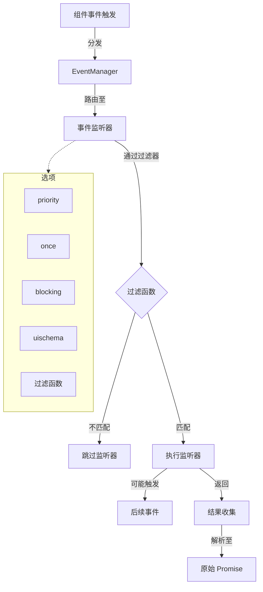
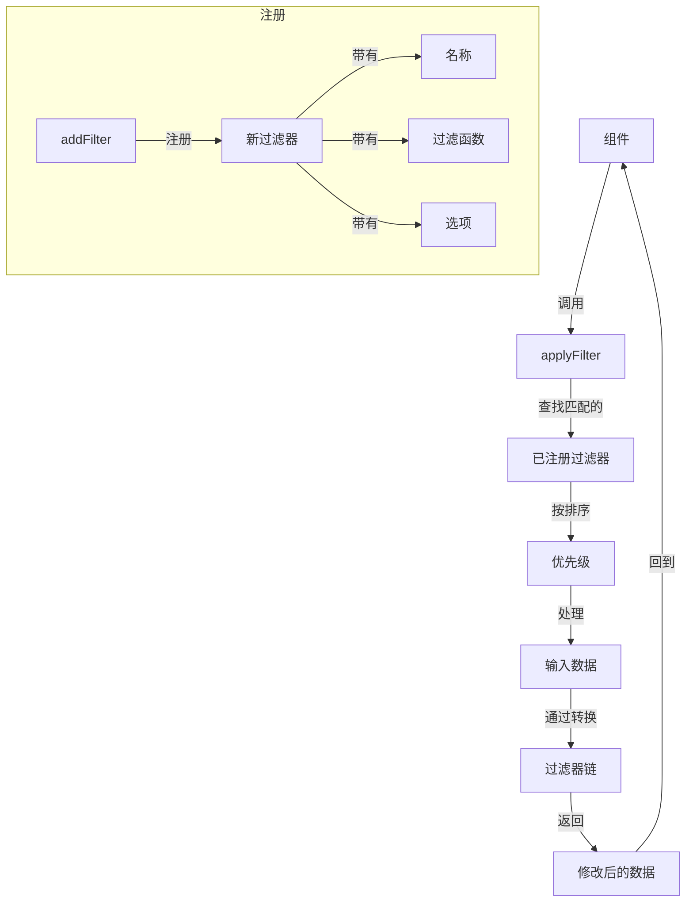
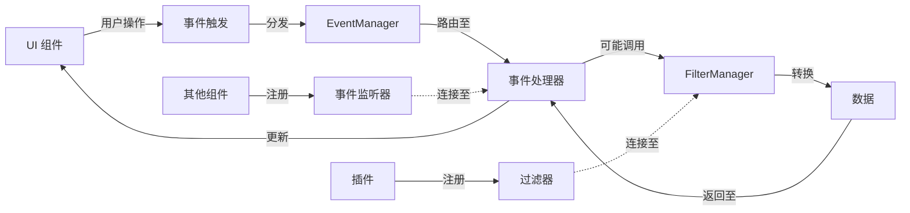
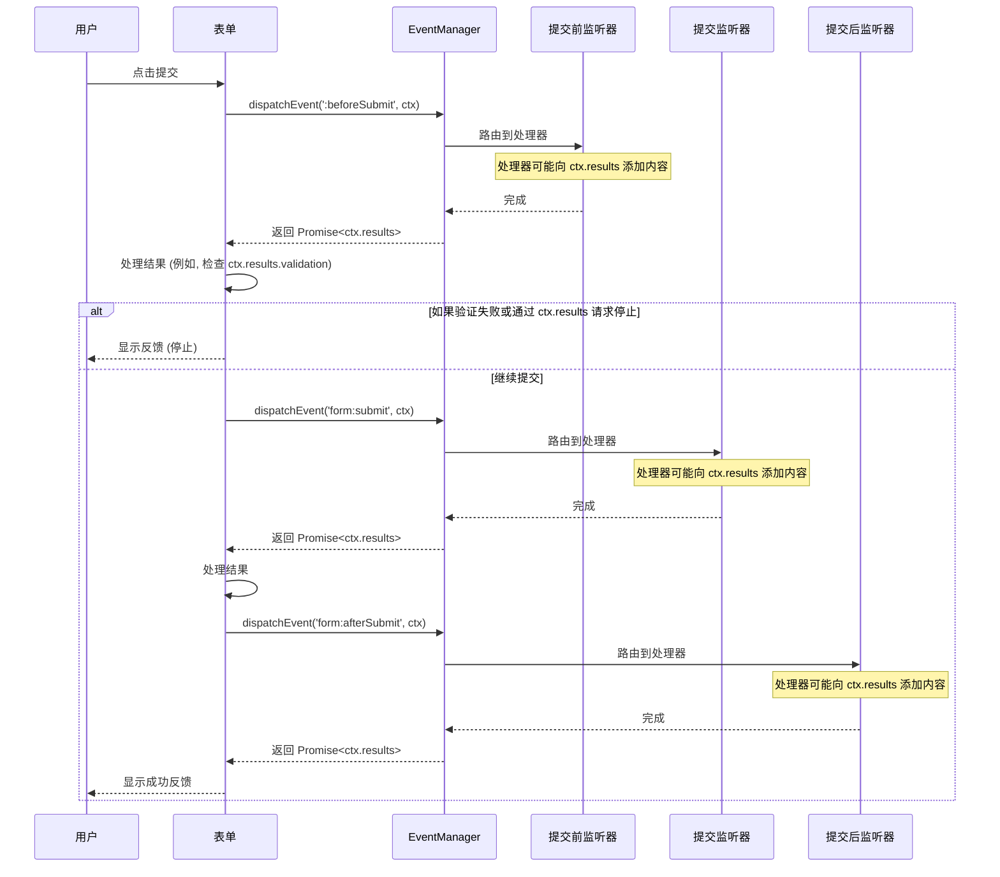

# 事件过滤器系统设计

## 简介

事件过滤器系统插件集成了 NocoBase 中的两个核心系统：

1.  **事件系统**：管理整个应用程序中的事件发布和订阅。
2.  **过滤器系统**：提供跨多种数据类型的数据转换能力。

本文档概述了这些系统的设计原则、架构和实现细节。

## 系统流程图

### 事件系统流程



### 过滤器系统流程



### 组件-事件-过滤器集成



## 核心组件

### 过滤器 API

过滤器 API 提供了数据转换机制，并通过 `addFilter` 增强了自定义能力。

#### FilterManager

```typescript
// 定义过滤器函数的预期签名
// 它可以是同步的或返回一个 Promise
type FilterFunction = (currentValue: any, ...contextArgs: any[]) => any | Promise<any>;

// 定义添加过滤器的选项
interface FilterOptions {
  priority?: number; // 数字越大，运行越晚
}

class FilterManager {  // 单例，通常通过 app.filterManager 访问
  // 为给定名称添加过滤器函数。
  addFilter(name: string, filter: FilterFunction, options?: FilterOptions): () => void; // 返回一个取消注册的函数

  // 移除指定的过滤器函数或移除某个名称下的所有过滤器。
  removeFilter(name: string, filter?: FilterFunction): void;

  // 将某个名称下所有已注册的过滤器应用于初始值。
  // 始终返回一个 Promise。
  applyFilter(name: string, initialValue: any, ...contextArgs: any[]): Promise<any>;
}
```

**关于异步性的说明：** 此 API 被设计为完全异步，以支持需要执行异步操作（例如 API 调用）的过滤器。`applyFilter` *始终* 返回一个 `Promise`，即使所有注册的过滤器都是同步的。调用者 *必须* 使用 `await` 或 `.then()` 来获取最终结果。

#### 过滤器命名约定

过滤器名称使用结构化的、类似命名空间的层级格式，以确保清晰并防止冲突：

`origin:[domain]:[sub-module/component]:attribute`

-   **`origin`**：（必需）标识来源。
    -   `core`：用于源自 NocoBase 核心的过滤器。
    -   `plugin:[plugin-name]`：用于来自特定插件的过滤器（例如 `plugin:workflow`）。
-   **`domain`**：（必需）高层级功能区域（例如 `block`、`collection`、`field`、`ui`、`data`、`auth`）。**注意：** 对于常见的、明确与 UI 相关的组件（例如 `modal`、`button`、`table`、`form`），如果组件名称明确暗示了其 UI 属性，为了简洁起见，*可以* 省略 `ui` 域。对于其他域或不太常见的组件，应包含域。
-   **`sub-module/component`**：（可选但推荐）更具体的组件或上下文（例如 `table`、`form`、`users`、`props`）。
-   **`attribute`**：（必需）正在被过滤的特定数据方面（例如 `props`、`data`、`schema`、`options`、`height`、`validationRules`）。

**理由：** 虽然这种格式可能导致名称更长，但明确性对于以下几点至关重要：

1.  **清晰性**：确保过滤器的来源和目的清晰。
2.  **避免冲突**：防止不同过滤器之间的命名冲突。
3.  **调试**：便于调试和维护。
4.  **可扩展性**：允许未来扩展而不破坏现有代码。
5.  **使用常量**：使用常量作为过滤器名称有助于在整个应用程序中保持一致性。

**示例：**

-   `core:block:table:props`：过滤核心表格区块的 props。
-   `core:collection:users:schema`：过滤核心 `users` 集合的 schema。
-   `plugin:workflow:node:approval:conditions`：过滤 `workflow` 插件中节点的审批条件。
-   `plugin:map:field:coordinates:format`：过滤 `map` 插件中坐标字段的显示格式。
-   `core:field:text:validationRules`：过滤核心文本字段的验证规则。

注册时需要使用这种完整的、结构化的名称。注册期间不支持通配符。

#### 方法

##### addFilter

```typescript
app.filterManager.addFilter(
  name: string,
  filter: FilterFunction, // 可以是同步或异步
  options?: FilterOptions
): () => void // 返回一个取消注册的函数
```

**参数**：
-   `name`: 过滤器名称，遵循 `origin:[domain]:[sub-module]:attribute` 约定。不支持通配符。
-   `filter`: 过滤器函数。它接收当前值（前一个过滤器的输出，或第一个过滤器的 `initialValue`）作为第一个参数，并将传递给 `applyFilter` 的任何 `contextArgs` 作为后续参数。它可以直接返回转换后的值，或返回一个解析为转换后值的 `Promise`。
-   `options`: 配置选项，目前只有 `priority`（默认为 0）。优先级较低的过滤器先运行。

**返回**：
-   一个函数，调用该函数将取消注册此特定过滤器。

##### removeFilter

```typescript
app.filterManager.removeFilter(name: string, filter?: FilterFunction): void
```

**参数**：
-   `name`: 过滤器名称，遵循约定。
-   `filter`: （可选）要移除的特定过滤器函数。如果省略，则移除为 `name` 注册的 *所有* 过滤器。

##### applyFilter

```typescript
async applyFilter(
  name: string,
  initialValue: any,
  ...contextArgs: any[]
): Promise<any>
```

**参数**：
-   `name`: 要应用的过滤器链的名称。
-   `initialValue`: 将作为第一个参数传递给链中第一个过滤器函数的起始值。
-   `...contextArgs`: （可选）此处提供的任何其他参数将作为第二个、第三个等参数传递给链中的 *每个* 过滤器函数，在 `currentValue` 之后。

**执行流程**：
1.  检索为 `name` 注册的所有过滤器函数。
2.  根据 `priority` 对它们进行排序（优先级较低的优先）。
3.  按顺序执行每个过滤器函数，传递前一个过滤器的结果（或第一个过滤器的 `initialValue`）和 `contextArgs`。
4.  **关键点：** 如果过滤器函数返回 `Promise`，管理器会 `await` 其解析，然后再继续下一个过滤器。

**返回**：
-   一个 `Promise`，在被链中所有匹配的过滤器处理后，解析为最终值。
-   如果任何过滤器抛出错误或拒绝，该 Promise 将以带有上下文的错误 **被拒绝**（请参阅错误处理部分）。
-   **破坏性变更：** 调用者现在必须使用 `await` 或 `.then()` 并包含 `try...catch` 块来处理潜在的拒绝。

#### 示例

**推荐模式：过滤组件 Props**

与其在过滤器内部链式调用 `applyFilter`，不如为 *相同* 的顶级名称（例如 `core:block:table:props`）注册多个过滤器，并使用 `priority` 和 `contextArgs` 来管理转换，这样通常更清晰。

**为什么不鼓励嵌套 `applyFilter`：**

虽然技术上可行，但强烈不鼓励在传递给 `addFilter` 的过滤器函数 *内部* 调用 `app.filterManager.applyFilter`，原因如下：

1.  **绕过中央控制：** `FilterManager` 的主要作用是根据注册的 `priority` 来协调过滤器的执行。当一个过滤器函数内部为另一个名称（甚至相同名称）调用 `applyFilter` 时，该嵌套执行发生在由初始 `applyFilter` 调用管理的主要优先级排序序列 *之外*。这绕过了预期的中央控制机制。
2.  **模糊执行流程：** 仅仅通过查看已注册的过滤器及其优先级，很难理解应用于给定过滤器名称（例如 `core:block:table:props`）的完整转换序列。有效的流程取决于潜在的许多不同过滤器函数的内部逻辑。
3.  **增加调试复杂性：** 追踪一个值是如何被转换的变得更加困难。你不能仅仅依赖 `FilterManager` 的排序列表；你需要进入每个过滤器函数的代码，查看它是否触发了其他嵌套的过滤器链。

**推荐方法（多个过滤器，相同名称）：**

-   为同一个宽泛的过滤器名称注册多个独立的过滤器函数。
-   使用 `priority` 精确控制执行顺序。
-   通过主 `applyFilter` 调用的 `contextArgs` 传递必要的上下文数据。

这种方法使单个过滤器函数保持专注，使整体转换序列明确并由 `FilterManager` 根据优先级集中管理，并简化了调试。

```typescript
// 过滤器 1：根据上下文调整表格高度（同步）
app.filterManager.addFilter('core:block:table:props', (props, context) => {
  if (context?.compact) {
    // 确保 props 对象是可变的或创建一个新的
    const newProps = { ...props };
    newProps.height = Math.min(props.height || 600, 300);
    return newProps;
  }
  return props; // 返回原始或可能修改过的 props
}, { priority: 10 }); // 相对较早运行

// 过滤器 2：基于异步用户角色检查添加 CSS 类（异步）
app.filterManager.addFilter('core:block:table:props', async (props, context) => {
  // 假设 context.currentUser 存在，但我们需要获取角色详细信息
  const userRole = await fetchUserRole(context.currentUser.id); // 示例异步调用

  if (userRole === 'admin') {
    const newProps = { ...props };
    newProps.className = `${props.className || ''} admin-table`;
    return newProps;
  }
  return props;
}, { priority: 20 }); // 在高度调整之后运行

// --- 组件用法 ---

const MyTableComponent = (/* ... */) => {
  const initialProps = useMemo(() => ({ /* 基础 props */ }), [/* 依赖项 */]);
  const context = useMemo(() => ({ /* 上下文 */ }), [/* 依赖项 */]);
  const [filteredProps, setFilteredProps] = useState(initialProps);
  const [isLoading, setIsLoading] = useState(false);

  useEffect(() => {
    let isMounted = true;
    const loadFilteredProps = async () => {
      setIsLoading(true);
      try {
        // 必须 await 结果
        const result = await app.filterManager.applyFilter(
          'core:block:table:props',
          initialProps,
          context
        );
        if (isMounted) {
          setFilteredProps(result);
        }
      } catch (error) {
        console.error("应用过滤器时出错:", error);
        // 适当地处理错误
      } finally {
        if (isMounted) {
          setIsLoading(false);
        }
      }
    };

    loadFilteredProps();

    return () => { isMounted = false; }; // 清理
  }, [initialProps, context]);

  if (isLoading) {
    return <Spin />; // 过滤器运行时显示加载指示器
  }

  return <Table {...filteredProps} />;
}
```

**示例说明：**
-   第一个过滤器保持同步。
-   第二个过滤器现在是 `async` 并使用 `await` 来获取用户角色。
-   **关键点**，组件用法 (`MyTableComponent`) 现在使用 `useEffect` 和 `async`/`await` 来调用 `applyFilter` 并处理返回的 `Promise`。它还包括加载和错误处理状态。
-   **注意：** 过滤器函数应注意对象的可变性。返回一个新对象 (`{...props}`) 通常比直接修改输入更安全，除非该过滤器链明确打算并记录了可变性操作。

### Hooks

#### useAddFilter

```typescript
const useAddFilter = (name:string, filterFunction, options) => {
  useEffect(() => {
    // 注册过滤器并在组件卸载时返回取消注册函数
    return app.filterManager.addFilter(name, filterFunction, options);
  }, [name, filterFunction, options, app.filterManager]); // 确保依赖项完整
}
```

#### useApplyFilter

```typescript
// 这个 hook 可能需要根据使用模式进行调整或提供一个新的异步版本。
// 一个简单的版本可能只是返回函数本身，而不立即执行。
const useApplyFilter = (name: string) => {
  const filterManager = app.filterManager; // 假设 app.filterManager 是稳定的

  // 注意：这里返回的是异步函数本身。
  // 使用此 hook 的组件需要使用 await 来调用它。
  return useCallback(async (initialValue: any, ...contextArgs: any[]) => {
    // 确保 filterManager 存在
    if (!filterManager) {
        console.warn(`FilterManager not available for filter: ${name}`);
        return initialValue; // 或者抛出错误
    }
    return filterManager.applyFilter(name, initialValue, ...contextArgs);
  }, [filterManager, name]); // 依赖项包括 filterManager 和 name
}
```

### 事件 API

事件 API 管理整个应用程序中的事件订阅和发布。

#### EventManager

```typescript
class EventManager { // 单例, 可以挂载到 app 上
  // 注册事件监听器
  on(eventName: string | string[], listener: EventListener, options: EventListenerOptions = {}): Unsubscriber;

  // 注册一次性事件监听器
  once(eventName: string | string[], listener: EventListener, options: Omit<EventListenerOptions, 'once'> = {}): Unsubscriber;

  // 取消事件监听器
  off(eventName: string | string[], listener?: EventListener): void;

  // 触发事件并收集结果
  // 始终返回一个解析为 ctx.results 对象的 Promise。
  async dispatchEvent<T = any>(eventName: string | string[], ctx: EventContext<T>): Promise<Record<string, any>>; // 返回 ctx.results

  // 获取特定事件的所有监听器, 主要用于测试
  getListeners(eventName: string | string[]): EventListener[];
}

type EventListener = (ctx: EventContext<any>) => void | Promise<void>;
type Unsubscriber = () => void;
```
*（注：补全了类型定义和方法签名以提高清晰度）*

#### 事件命名约定

事件名称遵循结构化的、类似过滤器的层级格式，以确保清晰并防止冲突：

`origin:[domain]:[sub-module/component]:action`

-   **`origin`**：（必需）`core` 或 `plugin:[plugin-name]`。
-   **`domain`**：（必需）高层级区域（例如 `block`、`collection`、`ui`、`system`、`auth`）。**注意：** 对于常见的、明确与 UI 相关的组件（例如 `modal`、`button`、`table`、`form`），如果组件名称明确暗示了其 UI 属性，为了简洁起见，*可以* 省略 `ui` 域。对于其他域或不太常见的组件，应包含域。
-   **`sub-module/component`**：（可选但推荐）特定上下文（例如 `table`、`form`、`modal`、`row`、`users`）。
-   **`action`**：（必需）描述事件，通常将动作动词与生命周期前缀/后缀结合。示例：`beforeCreate`、`afterUpdate`、`loadSuccess`、`validateError`、`submit`、`afterSubmit`、`click`、`open`。

**理由与建议：** 与过滤器命名约定相同（清晰性、避免冲突、调试、可扩展性、使用常量）。

**示例：**

-   `core:collection:posts:beforeCreate` // 在核心 `posts` 集合中创建记录之前。
-   `core:block:table:row:select` // 在核心表格区块中选择了一行。
-   `core:modal:open` // 打开一个通用的核心模态框（省略了 `ui` 域）。
-   `core:form:afterSubmit` // 通用表单提交之后（使用组合动作）。
-   `core:auth:login:success` // 用户成功登录事件。
-   `plugin:workflow:execution:start` // 工作流执行开始（来自 `workflow` 插件）。
-   `plugin:audit-log:entry:created` // 创建了一条审计日志条目（来自 `audit-log` 插件）。

监听器可以使用通配符进行监听（例如 `core:block:table:**`），但分发必须使用特定的事件名称。（注意：通配符支持需要根据 `EventManager` 的实现细节确认）。

**监听器通配符支持：**

通过 `on()` 和 `once()` 注册的事件监听器 **支持在 `eventName` 字符串中使用通配符** (`*`) 来匹配多个事件。通配符 `*` 精确匹配事件名称层级中的一个段。

-   示例：`core:collection:*:afterCreate` 会匹配 `core:collection:posts:afterCreate`、`core:collection:users:afterCreate` 等。
-   示例：`plugin:workflow:*:start` 会匹配 `plugin:workflow:execution:start`、`plugin:workflow:node:start` 等。
-   示例：`core:*:*:select` 会匹配 `core:block:table:select`、`core:field:user:select` 等。

**注意：**
-   `dispatchEvent` **必须** 始终使用特定的、非通配符的事件名称。
-   使用许多广泛的通配符（例如 `core:**:**`）可能会有性能影响，因为 `EventManager` 需要为每个分发的事件执行模式匹配。

#### EventContext

```typescript
interface EventContext<T = any> {
  // 事件源 (dispatchEvent调用者) 信息
  // 监听器应该将其视为只读。
  source?: {
    id?: string;        // 触发源的标识符，例如按钮的 key 或区块的 uid
    type?: string;      // 触发类型，例如 'user-interaction', 'system', 'workflow'
    component?: any;    // 触发事件的组件实例（可选）
    [key: string]: any // 其他额外信息
  };

  // 用于指定接收者信息, 主要用于精准触发事件
  // 监听器应该将其视为只读。
  target?: {
    id?: string;        // 目标标识符，例如特定区块的 uid
    uischema?: ISchema; // 目标的 UI Schema (用于 UI 组件定位)
  };

  // 事件相关数据
  // 监听器按约定应将其视为只读。
  // 使用 ctx.results 进行输出。
  payload?: T;

  // 元数据
  // 监听器应该将其视为只读。
  meta?: {
    timestamp?: number;         // 事件触发的时间戳
    userId?: string;            // 当前用户 ID (可选)
    event?: string | string[];  // 当前处理的事件名称（对于通配符监听器有用）
    // 原始的 eventName (dispatch 时传入的)
    dispatchedEventName?: string | string[];
    [key: string]: any;         // 其他元数据
  };

  // 用于收集事件监听器的输出结果
  // 由 dispatchEvent 初始化为 {}。监听器在此处添加属性。
  // 也可以包含保留的控制标志，如 `_stop` 或 `_errors`。
  results: Record<string, any>;

  // 控制事件传播（可选的高级功能）
  // propagation?: {
  //   stopped: boolean;
  //   stop: () => void;
  // };
}

// 假设 ISchema 的基本定义
interface ISchema {
  'x-uid'?: string;
  [key: string]: any;
}
```
*（注：增加了 `component` 和 `dispatchedEventName` 字段，细化了注释）*

**监听器指南：**

*   **上下文不可变性：** 监听器应将传入的上下文属性（`ctx.source`, `ctx.target`, `ctx.payload`, `ctx.meta`）视为 **只读**。直接修改这些共享对象可能导致其他监听器或事件分发器产生不可预测的副作用。
*   **提供结果：** 为了将结果或数据传回给调用者或其他潜在的监听器（取决于执行顺序），监听器应 **向 `ctx.results` 对象添加属性**。`dispatchEvent` 返回此对象的最终状态。
*   **停止传播：** 监听器可以通过设置 `ctx.results._stop = true` 来阻止后续监听器（针对当前分发）运行。`dispatchEvent` 的 promise 仍将正常解析，并包含截至该点的已收集结果。
*   **覆盖结果：** 请注意，如果多个监听器写入 `ctx.results` 中的相同属性键，则最后完成的监听器设置的值将在最终返回的对象中生效。

#### 监听器选项

```typescript
interface EventListenerOptions {
  priority?: number;      // 监听器优先级，数值越小优先级越高，默认为 0 (与 Filter 相反，保持常见事件库风格)
  once?: boolean;         // 是否只执行一次，默认为 false
  blocking?: boolean;     // 是否为阻塞监听器，默认 false。阻塞监听器失败会 reject dispatchEvent 的 Promise。
  uischema?: ISchema;     // UI Schema，主要用于在 defaultListenerFilter 中进行精准目标匹配
  filter?: (ctx: EventContext, options: EventListenerOptions) => boolean | Promise<boolean>; // 过滤函数，允许根据上下文异步确定监听器是否执行。默认为 defaultListenerFilter。
  id?: string;            // 监听器的唯一标识符（可选，用于调试或特定移除场景）
}
```
*（注：调整了 `priority` 描述以符合常见实践，明确了 `blocking` 的影响，并允许 `filter` 返回 Promise）*

默认过滤函数：
```typescript
/**
 * 事件监听器的默认过滤函数。
 * 根据事件上下文 (ctx) 和监听器的选项确定监听器是否应执行。
 *
 * 逻辑:
 * 1. 如果事件分发未包含目标 (ctx.target 为假值)，则监听器始终运行（多播）。
 * 2. 如果事件分发包含目标 (ctx.target 存在):
 *    a. 如果监听器选项包含特定的目标条件 (例如 options.uischema 且具有 'x-uid')，
 *       则仅当目标条件与上下文的目标匹配时，监听器才运行。
 *    b. 如果监听器选项不包含特定的目标条件 (例如没有 options.uischema 或没有 'x-uid')，
 *       则监听器运行（它接受任何目标性事件）。
 */
function defaultListenerFilter(ctx: EventContext, options: EventListenerOptions): boolean {
  // 1. 多播：分发中未指定目标？监听器运行。
  if (!ctx.target) {
    return true;
  }

  // 2. 单播：分发中指定了目标。检查监听器选项。
  const listenerSchema = options.uischema;
  const targetSchema = ctx.target.uischema;

  // 检查监听器是否有基于 uischema 的目标定位
  if (listenerSchema && listenerSchema['x-uid']) {
    // 监听器具有 uischema 目标。仅当目标 uischema 存在且 'x-uid' 匹配时运行。
    return !!(targetSchema && targetSchema['x-uid'] && listenerSchema['x-uid'] === targetSchema['x-uid']);
  } else {
    // 监听器没有定义特定的目标选项（如此处的 uischema 'x-uid'）。
    // 因此，即使是目标性分发，它也应该运行。
    return true;
  }
}
```
*（注：代码和注释与英文版保持一致，细化了逻辑说明）*

#### 方法

##### on

```typescript
on(event: string | string[], listener: EventListener, options?: EventListenerOptions): Unsubscriber
```

用于注册事件监听器。当触发与 `event` 名称（或模式，如果使用通配符）匹配的事件时，将执行监听器。

**参数：**
-   `event`: 要监听的特定事件名称、通配符模式（使用 `*`）或名称/模式数组。
-   `listener`: 事件发生时要执行的函数。可以是同步或异步 (`async`) 函数。
-   `options`: 监听器的配置（优先级、阻塞等）。

**返回：** 一个 `Unsubscriber` 函数，用于移除此特定监听器。

##### once

```typescript
once(event: string | string[], listener: EventListener, options?: Omit<EventListenerOptions, 'once'>): Unsubscriber
```

与 `on()` 类似，但在 *任何* 匹配 `event` 名称或模式的事件第一次执行后，监听器会自动移除。

**参数：** 与 `on()` 相同（`once` 选项由 `once` 方法隐式设置）。

##### off

```typescript
// 移除特定事件名称（或模式）下的所有监听器
off(eventName: string | string[]): void;
// 移除特定事件名称（或模式）下的指定监听器
off(eventName: string | string[], listener: EventListener): void;
```

移除事件监听器。

##### dispatchEvent

```typescript
// 注意：异步结果可能需要重新考虑 timeout 参数
async dispatchEvent<T = any>(
  eventName: string | string[],
  ctx: EventContext<T>
  // timeout?: number // 为简化异步结果，暂时移除 timeout
): Promise<Record<string, any>>; // 解析为 ctx.results
```

**参数**：
-   `eventName`: 事件名称或名称数组。**必须是具体的名称，不支持通配符**。
-   `ctx`: 事件上下文对象。`EventManager` 将确保 `ctx.results` 存在，然后再将其传递给监听器。通常 `ctx` 由调用者提供，至少包含 `payload` 或 `source`。

**执行流程**：
1.  确保 `ctx.results` 存在且是一个空对象 `{}`。
2.  填充 `ctx.meta.dispatchedEventName`。
3.  查找与 `eventName`（或数组中的每个名称）匹配的所有监听器。
4.  根据 `priority`（值越小越优先）、`blocking` 选项和 `filter` 函数（包括异步过滤器）执行监听器。
    -   对于每个匹配的监听器，首先（异步）执行其 `filter` 函数（如果存在）。
    -   如果过滤器返回 `true`，则（异步）执行监听器本身。
5.  适当地处理 `async` 监听器，如果需要，等待其完成（特别是阻塞监听器）。
6.  监听器可以在其执行期间向共享的 `ctx.results` 对象添加属性。
7.  **每个监听器完成（或失败）后：** 检查 `ctx.results._stop === true`。如果是，则停止处理此分发的后续监听器。
8.  捕获监听器的错误，并根据错误处理策略处理它们（对于非阻塞错误，填充 `ctx.results._errors`；对于阻塞失败，可能拒绝主 promise）。

**返回**：
-   一个 `Promise`，在所有相关监听器完成执行 *或* 通过 `ctx.results._stop` 停止传播后，解析为 `ctx.results` 对象的 **最终状态**。此对象包含累积的输出以及可能的控制标志（`_stop`、`_errors`）。
-   如果一个 **阻塞** 监听器失败（抛出错误或返回拒绝的 Promise），则 `dispatchEvent` 返回的 Promise 将以该监听器的带上下文的错误 **被拒绝**。
-   如果 **没有阻塞** 监听器失败（即使非阻塞监听器失败了），`dispatchEvent` 返回的 Promise 将 **成功解析** 为最终的 `ctx.results` 对象。调用者 **必须** 检查 `ctx.results._errors` 来检测非阻塞监听器的部分失败。

## 错误处理策略

本节概述了在过滤器和事件系统内如何处理错误。

**1. 过滤器系统 (`applyFilter`)**

*   **策略：** 快速失败并携带上下文。
*   **行为：** 如果链中的任何过滤器函数抛出错误或返回一个被拒绝的 Promise，`FilterManager` 会立即停止处理该特定 `applyFilter` 调用的剩余过滤器。
*   **错误传播：** `applyFilter` 返回的 `Promise` 将 **被拒绝**。
*   **错误上下文：** `FilterManager` 捕获内部错误，并在拒绝前对其进行增强（或包装），提供关键的调试信息。被拒绝的错误对象通常会包含：
    *   `filterName`：失败过滤器的完整名称。
    *   `filterPriority`：失败过滤器的优先级。
    *   `originalError`：过滤器函数抛出的原始错误。
*   **日志记录：** 带有上下文的错误由 `FilterManager` 在内部记录（例如，通过 `console.error`）。
*   **理由：** 过滤器链通常对数据完整性至关重要。立即失败提供了明确的信号，而添加的上下文有助于调试。

**2. 事件系统 (`dispatchEvent`)**

*   **策略：** 收集非阻塞错误，对阻塞错误快速失败。
*   **行为（非阻塞监听器）：** 如果一个非阻塞监听器（`blocking: false` 或默认）抛出错误或返回一个被拒绝的 Promise，`EventManager` **不会** 停止处理该 `dispatchEvent` 调用的其他监听器。
*   **行为（阻塞监听器）：** 如果一个阻塞监听器（`blocking: true`）抛出错误或返回一个被拒绝的 Promise，`EventManager` 会 **停止** 处理该特定 `dispatchEvent` 调用的后续监听器。
*   **错误收集（非阻塞失败）：**
    *   `EventManager` 包装监听器执行以捕获错误。
    *   来自非阻塞监听器的错误被捕获，并使用诸如 `listener` 标识符（如果可能）、`eventName` 和 `originalError` 等详细信息进行上下文关联。
    *   这些带有上下文的错误被添加到一个位于结果对象内的专用数组中：`ctx.results._errors = []`。（`_errors` 属性为此目的保留）。
*   **错误传播和返回值：**
    *   如果一个 **阻塞** 监听器失败，`dispatchEvent` 返回的 `Promise` 将以该监听器的带有上下文的错误 **被拒绝**。
    *   如果 **没有阻塞** 监听器失败（即使非阻塞监听器失败了），`dispatchEvent` 返回的 `Promise` 将 **成功解析** 为最终的 `ctx.results` 对象。调用者 **必须** 检查 `ctx.results._errors` 来检测来自非阻塞监听器的部分失败。
*   **日志记录：** 所有捕获到的错误（来自阻塞和非阻塞监听器）都由 `EventManager` 在内部连同其上下文一起记录。
*   **理由：** 这为非关键的副作用（非阻塞监听器）提供了韧性，同时确保关键工作流（阻塞监听器）清晰地失败。错误收集允许意识到部分失败。

## 表单提交流程示例


*（注：将英文参与者和消息翻译为中文）*

## 设计考量

### 当前实现挑战

1.  **对象不可变性**：目前 `source`、`target`、`meta` 属性只能通过 `Object.freeze` 冻结，但对 payload 的修改没有限制。是否应该保护更多属性？

2.  **异步事件收集**：确定 `dispatchEvent` 是否应该收集并返回处理程序的返回值。如果需要返回值，应该是来自所有处理程序还是特定的处理程序？

3.  **性能优化**：
    -   防止事件风暴
    -   实现防抖（debounce）机制

4.  **错误处理**：考虑如何可靠地处理事件监听器中的错误

5.  **事件链**：支持复杂的事件流并防止意外的循环依赖

### 集成点

1.  **组件操作**：
    ```jsx
    <Button onClick={() => app.dispatchEvent('form:record:create', { /* 上下文 */ })}>
      新建
    </Button>

    // 内核已经监听 form:record:create 事件
    app.on('form:record:create', (ctx) => {
      openCreationModal(ctx); // 假设这是一个打开创建模态框的函数
    });
    ```

2.  **表单提交流**：
    ```typescript
    // block-form.ts
    async function submit() {
      const actionId = 'mySubmitAction'; // 示例动作 ID
      const beforeSubmitCtx = {
        results: {},
        source: {
          id: actionId,
          type: 'user-interaction'
        },
        // ... 其他上下文，例如 payload: formData
      };
      try {
        // 分发并获取结果
        const beforeSubmitResults = await app.eventManager.dispatchEvent('core:form:beforeSubmit', beforeSubmitCtx); // 使用标准命名

        // 检查结果中的停止条件或验证失败
        if (beforeSubmitResults._stop || beforeSubmitResults.validationFailed) {
           console.log('提交被前置监听器阻止或验证失败');
           // 可能需要显示错误消息
           return;
        }

        // 继续提交
        const submitCtx = { ...beforeSubmitCtx }; // 可以复用或创建新的上下文
        const submitResults = await app.eventManager.dispatchEvent('core:form:submit', submitCtx);
        // 处理提交结果...

        const afterSubmitCtx = { ...submitCtx, results: {} }; // 为 afterSubmit 创建新 results
        await app.eventManager.dispatchEvent('core:form:afterSubmit', afterSubmitCtx);
        // 显示成功消息等...

      } catch (error) {
         console.error('表单提交过程中发生错误:', error);
         // 处理阻塞监听器可能抛出的拒绝错误
      }
    }

    // event-flow.ts (某个插件或应用逻辑中)
    const actionId = 'mySubmitAction';
    app.eventManager.on('core:form:beforeSubmit', async (ctx) => {
      // 假设 openDialog 是一个异步操作，例如打开确认对话框
      const confirmed = await openDialog('确认提交吗？', ctx);
      if (!confirmed) {
        ctx.results._stop = true; // 如果用户取消，则停止后续处理
      }
      // 可以在这里添加验证逻辑到 ctx.results
      // if (!isValid(ctx.payload)) {
      //   ctx.results.validationFailed = true;
      //   ctx.results._stop = true; // 通常验证失败也应停止
      // }
    }, {
      // 使用 filter 确保只处理来自特定按钮的事件
      filter: (eventCtx, listenerOptions) => {
        return eventCtx.source?.id === listenerOptions.id;
      },
      id: actionId, // 将 actionId 作为监听器选项传递
      blocking: true // 确认对话框通常是阻塞性的
    });
    ```
    *（注：更新了示例代码以使用标准事件名称，添加了错误处理和更实际的上下文/结果用法）*

3.  **表格组件集成**：
    ```jsx
    // 假设 Table1 和 Table2 是两个独立的表格组件实例
    const table1Uid = 'table1-uid';
    const table2Uid = 'table2-uid';

    // --- Table1 组件内部或其父组件 ---
    <Table1 uid={table1Uid} /* ...其他 props */ />
    useEffect(() => {
      const refresh = () => {
        console.log('刷新 Table1 数据');
        // 调用 Table1 实例的刷新方法...
      };
      const unsub = app.eventManager.on('core:block:table:data:refresh', refresh, {
        // 使用 filter 函数或 uischema 进行目标匹配
        filter: (ctx) => !ctx.target || ctx.target.id === table1Uid // 处理多播和针对 Table1 的单播
        // 或者如果 uischema 可用且包含 uid:
        // uischema: { 'x-uid': table1Uid }
      });
      return unsub; // 组件卸载时取消订阅
    }, [table1Uid]);


    // --- Table2 组件内部或其父组件 ---
    <Table2 uid={table2Uid} /* ...其他 props */ />
     useEffect(() => {
      const refresh = () => {
        console.log('刷新 Table2 数据');
        // 调用 Table2 实例的刷新方法...
      };
      const unsub = app.eventManager.on('core:block:table:data:refresh', refresh, {
        filter: (ctx) => !ctx.target || ctx.target.id === table2Uid
        // 或者: uischema: { 'x-uid': table2Uid }
      });
      return unsub;
    }, [table2Uid]);


    // --- 触发刷新的按钮 ---

    // 按钮 1: 刷新所有表格 (多播)
    <Button onClick={() => {
      app.eventManager.dispatchEvent('core:block:table:data:refresh', { source: { type: 'user-interaction' } });
    }}>
      刷新所有表格
    </Button>

    // 按钮 2: 只刷新 Table2 (单播)
    <Button onClick={() => {
      app.eventManager.dispatchEvent('core:block:table:data:refresh', {
        source: { type: 'user-interaction' },
        target: {
          id: table2Uid // 通过 target.id 指定目标
          // 或者如果使用 uischema: uischema: { 'x-uid': table2Uid }
        }
      });
    }}>
      仅刷新表格2
    </Button>
    ```
    *（注：使用了更标准的事件名，演示了通过 `useEffect` 在组件生命周期内管理订阅，并使用 `filter` 或 `target.id` 进行目标定位）*

## 架构目标

1.  **解耦 UI 和业务逻辑**：清晰分离事件触发和处理逻辑
    ```jsx
    // 耦合的方式
    function ButtonWithLogic(props) {
      const handleClick = () => {
        // UI 组件内混合了业务逻辑
        openDialog(props.dialogContext); // 直接调用业务函数
        refreshData(props.refreshContext);
      }
      return <Button onClick={handleClick}>操作</Button>;
    }

    // 解耦的方式 (推荐)
    function ActionButton(props) {
      const handleClick = () => {
        // UI 组件只负责触发语义化的事件
        app.eventManager.dispatchEvent('ui:button:action:click', {
          source: { id: props.actionKey, type: 'user-interaction' },
          payload: props.eventPayload
        });
      }
      return <Button onClick={handleClick}>{props.label}</Button>;
    }

    // 业务逻辑在监听器中处理 (可位于不同文件/模块)
    app.eventManager.on('ui:button:action:click', (ctx) => {
      if (ctx.source.id === 'myActionKey') {
        openDialog(ctx.payload.dialogContext);
        refreshData(ctx.payload.refreshContext);
      }
    });

    // 另一个适合编排的方式：通过事件触发其他事件
    function orchestrateAction(ctx) {
      // 这个 action 实现方式适合编排，只需保存需要触发的事件及顺序即可
      app.dispatchEvent('dialog:open', { payload: ctx.payload.dialogData }); // 触发打开对话框事件
      app.dispatchEvent('data:refresh', { payload: ctx.payload.refreshScope }); // 触发数据刷新事件
    }
    // 监听某个初始事件来启动编排
    app.eventManager.on('app:start:someProcess', orchestrateAction);

    ```
    *（注：提供了更对比鲜明的例子，并展示了事件驱动的编排）*

2.  **提高可测试性**：事件处理器中的业务逻辑更容易独立测试
    ```javascript
    // 假设 openCreationModal 是在监听器内部调用的函数
    import { openCreationModal } from './modalLogic';
    import { eventManager } from './eventManager'; // 假设是单例实例

    // Mock 依赖项
    jest.mock('./modalLogic');

    // 测试事件处理器逻辑
    test('form:record:create 事件处理器应打开创建模态框', () => {
      const mockContext = {
         source: { id: 'someButton' },
         payload: { entity: 'users' }
      };
      // 假设 'form:record:create' 的监听器直接调用 openCreationModal
      // 获取监听器实例（或者直接测试注册的函数）
      const listeners = eventManager.getListeners('form:record:create');
      // 假设只有一个监听器，或者找到需要测试的那个
      const handler = listeners[0]; // 注意：实际获取方式可能不同

      // 执行处理器
      handler(mockContext);

      // 断言业务逻辑函数被正确调用
      expect(openCreationModal).toHaveBeenCalledTimes(1);
      expect(openCreationModal).toHaveBeenCalledWith(mockContext); // 确认传递了上下文
    });
    ```
    *（注：使用了 Jest 的 mock 功能来演示单元测试）*

3.  **增强可扩展性**：通过过滤器 API，允许在不修改核心代码的情况下进行扩展
    ```typescript
    // 核心代码可能只提供基础功能
    app.on('core:table:record:create', async (ctx) => {
       // 核心逻辑：打开通用的创建模态框
       const recordData = await openGenericCreationModal(ctx.payload.collectionName);
       ctx.results.createdRecord = recordData; // 将结果放入 results
    });

    // 插件或应用特定代码可以添加额外的行为
    // 示例：添加创建前的验证
    app.on('core:table:record:create', async (ctx) => {
      const validationResult = await app.dispatchEvent('plugin:data-validation:validate', {
         payload: { action: 'create', collection: ctx.payload.collectionName }
      });
      if (validationResult.errors) {
         ctx.results._stop = true; // 如果验证失败，停止后续核心逻辑
         ctx.results.validationErrors = validationResult.errors;
         showValidationErrors(validationResult.errors); // 显示错误
      }
    }, { priority: -10 }); // 优先级设为负数，确保在核心逻辑之前运行

    // 示例：记录创建日志
    app.on('core:table:record:create', (ctx) => {
       // 检查核心逻辑是否已成功执行 (通过检查 results 和 _stop)
       if (!ctx.results._stop && ctx.results.createdRecord) {
          app.dispatchEvent('plugin:audit-log:log', {
             payload: { action: 'create', record: ctx.results.createdRecord }
          });
       }
    }, { priority: 10 }); // 优先级设为正数，在核心逻辑之后运行
    ```
    *（注：展示了如何使用不同优先级的监听器来扩展核心事件，实现验证和日志记录等功能）*

4.  **简化工作流**：支持事件链和工作流
    ```typescript
    // 简化复杂流程：创建记录后自动刷新表格并通知用户
    app.on('core:table:record:create:success', (ctx) => { // 假设有一个成功事件
      // 触发后续事件
      // 1. 刷新相关表格
      app.dispatchEvent('core:block:table:data:refresh', {
        target: { id: ctx.source.tableUid } // 假设源信息中有表格 ID
      });

      // 2. 显示成功通知
      app.dispatchEvent('core:system:notification:show', {
        payload: { type: 'success', message: '记录创建成功！' }
      });

      // 3. 可能触发其他业务流程
      if (ctx.payload.needsFurtherAction) {
         app.dispatchEvent('plugin:workflow:start', { payload: { trigger: 'recordCreated', recordId: ctx.results.createdRecord.id } });
      }
    });

    // 另一个例子：打开表单，提交后刷新数据
    app.on('ui:button:openCreateForm:click', async (ctx) => {
       const formData = await openForm(ctx.payload.formConfig); // 打开表单并等待结果
       if (formData) { // 检查用户是否提交了数据
          // 触发一个事件来处理表单数据的保存
          const saveResult = await app.dispatchEvent('core:data:record:save', { payload: formData });
          if (!saveResult._errors && !saveResult._stop) {
            // 保存成功后触发数据刷新
            app.dispatchEvent('core:block:table:data:refresh', { target: { id: ctx.payload.targetTableUid } });
          }
       }
    });
    ```
    *（注：提供了两个更具体的事件链示例）*

5.  **方法封装**：通过功能模块更好地组织代码
    ```typescript
    // --- dialogLogic.ts ---
    export function openDialog(ctx) {
      console.log('打开对话框，上下文:', ctx);
      // 实现打开对话框的逻辑...
      return true; // 或返回 Promise
    }
    app.on('core:dialog:open', openDialog); // 将函数注册为监听器

    // --- dataLogic.ts ---
    export function refreshData(ctx) {
      console.log('刷新数据，上下文:', ctx);
      // 实现刷新数据的逻辑...
      return true; // 或返回 Promise
    }
    app.on('core:data:refresh', refreshData);

    // --- component.ts ---
    import { eventManager } from './eventManager';

    function MyComponent() {
      const handleOpen = () => {
        eventManager.dispatchEvent('core:dialog:open', { payload: 'dialog data' });
      }
      const handleRefresh = () => {
         eventManager.dispatchEvent('core:data:refresh', { payload: 'refresh scope' });
      }
      // ...
    }
    ```
    *（注：展示了将逻辑封装在不同模块的函数中，并通过事件系统连接）*

6.  **一致性**：在整个实现中保持可预测的行为
    ```typescript
    // 方便编排：支持通过配置动态改变运行时逻辑，为事件流（工作流引擎）做准备

    // 不利于编排的动作实现 (直接调用)
    function directAction(ctx) {
      console.log("执行直接操作...");
      openDialog(ctx); // 硬编码调用
      refreshData(ctx); // 硬编码调用
    }

    // 利于编排的动作实现 (通过分发事件)
    function eventDrivenAction(ctx) {
      console.log("执行事件驱动的操作...");
      app.dispatchEvent('core:dialog:open', ctx); // 分发事件
      app.dispatchEvent('core:data:refresh', ctx); // 分发事件
    }

    // 编排配置 (例如，从 JSON 或数据库加载)
    const workflowSteps = [
      { event: 'core:dialog:open', params: { message: '步骤 1' } },
      { event: 'core:data:refresh', params: { scope: 'users' } },
      { event: 'plugin:notification:show', params: { type: 'success', message: '完成' } }
    ];

    // 工作流引擎执行
    async function runWorkflow(steps, initialContext) {
      let currentCtx = initialContext;
      for (const step of steps) {
         console.log(`执行工作流步骤: ${step.event}`);
         // 合并参数到上下文中 (简化示例)
         const stepCtx = { ...currentCtx, payload: step.params, results: {} };
         currentCtx = await app.dispatchEvent(step.event, stepCtx);
         // 可以在此检查 currentCtx.results._stop 或 _errors 来处理中断
         if (currentCtx.results._stop) {
            console.log('工作流被步骤中断:', step.event);
            break;
         }
      }
      console.log('工作流执行完毕');
    }

    // 触发工作流
    runWorkflow(workflowSteps, { source: { type: 'workflow' } });
    ```
    *（注：强化了编排的概念，展示了如何通过事件配置和执行引擎来实现动态工作流）*

## 菜单配置流程

```mermaid
flowchart TD
    A[设置菜单项] -- 点击 --> B(触发 onClick 处理函数)
    B -- 分发 --> C{block:setting:update 事件?}
    C -- 否 --> D[直接执行操作或分发其他事件, e.g., dialog:open]
    C -- 是 --> E[分发 block:setting:update 事件]

    subgraph 过滤器流程 (处理菜单项展示逻辑)
        F[applyFilter('settings:menu:item:props', initialProps, ctx)] --> G{获取最终 props}
        G -- 应用 --> A
    end

    subgraph 事件流程 (处理点击行为)
        B -- 可能分发 --> H[例如: eventFlow:add (添加到事件流)]
        H -- 可能分发 --> I[例如: dialog:open (打开设置对话框)]
        I -- 可能分发 --> E[block:setting:update (如果对话框保存)]
    end

    E --> J[已注册的监听器]
    J --> K[例如: 更新区块设置]

    style F fill:#f9f,stroke:#333,stroke-width:2px
    style H fill:#ccf,stroke:#333,stroke-width:2px
```
*（注：重新梳理了流程图，使其更清晰地反映配置和事件处理的分离）*

## 实现示例

### 组件用法

```jsx
import React, { useState, useEffect, useMemo, useCallback } from 'react';
import { useActionSettings, useFilterSettings } from './customHooks'; // 假设的 Hooks
import { app } from './app'; // 假设的 app 实例
import { Spin, Menu } from 'antd'; // 示例 UI 库

// 假设的内部组件和设置菜单
const SomeInternalComponent = ({ onClick, ...props }) => <button onClick={onClick} {...props}>内部组件: {props.text}</button>;
const SettingMenus = ({ menus }) => <div>设置菜单: {JSON.stringify(menus)}</div>;


function MyComponent(props) {
  // 假设这些 hooks 返回配置对象
  const [actionSettings] = useActionSettings('myComponentAction');
  const [filterSettings] = useFilterSettings('myComponentFilter');

  // 使用 useApplyFilter Hook 获取异步应用过滤器的函数
  const applyPropsFilter = useApplyFilter('myComponent:props');
  const [filteredProps, setFilteredProps] = useState(props);
  const [isLoading, setIsLoading] = useState(true); // 初始为 true，等待过滤器应用

  // 应用过滤器来获取最终的 props
  useEffect(() => {
    let isMounted = true;
    const applyFilters = async () => {
      setIsLoading(true);
      try {
        // 使用 Hook 返回的函数，传入初始 props 和上下文
        const result = await applyPropsFilter(props, { componentContext: filterSettings });
        if (isMounted) {
          setFilteredProps(result);
        }
      } catch (error) {
        console.error("应用组件 props 过滤器时出错:", error);
        // 可以设置错误状态或使用原始 props
        if (isMounted) setFilteredProps(props);
      } finally {
        if (isMounted) setIsLoading(false);
      }
    };
    applyFilters();
    return () => { isMounted = false };
  }, [props, applyPropsFilter, filterSettings]); // 依赖项

  const handleClick = useCallback(async () => {
    // 在 dispatchEvent 之前可以做一些事情
    const eventCtx = {
      source: { id: 'myComponentButton', type: 'user-interaction' },
      payload: { someData: 'example' },
      settings: actionSettings // 将动作配置附加到上下文中
    };

    try {
      // 示例：二次确认
      if (actionSettings?.secondConfirm) {
        const confirmCtx = { ...eventCtx, payload: { message: '确定执行操作吗？' } };
        const confirmResult = await app.eventManager.dispatchEvent('core:system:dialog:confirm', confirmCtx);
        if (confirmResult.confirmed !== true) {
           console.log('操作取消');
           return; // 用户取消，则不继续
        }
      }

      // 分发主要的动作事件
      const actionResult = await app.eventManager.dispatchEvent('core:action:myComponent:click', eventCtx);

      // 检查动作结果以及是否需要刷新
      if (!actionResult._stop && actionSettings?.refreshAfterDone) {
        // 假设需要刷新另一个区块 'block-xyz'
        await app.eventManager.dispatchEvent('core:block:xyz:refresh', {
           source: { id: 'myComponentButton', type: 'system' }, // 源可以是触发它的组件/按钮
           payload: { triggerAction: 'myComponent:click' }
        });
      }
       console.log('操作完成', actionResult);

    } catch (error) {
       console.error('处理点击事件时出错:', error);
       // 处理阻塞监听器可能抛出的拒绝
       app.eventManager.dispatchEvent('core:system:notification:show', {
          payload: { type: 'error', message: `操作失败: ${error.message}` }
       });
    }

  }, [actionSettings, app.eventManager, applyPropsFilter]); // 确保 useCallback 依赖项完整

  // 如果正在加载过滤器或 props 指示隐藏，则不渲染
  if (isLoading) {
    return <Spin tip="加载配置中..." />;
  }
  if (filteredProps.hidden) {
    return null;
  }

  // 渲染最终组件
  return (
    <>
      <SomeInternalComponent onClick={handleClick} {...filteredProps} />
      {/* 假设 filteredProps 中包含 menus 数据 */}
      <SettingMenus menus={filteredProps.menus} />
    </>
  );
}

// --- MenuItem 组件示例 ---
function MyMenuItem(props) {
  const { itemKey, initialProps } = props;
  const [actionSettings] = useActionSettings(`menuItem:${itemKey}`);
  const [filterSettings] = useFilterSettings(`menuItem:${itemKey}`);

  const applyMenuItemPropsFilter = useApplyFilter('core:menu:item:props');
  const [filteredProps, setFilteredProps] = useState(initialProps);
  const [isLoading, setIsLoading] = useState(true);

  useEffect(() => {
    let isMounted = true;
    const applyFilters = async () => {
      setIsLoading(true);
      try {
        const result = await applyMenuItemPropsFilter(initialProps, { context: filterSettings, actionSettings });
        if (isMounted) setFilteredProps(result);
      } catch (error) {
        console.error(`应用菜单项 ${itemKey} props 过滤器时出错:`, error);
        if (isMounted) setFilteredProps(initialProps);
      } finally {
        if (isMounted) setIsLoading(false);
      }
    };
    applyFilters();
    return () => { isMounted = false };
  }, [initialProps, applyMenuItemPropsFilter, filterSettings, actionSettings, itemKey]);


  const handleClick = useCallback(() => {
    // 点击菜单项时，通常是触发一个动作或打开设置
    app.eventManager.dispatchEvent('core:menu:item:click', {
      source: { id: itemKey, type: 'user-interaction' },
      payload: {
        // 传递相关信息
        actionSettings,
        originalProps: props.initialProps
      }
    });

    // 示例：如果菜单项用于打开设置
    if (actionSettings?.opensSettings) {
        app.eventManager.dispatchEvent('core:settings:open', {
           source: { id: itemKey },
           payload: { settingsType: 'menuItem', targetKey: itemKey, currentSettings: actionSettings }
        });
    }

  }, [itemKey, actionSettings, props.initialProps, app.eventManager]);

  if (isLoading) return <Menu.Item key={itemKey} disabled>加载中...</Menu.Item>;
  if (filteredProps.hidden) return null;

  // 使用 Ant Design 的 Menu.Item 作为示例
  return (
    <Menu.Item key={itemKey} onClick={handleClick} disabled={filteredProps.disabled} {...filteredProps.antdProps}>
      {filteredProps.title || initialProps.title}
    </Menu.Item>
  );
}

// --- 全局过滤器文件示例 (global-filters.ts) ---
// 组合过滤器：为一个高层级过滤器组合多个细粒度过滤器的结果
app.filterManager.addFilter('myComponent:props', async (initialProps, context) => {
  let props = { ...initialProps }; // 从初始 props 开始

  try {
      // 1. 应用文本过滤器
      props.text = await app.filterManager.applyFilter('myComponent:props:text', props.text, context);

      // 2. 应用可见性过滤器
      props.hidden = await app.filterManager.applyFilter('myComponent:props:hidden', props.hidden, context);

      // 3. 应用菜单过滤器
      props.menus = await app.filterManager.applyFilter('myComponent:props:menus', props.menus || [], context);

      // ... 可以组合更多过滤器

  } catch (error) {
      console.error("组合过滤器 'myComponent:props' 执行出错:", error);
      // 决定是返回部分修改的 props 还是原始 props，或抛出错误
      return initialProps; // 这里选择返回原始 props 作为安全回退
  }

  return props; // 返回组合结果
}, { priority: 0 }); // 组合过滤器本身的优先级

// 单个细粒度过滤器示例
app.filterManager.addFilter('myComponent:props:text', (currentText, context) => {
  // 根据上下文修改文本
  if (context?.componentContext?.highlight) {
    return `*${currentText}*`;
  }
  return currentText;
}, { priority: 10 });

app.filterManager.addFilter('myComponent:props:hidden', async (isHidden, context) => {
   // 异步检查权限
   const hasPermission = await checkPermission('viewMyComponent', context.user);
   return !hasPermission || isHidden; // 如果没有权限或原本就隐藏，则隐藏
}, { priority: 5 }); // 优先级可以不同
```
*（注：提供了更完整的 React 组件示例，使用了假设的 hooks 和 Ant Design 组件，展示了异步过滤器应用、加载状态、错误处理以及组合过滤器模式）*


### 表格区块示例

```typescript
// table-filters.ts
const { addFilter, applyFilter } = app.filterManager;

// 主过滤器：聚合表格区块所需的所有配置和数据
addFilter('core:block:table', async (initialCtx) => {
  const { settings, payload } = initialCtx; // 假设上下文包含设置和可能的载荷
  const ctx = { ...initialCtx, results: {} }; // 创建用于传递给子过滤器的上下文

  try {
    // 1. 获取表格自身的 Props (如 title, height, antd table props)
    // 初始值可以是 settings 中的 tableProps 或一个空对象
    const initialTableProps = settings?.tableProps || {};
    ctx.results.props = await applyFilter('core:block:table:props', initialTableProps, ctx);

    // 2. 获取联动规则配置
    const initialLinkages = settings?.linkageRules || [];
    ctx.results.linkageRules = await applyFilter('core:block:table:linkageRules', initialLinkages, ctx);

    // 3. 获取字段配置 (用于渲染列)
    // 初始字段可能来自 settings 或 collection 定义
    const initialFields = settings?.fields || await getDefaultFields(settings?.collectionName);
    ctx.results.fields = await applyFilter('core:block:table:fields', initialFields, ctx);

    // 4. 获取操作配置 (如行操作、工具栏按钮)
    const initialActions = settings?.actions || getDefaultActions(settings?.collectionName);
    ctx.results.actions = await applyFilter('core:block:table:actions', initialActions, ctx);

    // 5. 获取数据 (核心数据获取逻辑，可能涉及 API 调用)
    // 数据过滤器可能需要字段和操作信息来进行查询优化
    const initialDataOptions = { fields: ctx.results.fields, actions: ctx.results.actions, settings };
    ctx.results.data = await applyFilter('core:block:table:data', null, { ...ctx, payload: initialDataOptions }); // 数据过滤器通常不接收初始数据

    // 6. 获取设置菜单项 (用于配置面板)
    const initialSettingOptions = settings?.settingOptions || getDefaultSettingOptions('table');
    ctx.results.settingOptions = await applyFilter('core:block:table:settingOptions', initialSettingOptions, ctx);

  } catch(error) {
      console.error("处理 'core:block:table' 过滤器时出错:", error);
      // 返回错误状态或部分结果，取决于需求
      return { error: error, ...ctx.results };
  }

  // 返回聚合后的所有配置和数据
  return ctx.results;
});


// --- 细粒度过滤器示例 ---

// 过滤表格 Props
addFilter('core:block:table:props', async (currentProps, ctx) => {
  let props = { ...currentProps };

  // a. 应用通用的区块 props 过滤器 (如标题、描述)
  props = await applyFilter('core:block:common:props', props, ctx);

  // b. 处理表格特有的 props (如 antd Table 的 props)
  // 示例：根据设置调整分页
  if (ctx.settings?.pagination === 'simple') {
     props.pagination = { simple: true, ...props.pagination };
  }
  // 示例：添加基于上下文的 CSS 类
  if (ctx.someContextFlag) {
     props.className = `${props.className || ''} context-active`;
  }

  // c. (可以废弃) 迁移旧的 props 结构?
  // props = await applyFilter('deprecated:block:table:props:migration', props, ctx);

  return props;
}, { priority: 10 });


// 过滤字段配置
addFilter('core:block:table:fields', async (currentFields, ctx) => {
  let fields = [...currentFields]; // 创建副本以避免修改原始数组

  // a. 应用通用的字段处理过滤器 (可能处理数据类型、权限等)
  fields = await applyFilter('core:fields', fields, ctx);

  // b. 应用表格特有的字段转换或添加 (例如，添加操作列)
  if (ctx.results?.actions?.length > 0 && !fields.some(f => f.key === 'actions')) {
     fields.push({ key: 'actions', title: '操作', type: 'actionColumn', /*...*/ });
  }

  // c. 根据联动规则隐藏/显示字段
  fields = applyLinkageRulesToFields(fields, ctx.results?.linkageRules);

  return fields;
}, { priority: 10 });


// 过滤操作配置
addFilter('core:block:table:actions', async (currentActions, ctx) => {
  let actions = [...currentActions];

  // a. 应用通用的操作处理过滤器 (权限、条件显示等)
  actions = await applyFilter('core:actions', actions, ctx);

  // b. 表格特定操作调整
  // 示例：如果数据为空，禁用某些行操作
  if (ctx.results?.data?.length === 0) {
     actions = actions.map(action => action.scope === 'row' ? { ...action, disabled: true } : action);
  }

  return actions;
}, { priority: 10 });


// 过滤数据获取逻辑 (重要！)
addFilter('core:block:table:data', async (initialValueIgnored, ctx) => {
  const { settings, payload } = ctx; // payload 可能包含字段、过滤、排序等信息
  const { fields, linkageRules } = ctx.results; // 可以使用之前过滤器的结果

  // 1. 构建查询参数 (基于 settings, payload, fields)
  const queryParams = buildQuery(settings, payload, fields);

  // 2. 调用 API 获取数据
  let data = await fetchDataFromApi(settings.collectionName, queryParams);

  // 3. (可选) 应用数据转换过滤器 (例如，格式化日期、计算派生值)
  data = await applyFilter('core:block:table:data:transform', data, ctx);

  // 4. (可选) 根据联动规则处理数据? (通常联动影响 UI 展示，而不是直接修改数据源)

  return data;
}, { priority: 5 }); // 数据获取通常优先级较高

// 过滤数据转换 (示例)
addFilter('core:block:table:data:transform', (currentData, ctx) => {
    return currentData.map(row => ({
        ...row,
        // 示例：将状态码转换为文本
        statusText: convertStatusCodeToText(row.status),
        // 示例：格式化日期
        createdAtFormatted: formatDate(row.createdAt)
    }));
}, { priority: 10 });


// 过滤设置选项
addFilter('core:block:table:settingOptions', (currentOptions, ctx) => {
    let options = [...currentOptions];
    // 添加或修改表格特定的设置选项
    options.push({ key: 'enableRowSelection', type: 'switch', title: '启用行选择' });
    return options;
}, { priority: 10 });
```
*（注：这是一个更结构化的表格区块过滤器示例，展示了如何通过主过滤器聚合多个细粒度过滤器的结果，以及每个过滤器如何处理特定方面，如 props、字段、操作、数据获取和设置。强调了上下文传递和依赖关系。）*

## 操作组件流程

```mermaid
flowchart TD
    subgraph 操作组件 (例如按钮)
        A[用户点击操作按钮] --> B{handleClick 函数}
        B -- 准备上下文 ctx (含 payload, settings) --> C
        C -- 分发动作事件 --> D(app.dispatchEvent('core:action:xxx:click', ctx))
        D -- Promise 返回 --> E{处理事件结果 (results, _stop, _errors)}
        E -- 可能触发后续事件 (如刷新) --> F(app.dispatchEvent('core:block:yyy:refresh', ...))
        E -- 更新 UI (如按钮状态) --> G
    end

    subgraph 事件监听器 (处理 action:xxx:click)
        H[EventManager] --> I{查找匹配的监听器}
        I -- 按优先级执行 --> J[监听器 1 (e.g., 验证)]
        J -- (可能修改 ctx.results, 设置 _stop) --> K
        K --> L[监听器 2 (e.g., 调用 API)]
        L -- (可能修改 ctx.results) --> M
        M --> N[...]
        N -- 最终结果 --> H
        H -- 返回最终 ctx.results --> D
    end

    subgraph 数据流 (通过过滤器修改组件 Props - 在渲染时)
        P[组件初始 Props] --> Q(applyFilter('core:action:xxx:props', Props, Ctx))
        Q -- 执行相关过滤器 --> R[过滤器 1 (e.g., 处理文本)]
        R --> S[过滤器 2 (e.g., 处理显隐/禁用状态)]
        S --> T[最终 Props]
        T -- 应用到 --> U[操作组件 UI]
    end

    style J fill:#ccf,stroke:#333,stroke-width:1px
    style L fill:#ccf,stroke:#333,stroke-width:1px
    style R fill:#f9f,stroke:#333,stroke-width:1px
    style S fill:#f9f,stroke:#333,stroke-width:1px
```
*（注：改进了流程图，更清晰地区分了事件处理流程（点击时）和过滤器流程（渲染时），并展示了它们如何交互影响组件。）*

## 改进点

### 当前问题

1.  **全局状态复杂性**：事件和过滤器都是全局的，增加了复杂性，使代码追踪困难。不知道单个操作中处理了多少过滤器可能导致意外行为。
    -   **解决方案**：添加一致的约定和约束（例如，强制使用命名空间，限制过滤器副作用）。

2.  **资源管理风险**：直接使用全局状态可能导致内存泄漏（未移除的监听器/过滤器）。
    -   **解决方案**：提供 Hooks（如 `useAddFilter`, `useEventListener`）来自动进行资源清理。

3.  **简单与复杂场景**：对于简单的数据转换，使用过滤器 API 可能过度设计。
    -   **解决方案**：在文档中明确指出何时直接编写代码优于使用过滤器 API。

4.  **过滤器设置与动作设置**：存储策略不清晰 - 应该存储在 UI schema 中还是分开存储？
    -   **解决方案**：考虑使用专用的过滤器（例如 `applyFilter('core:component:settings', ...)`）来聚合和处理设置，或者定义明确的存储约定。可能需要一个 `settings` 域。

### 未来增强

1.  **类型安全**：改进 TypeScript 集成，为事件名称和载荷提供更好的自动完成和类型检查（例如，使用映射类型或代码生成）。

2.  **文档**：为这两个系统创建带有真实世界示例的全面文档。

3.  **性能监控**：添加工具来分析事件传播和过滤器执行性能（例如，测量耗时，检测长链）。

4.  **测试实用程序**：开发专门的测试实用程序，用于模拟事件和验证过滤器链。

5.  **事件可视化**：创建开发者工具来可视化事件流和过滤器链，以便调试。

6.  **中间件支持**：为日志记录、验证和错误处理等横切关注点添加中间件能力。

7.  **标准化事件 Schema**：进一步细化事件 schema，确保整个应用程序的一致性。

8.  **过滤器组合**：改进组合和重用过滤器以进行复杂转换的方法（例如，提供组合函数）。

9.  **条件事件处理**：增强对基于应用程序状态的条件事件处理的支持。

10. **错误恢复**：为失败的事件处理程序和过滤器实现健壮的错误恢复机制。 