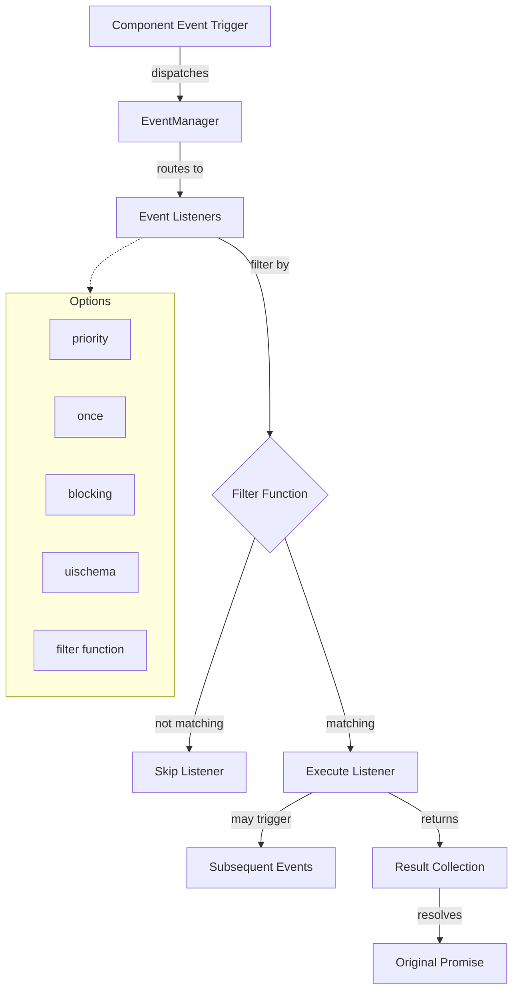
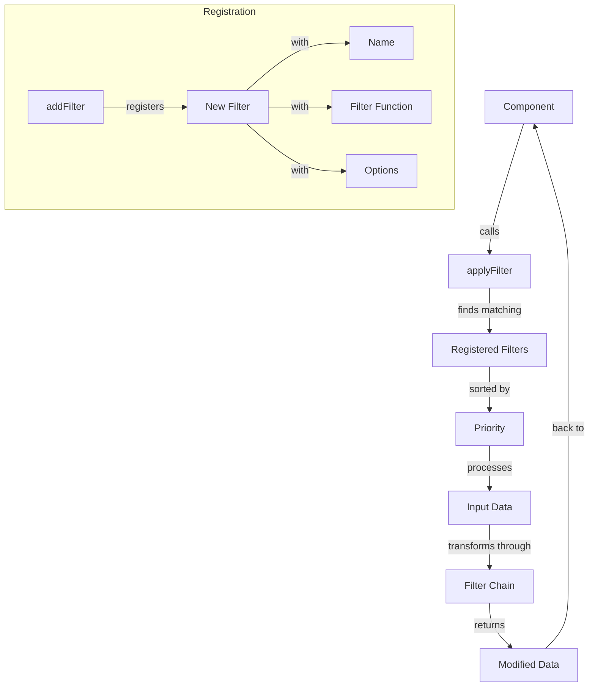
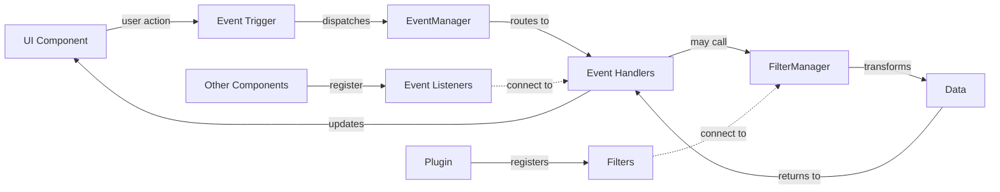
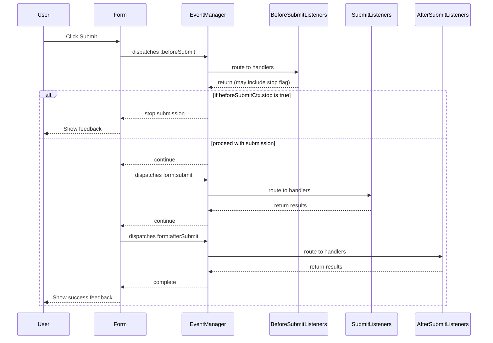
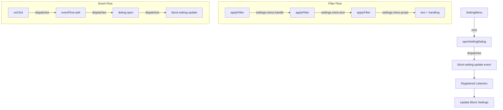
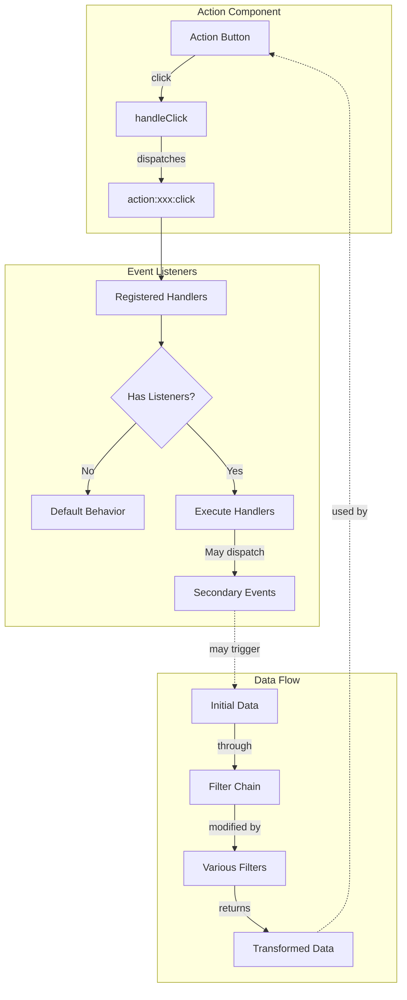

# Event Filter System Design

## Introduction

The Event Filter System plugin integrates two core systems in NocoBase:

1. **Event System**: Manages event publishing and subscriptions throughout the application.
2. **Filter System**: Provides data transformation capabilities across various data types.

This document outlines the design principles, architecture, and implementation details of these systems.

## System Flow Diagrams

### Event System Flow



### Filter System Flow



### Component-Event-Filter Integration



## Core Components

### Filter API

The Filter API provides mechanisms for data transformation with enhanced customization capabilities through `addFilter`.

#### FilterManager

```typescript
// Define the expected signature for a filter function
// It can be synchronous or return a Promise
type FilterFunction = (currentValue: any, ...contextArgs: any[]) => any | Promise<any>;

// Define options for adding a filter
interface FilterOptions {
  priority?: number; // Higher numbers run later
}

class FilterManager {  // Singleton, typically accessed via app.filterManager
  // Adds a filter function for a given name.
  addFilter(name: string, filter: FilterFunction, options?: FilterOptions): () => void; // Returns an unregister function

  // Removes a specific filter function or all filters for a name.
  removeFilter(name: string, filter?: FilterFunction): void;

  // Applies all registered filters for a name to an initial value.
  // ALWAYS returns a Promise.
  applyFilter(name: string, initialValue: any, ...contextArgs: any[]): Promise<any>;
}
```

**Note on Asynchronicity:** This API is designed to be fully asynchronous to support filters that need to perform async operations (e.g., API calls). `applyFilter` *always* returns a `Promise`, even if all registered filters are synchronous. Callers *must* use `await` or `.then()` to get the final result.

#### Filter Naming Convention

Filter names use a structured, hierarchical format similar to filters to ensure clarity and prevent collisions:

`origin:[domain]:[sub-module/component]:attribute`

- **`origin`**: (Required) Identifies the source.
  - `core`: For filters originating from the NocoBase core.
  - `plugin:[plugin-name]`: For filters from a specific plugin (e.g., `plugin:workflow`).
- **`domain`**: (Required) A high-level functional area (e.g., `block`, `collection`, `field`, `ui`, `data`, `auth`). **Note:** For common, unambiguously UI-related components (e.g., `modal`, `button`, `table`, `form`), the `ui` domain *may* be omitted for brevity if the component name clearly implies it. For other domains or less common components, the domain should be included.
- **`sub-module/component`**: (Optional but Recommended) A more specific component or context (e.g., `table`, `form`, `users`, `props`).
- **`attribute`**: (Required) The specific data aspect being filtered (e.g., `props`, `data`, `schema`, `options`, `height`, `validationRules`).

**Rationale:** While this format can lead to longer names, the explicitness is crucial for:

1. **Clarity**: Ensuring that the filter's origin and purpose are clear.
2. **Collision Avoidance**: Preventing naming conflicts between different filters.
3. **Debugging**: Facilitating easier debugging and maintenance.
4. **Scalability**: Allowing for future expansion without breaking existing code.
5. **Use Constants**: Using constants for filter names can help maintain consistency across the application.

**Examples:**

- `core:block:table:props`: Filter props for a core table block.
- `core:collection:users:schema`: Filter the schema for the core `users` collection.
- `plugin:workflow:node:approval:conditions`: Filter approval conditions for a node in the `workflow` plugin.
- `plugin:map:field:coordinates:format`: Filter the display format for a coordinates field from the `map` plugin.
- `core:field:text:validationRules`: Filter validation rules for a core text field.

Registration requires using this full, structured name. Wildcards are not supported during registration.

#### Methods

##### addFilter

```typescript
app.filterManager.addFilter(
  name: string, 
  filter: FilterFunction, // Can be sync or async
  options?: FilterOptions 
): () => void // Returns an unregister function
```

**Parameters**:
- `name`: Filter name, following the convention `origin:[domain]:[sub-module]:attribute`. Wildcards are not supported.
- `filter`: The filter function. It receives the current value (output of the previous filter or the `initialValue` for the first filter) as its first argument, and any `contextArgs` passed to `applyFilter` as subsequent arguments. It can return the transformed value directly or a `Promise` resolving to the transformed value.
- `options`: Configuration options, currently only `priority` (default 0). Filters with lower priority run first.

**Returns**:
- A function that, when called, unregisters this specific filter.

##### removeFilter

```typescript
app.filterManager.removeFilter(name: string, filter?: FilterFunction): void
```

**Parameters**:
- `name`: Filter name, following the convention.
- `filter`: (Optional) The specific filter function to remove. If omitted, *all* filters registered for `name` are removed.

##### applyFilter

```typescript
async applyFilter(
  name: string, 
  initialValue: any, 
  ...contextArgs: any[]
): Promise<any>
```

**Parameters**:
- `name`: The name of the filter chain to apply.
- `initialValue`: The starting value that will be passed as the first argument to the first filter function in the chain.
- `...contextArgs`: (Optional) Any additional arguments provided here will be passed as the second, third, etc., arguments to *every* filter function in the chain, after the `currentValue`.

**Execution Flow**:
1. Retrieves all filter functions registered for `name`.
2. Sorts them based on `priority` (lower priority first).
3. Sequentially executes each filter function, passing the result of the previous filter (or `initialValue` for the first) and the `contextArgs`.
4. **Crucially:** If a filter function returns a `Promise`, the manager `await`s its resolution before proceeding to the next filter.

**Returns**:
- A `Promise` that resolves with the final value after being processed by all matching filters in the chain. 
- **Breaking Change:** Callers must now use `await` or `.then()` to handle the result.

#### Examples

**Recommended Pattern: Filtering Component Props**

Instead of chaining `applyFilter` calls within filters, it's often clearer to register multiple filters for the *same* top-level name (e.g., `core:block:table:props`) and use `priority` and `contextArgs` to manage the transformation.

**Why Nesting `applyFilter` is Discouraged:**

While technically possible, calling `app.filterManager.applyFilter` from *within* a filter function passed to `addFilter` is strongly discouraged for several reasons:

1.  **Bypasses Central Control:** The `FilterManager`'s primary role is to orchestrate the execution of filters based on their registered `priority`. When a filter function internally calls `applyFilter` for another name (or even the same name), that nested execution happens *outside* the main priority-sorted sequence managed by the initial `applyFilter` call. This bypasses the intended central control mechanism.
2.  **Obscures Execution Flow:** It becomes much harder to understand the complete sequence of transformations applied for a given filter name (e.g., `core:block:table:props`) just by looking at the registered filters and their priorities. The effective flow depends on the internal logic of potentially many different filter functions.
3.  **Increases Debugging Complexity:** Tracing how a value was transformed becomes more difficult. You can't rely solely on the `FilterManager`'s sorted list; you need to step into the code of each filter function to see if it triggers other, nested filter chains.

**The Recommended Approach (Multiple Filters, Same Name):**

- Register multiple, independent filter functions for the same broad filter name.
- Use `priority` to precisely control the order of execution.
- Pass necessary contextual data via the `contextArgs` of the main `applyFilter` call.

This approach keeps individual filter functions focused, makes the overall transformation sequence explicit and centrally managed by the `FilterManager` based on priority, and simplifies debugging.

```typescript
// Filter 1: Adjust table height based on context (Synchronous)
app.filterManager.addFilter('core:block:table:props', (props, context) => {
  if (context?.compact) {
    // Ensure props object is mutable or create a new one
    const newProps = { ...props }; 
    newProps.height = Math.min(props.height || 600, 300);
    return newProps;
  }
  return props; // Return original or potentially modified props
}, { priority: 10 }); // Runs relatively early

// Filter 2: Add CSS class based on async user role check (Asynchronous)
app.filterManager.addFilter('core:block:table:props', async (props, context) => {
  // Assume context.currentUser exists, but we need to fetch role details
  const userRole = await fetchUserRole(context.currentUser.id); // Example async call
  
  if (userRole === 'admin') {
    const newProps = { ...props };
    newProps.className = `${props.className || ''} admin-table`;
    return newProps;
  }
  return props;
}, { priority: 20 }); // Runs after the height adjustment

// --- Component Usage ---

const MyTableComponent = (/* ... */) => {
  const initialProps = useMemo(() => ({ /* base props */ }), [/* deps */]);
  const context = useMemo(() => ({ /* context */ }), [/* deps */]);
  const [filteredProps, setFilteredProps] = useState(initialProps);
  const [isLoading, setIsLoading] = useState(false);

  useEffect(() => {
    let isMounted = true;
    const loadFilteredProps = async () => {
      setIsLoading(true);
      try {
        // MUST await the result
        const result = await app.filterManager.applyFilter(
          'core:block:table:props', 
          initialProps, 
          context
        );
        if (isMounted) {
          setFilteredProps(result);
        }
      } catch (error) {
        console.error("Error applying filters:", error);
        // Handle error appropriately
      } finally {
        if (isMounted) {
          setIsLoading(false);
        }
      }
    };

    loadFilteredProps();

    return () => { isMounted = false; }; // Cleanup
  }, [initialProps, context]);

  if (isLoading) {
    return <Spin />; // Show loading indicator while filters run
  }

  return <Table {...filteredProps} />;
}
```

**Explanation of Example:**
- The first filter remains synchronous.
- The second filter is now `async` and uses `await` to fetch user roles.
- **Crucially**, the component usage (`MyTableComponent`) now uses `useEffect` and `async`/`await` to call `applyFilter` and handle the resulting `Promise`. It also includes loading and error handling state.
- **Note:** Filter functions should be mindful of object mutability. Returning a new object (`{...props}`) is often safer than modifying the input directly, unless mutation is explicitly intended and documented for that filter chain.

### Hooks

#### useAddFilter

```typescript
const useAddFilter = (name:string, filterFunction, options) => {
  useEffect(() => {
    return app.filterManager.addFilter(name, filterFunction, options);
  }, [...]);
}
```

#### useApplyFilter

```typescript
// This hook might need adjustment or a new async version depending on usage patterns.
// A simple version might just return the function without immediate execution.
const useApplyFilter = (name: string) => {
  // Note: This returns the async function itself. 
  // The component using this hook would need to call it with await.
  return useCallback(async (initialValue: any, ...contextArgs: any[]) => {
    return app.filterManager.applyFilter(name, initialValue, ...contextArgs);
  }, [app, name]); // Ensure app is stable if passed via context
}
```

### Event API

The Event API manages event subscriptions and publications throughout the application.

#### EventManager

```typescript
class EventManager { // 单例, 可以挂载到app上
  // 注册事件监听器
  on(eventName, listener, options = {}) { ... }
  
  // 注册一次性事件监听器
  once(eventName, listener, options = {}) { ... }
  
  // 取消事件监听器
  off(eventName, listener) { ... }
  
  // 触发事件
  async dispatchEvent(eventName, context = {}) { ... }
  
  // 获取特定事件的所有监听器, 主要用于测试
  getListeners(eventName) { ... }
}
```

#### Event Naming Convention

Event names follow a structured, hierarchical format similar to filters to ensure clarity and prevent collisions:

`origin:[domain]:[sub-module/component]:action`

- **`origin`**: (Required) `core` or `plugin:[plugin-name]`.
- **`domain`**: (Required) High-level area (e.g., `block`, `collection`, `ui`, `system`, `auth`). **Note:** For common, unambiguously UI-related components (e.g., `modal`, `button`, `table`, `form`), the `ui` domain *may* be omitted for brevity if the component name clearly implies it. For other domains or less common components, the domain should be included.
- **`sub-module/component`**: (Optional but Recommended) Specific context (e.g., `table`, `form`, `modal`, `row`, `users`).
- **`action`**: (Required) Describes the event, often combining the action verb with lifecycle prefixes/suffixes. Examples: `beforeCreate`, `afterUpdate`, `loadSuccess`, `validateError`, `submit`, `afterSubmit`, `click`, `open`.

**Rationale & Recommendation:** Same as for Filter Naming Convention (clarity, collision avoidance, debugging, scalability, use constants).

**Examples:**

- `core:collection:posts:beforeCreate` // Before creating a record in the core `posts` collection.
- `core:block:table:row:select` // A row is selected in a core table block.
- `core:modal:open` // A generic core modal is opened (omitting `ui` domain).
- `core:form:afterSubmit` // After a generic form submission (using combined action).
- `core:auth:login:success` // Successful user login event.
- `plugin:workflow:execution:start` // A workflow execution starts (from `workflow` plugin).
- `plugin:audit-log:entry:created` // An audit log entry was created (from `audit-log` plugin).

Listeners can potentially listen using wildcards (e.g., `core:block:table:**`), although dispatching must use a specific event name. (Note: Wildcard support needs confirmation based on `EventManager` implementation details).

#### EventContext

```typescript
interface EventContext<T = any> {
  // 事件源 (dispatchEvent调用者) 信息
  source?: {
    id?: string;
    type?: string;  // 'user-interaction', 'system', 'workflow'
    [key: string]: any // any extra information
  };
  
  // 用于指定接收者信息, 主要用于精准触发事件
  target?: {
    id?: string;      // id
    uischema?: ISchema;    // ui schema
  }
  
  // 事件相关数据
  payload?: T;        // 事件特定的数据, TODO: 列出常用的事件相关数据
  
  // 元数据
  meta?: {
    timestamp?: number;     // 事件触发的时间
    userId?: string;      // 当前用户ID (可选)
    event?: string | string[];     // 事件名, 可以通配符匹配 table:*, 可支持多个eventName组成的数组
    [table:refresh, form:refresh]
  };
  
  // TODO: 是否需要支持事件中断执行?
  // propagation: true; // 可能改成propagation.stop()是否停止继续执行
}
```

#### Listener Options

```typescript
interface EventListenerOptions {
  priority?: number;      // 监听器优先级，数值越大优先级越高，默认为 0
  once?: boolean;       // 是否只执行一次，默认为 false
  blocking?: boolean;     // 是否为阻塞监听器，默认false，即默认行为是不需要当前监听器结束再执行后续监听器
  uischema?: ISchema;     // Json Schema，主要用于精准触发事件
  filter?: (ctx: EventContext, options: EventListenerOptions) => boolean;  // 过滤函数，允许根据上下文来确定当前监听器是否执行，默认行为是：处理多播(dispatch时未指定target)和单播(dispatch时指定当前组件为target)事件。
}
```

Default filter function:
```typescript
function filter(ctx: EventContext, options: EventListenerOptions) {
  if (ctx.target) {
    return true;
  }
  if (ctx.target.uischema === options.uischema) {
    return true;
  }
  return false;
}
```

#### Methods

##### on

```typescript
on(event: string | string[], listener: EventListener, options?: EventListenerOptions): Unsubscriber
```

Used to register event listeners. When the specified event is triggered, the listener will execute.

##### once

```typescript
once(event: string | string[], listener: EventListener, options?: OmitEventListenerOptions, 'once'): Unsubscriber
```

Similar to `on()` but the listener is automatically removed after the first execution.

##### off

```typescript
off(eventName) // 取消事件所有的监听器
off(eventName, listener) // 取消事件指定监听器
```

Removes event listeners.

##### dispatchEvent

```typescript
app.eventManager.dispatchEvent(eventName, ctx: EventContext, timeout: number): Promise<void>;
```

**Parameters**:
- `eventName`: Event name
- `ctx`: Event context
- `timeout`: Event timeout in milliseconds, default 2 minutes

**Returns**:
- A Promise that resolves when all listeners have completed processing

## Form Submission Flow Example



## Design Considerations

### Current Implementation Challenges

1. **Object Immutability**: Currently `source`, `target`, `meta` properties can only be frozen using `Object.freeze`, but payload modification is not restricted. Should more attributes be protected?

2. **Async Event Collection**: Determining whether `dispatchEvent` should collect and return values from handlers. If return values are needed, should they be from all handlers or specific ones?

3. **Performance Optimization**:
   - Preventing event storms
   - Implementing debounce mechanisms

4. **Error Handling**: Considering how to handle errors in event listeners reliably

5. **Event Chaining**: Supporting complex event flows and preventing unintended circular dependencies

### Integration Points

1. **Component Actions**:
   ```jsx
   <Button onClick={() => app.dispatchEvent('form:record:create', { ... })}>
     新建
   </Button>
   
   // 内核已经监听form:record:create事件
   app.on('form:record:create', (ctx) => {
     openCreationModal(ctx);
   });
   ```

2. **Form Submission Flow**:
   ```jsx
   // block-form.ts
   async function submit() {
     const beforeSubmitCtx = {
       source: {
         id: actionId
       }
       ...
     };
     await app.eventManager.dispatchEvent(':beforeSubmit', beforeSubmitCtx);
     if (beforeSubmitCtx.stop) {
       return;
     }
     // 继续提交
     await app.eventManager.dispatchEvent('form:submit', ctx);
     await app.eventManager.dispatchEvent('form:afterSubmit', ctx);
   }
   
   // event-flow.ts
   app.eventManager.on('form.beforeSubmit', (ctx) => {
     await openDialog(ctx);
     await openDialog(ctx);
   }, {
     filter: (eventCtx, listenerOptions) => {
       return eventCtx.source.id === listenerOptions.id;
     },
     id: actionId
   });
   ```

3. **Table Component Integration**:
   ```jsx
   <Table1 />
   const refresh = () => {
     console.log('refresh table1 data');
   };
   app.eventManager.on('table:data:refresh', ()=> {
     refresh();
   }, {
     target: {
       uischema: { 'x-uid': 'table1' }
     }
   });
   
   <Table2 />
   const refresh = () => {
     console.log('refresh table1 data');
   };
   app.eventManager.on('table:data:refresh', ()=> {
     refresh();
   }, {
     target: {
       uischema: { 'x-uid': 'table2' }
     }
   });
   
   <Button onClick={() => {
     app.eventManager.dispatchEvent('table:data:refresh', ctx); // this will refresh both table1 and table2
   }}>
     
   <Button2 onClick={() => {
     app.eventManager.dispatchEvent('table:data:refresh', {
       target: {
         uischema: {'x-uid': 'tablue2'}
       }
     }); // refresh just tablue2
   }} />
   ```

## Architecture Goals

1. **Decouple UI and Business Logic**: Clean separation between event triggering and handling
   ```jsx
   <Button onClick={onClick}/>
   
   function onClick() {
     // 这个action实现方式不适合编排，因为需要写多个上面的代码
     openDialog(ctx);
     refresh(ctx);
   }
   
   function anotherAction(ctx) {
     // 这个action实现方式就适合编排，只有保存需要触发的事件及顺序即可
     app.dispatchEvent('dialog.open', ctx);
     app.dispatchEvent('data.refresh', ctx);
   }
   ```

2. **Improve Testability**: Business logic in event handlers is easier to test independently
   ```jsx
   // 事件处理器可单独测试
   test('record create event handler', () => {
     const mockContext = { ... };
     const handler = app.getEventHandler('form:record:create');
     
     handler(mockContext);
     
     expect(modalOpenSpy).toHaveBeenCalledWith({...});
   });
   ```

3. **Enhance Extensibility**: Through filter API, allowing extensions without modifying core code
   ```jsx
   // 通过事件系统可以在不修改原始组件的情况下添加新功能
   app.on('table:record:create', async (ctx) => {
     await app.dispatchEvent('data:validation', ctx); // 后续只要检测监听返回，即可在不改变区块内的前提下增加验证功能
     openModal(ctx);
   });
   ```

4. **Simplify Workflow**: Support for event chains and workflows
   ```jsx
   // 简化复杂流程
   app.on('table:record:create', (ctx) => {
     // 可触发后续事件
     openForm(ctx).then((formData) => {
       app.dispatchEvent('form:data:refresh', { ...ctx, payload: formData });
       app.dispatchEvent('table:data:refresh', {...});
     });
   });
   ```

5. **Method Encapsulation**: Better organize code through functional modules
   ```jsx
   function openDialog(ctx) {
     // 打开弹出
   }
   
   function refresh(ctx) {
     // 区块刷新
   }
   
   app.on('dialog.open', openDialog);
   app.on('data.refresh', refresh);
   ```

6. **Consistency**: Maintaining predictable behavior across implementation
   ```jsx
   // 方便编排: 支持通过配置动态改变运行时逻辑，为事件流做准备
   function openDialog(ctx) {
     // 这个action就不适合编排，因为需要写入上面的函数
     openDialog(ctx);
     refresh(ctx);
   }
   
   function anotherAction(ctx) {
     // 这个action实现方式就适合编排，只有保存需要触发的事件及顺序即可
     app.dispatchEvent('dialog.open', ctx);
     app.dispatchEvent('data.refresh', ctx);
   }
   ```

## Menu Configuration Flow



## Implementation Examples

### Component Usage

```jsx
function Component (props) {
  const [actionSettings, setActionSettings] = useActionSettings();
  const [filterSettings, setFilterSettings] = useFilterSettings();
  // TODO: 如何避免不必要的运行逻辑，例如filter执行时，能否有些提示?
  const [newProps, done] = useFilter('xxx:props', props, filterSettings);
  
  if(!done || newProps['hidden']) {
    return null;
  }
  
  const handleClick = async () => {
    // do something before dispatchEvent
    const eventCtx = {
      payload: xxx,
      settings: actionSettings
    };
    if (actionSettings.secondConfirm) {
      await app.dispatchEvent('system:dialog:open', eventCtx)
    }
    const done = await app.dispatchEvent('action:xxx:click', eventCtx);
    if (done && actionSettings.refreshAfterDone) {
      await app.dispatchEvent('block:yyy:refresh', eventCtx);
    }
  }
  
  return <>
    <SomeInternalComponent onClick={handleClick} ...newProps />
    <SettingMenus {newProps.menus}/>
  </>
}

function MenuItem(props) {
  const [actionSettings, setActionSettings] = useActionSettings();
  const [filterSettings, setFilterSettings] = useFilterSettings();
  const [newProps, done] = useFilter('menuItem:props', props, filterSettings);
  if (!done) {
    return null
  }
  
  const handleClick = () => {
    app.dispatchEvent('xxx:settings', {
      actionSettings,
      props
    });
  };
  
  return <MenuItemInner onClick={handleClick}>
    
  </MenuItemInner>
}

// some global filters.ts file
app.filterManager.on('xxx:props', (...inputs) => {
  const newProps = {};
  newProps['text'] = app.filterManager.applyFilter('xxx:props:text', ...inputs);
  // applyFilter组合了很多个单里filter...
  return newProps;
});
```

### Table Block Example

```typescript
// table-filters.ts
const { addFilter, applyFilter } = app.filterManager;

addFilter('block:table', async(ctx: {payload, settings}) => {
  // props属性
  const tableProps = applyFilter('block:table:props', ctx);
  
  // linkages 配置, 后续data, fields, actions的生成可用其结果
  const linkageRules = applyFilter('block:table:linkages', ctx);
  
  // data数据, 可以根据settings来过滤一些数据
  const data = applyFilter('block:table:data', ctx);
  
  // 用来渲染字段的
  const fields = applyFilter('block:table:fields', ctx);
  
  // 用来渲染actions的
  const actions = applyFilter('block:table:actions', ctx);
  
  // 用来渲染配置项的
  const settingOptions = applyFilter('block:table:settingOptions', ctx);
  
  return { props: tableProps, linkageRules, data, fields, actions, settingOptions }
});

addFilter('block:table:props', async (ctx: {props, settings, previousResult}) => {
  // 包含 title, description, height 等props的处理
  const blockCommonProps = await applyFilter('block:common:props', ctx);
  
  // 包含
  const tableProps = convertTableProps(props); // table block区域已处理的
  
  // 大部分配置项都是filter配置, 公用的配置项命名为 block:xxx, table自己的配置项为 block:table:setting
  return { ...blockCommonProps, tableProps };
});

addFilter('block:table:fields', async (ctx) => {
  const dataFields = applyFilter('block:fields', ctx);
  // some logical related to table block
  const tableFields = convertToTableFields(dataFields);
  return tableFields;
});
addFilter('block:table:actions', async (ctx) => {
  const actions = applyFilter('block:actions', ctx);
  // some logical related to table actions
  const tableActions = convertToTableActions(actions);
  return tableActions;
});

addFilter('block:table:datas', async (ctx) => {
  const data = applyFilter('block:data', ctx);
  const tableData = convertToTableData(data);
  return tableData;
});
```

## Action Component Flow



## Improvement Points

### Current Issues

1. **Global State Complexity**: Both Event & Filter being global increases complexity, making code harder to trace. Not knowing how many filters have been processed in a single operation can lead to unexpected behavior.
   - **Solution**: Add consistent conventions and constraints.

2. **Resource Management Risk**: Direct use of global state can lead to memory leaks.
   - **Solution**: Provide hooks for automatic resource cleanup.

3. **Simple vs. Complex Scenarios**: For simple data transformations, using Filter API might be overengineered.
   - **Solution**: Document use cases where direct code is preferable over the Filter API.

4. **Filter Settings & Action Settings**: Unclear storage strategy - should they be stored in UI schema or separately?
   - **Solution**: Consider using a dedicated filter like `applyFilter('deprecated:props')` to collect old settings.

### Future Enhancements

1. **Type Safety**: Improve TypeScript integration to provide better autocompletion and type checking for event names and payloads.

2. **Documentation**: Create comprehensive documentation with real-world examples for both systems.

3. **Performance Monitoring**: Add tools to analyze event propagation and filter execution performance.

4. **Testing Utilities**: Develop specialized testing utilities for simulating events and validating filter chains.

5. **Event Visualization**: Create developer tools to visualize event flows and filter chains for debugging.

6. **Middleware Support**: Add middleware capabilities for cross-cutting concerns like logging, validation, and error handling.

7. **Standardized Event Schema**: Further refine the event schema to ensure consistency across the application.

8. **Filter Composition**: Improve ways to compose and reuse filters for complex transformations.

9. **Conditional Event Processing**: Enhanced support for conditional event processing based on application state.

10. **Error Recovery**: Implement robust error recovery mechanisms for failed event handlers and filters. 