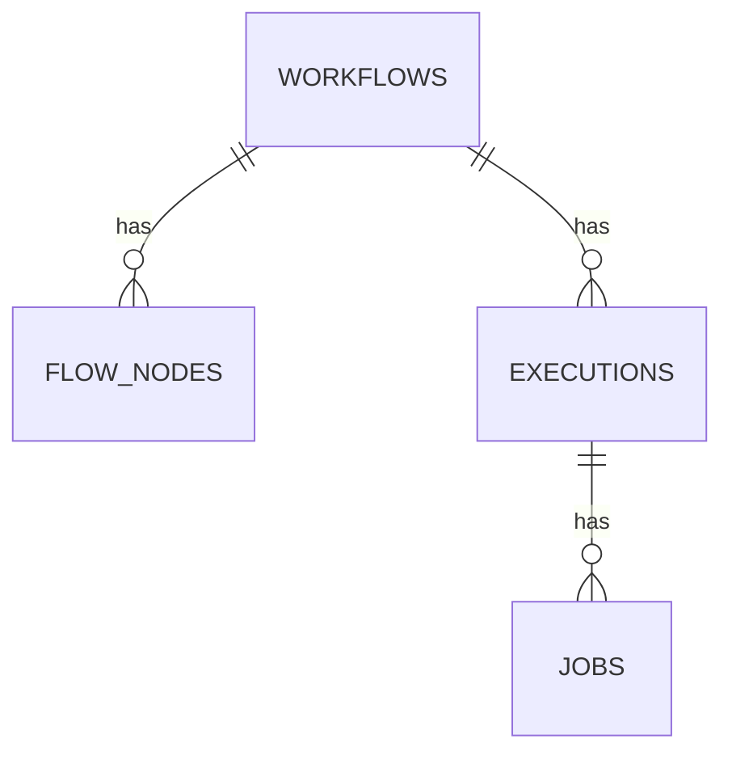

# 工作流建模知识

本文档从服务端视角总结 plugin-workflow 的核心模型、触发器、节点关系与编排步骤。节点配置的细节不在本文展开，请直接查阅各节点的对应文档。

## 核心模型

工作流引擎最核心的四张表：

- `workflows`：工作流主表，一个工作流可以有任意多个节点（`nodes`），被触发执行后有任意多个执行计划（`executions`）。
- `flow_nodes`：节点表，任何节点都必须属于某个工作流（外键 `workflowId`）。
- `executions`：工作流的执行记录，必须关联到某个工作流版本（外键 `workflowId`）。
- `jobs`：节点执行记录，必须关联到某个执行记录（外键 `executionId`）和某个节点（外键 `nodeId` 或 `nodeKey`）。

其中用于编排时，主要关注 `workflows` 和 `flow_nodes` 两张表，对其进行创建和配置，`executions` 和 `jobs` 则是运行时产生的记录，**不需要人工创建**。
